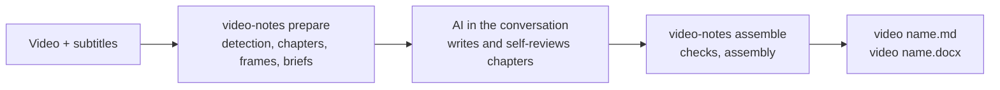

# video-notes

[中文](README.md) | **English** | [Magyar](README.hu.md)

Turn a local lecture, course or training video into a **shareable study note with screenshots from the original video** (Markdown and Word).

- The AI you talk to in the Claude or Codex app writes the note **itself**: it reads the subtitles once, looks at each image once, and explains reasons, mechanisms, conditions, steps and examples in the original teaching order. It is not a summary or a transcript.
- The tool does all the work that needs no large language model: subtitle checks, screen-change detection, chapters, candidate screenshots and quality filtering, mechanical checks, Markdown and Word output. **The tool itself calls no model** and uses no extra quota in the background.
- At most 8 key screenshots per chapter, each slide once, captioned with what the image shows and the original video time.
- The note is named after the video and saved next to it: `<video name>.md`, `<video name>.docx`, `<video name>_assets/`.

> Version 0.2. The workflow and its checks are covered by unit tests and real video clips; the quality of the text depends on the writing AI and its self-review.

## Quick start

1. Install (once):

```bash
git clone https://github.com/songyang8964/video-notes.git
cd video-notes
powershell -ExecutionPolicy Bypass -File install.ps1 -AddToPath   # macOS/Linux: sh install.sh
```

2. Put the video (and, optionally, a `.srt` subtitle with the same name) in a folder.
3. Open that folder in Claude desktop (Code) or the Codex desktop app and tell the AI: "Use video-notes to turn this video into notes".
4. The AI runs `video-notes prepare`, writes the chapters one by one, then runs `video-notes assemble`; the Markdown and Word versions appear next to the video.



---

## Contents

1. [Quick start](#quick-start)
2. [Installation](#installation)
3. [Usage](#usage)
4. [Generating subtitles on a Colab T4 GPU](#generating-subtitles-on-a-colab-t4-gpu)
5. [Video context (optional)](#video-context-optional)
6. [Quality assurance](#quality-assurance)
7. [Configuration](#configuration)
8. [Development and tests](#development-and-tests)

---

## Installation

### Requirements

- Python 3.10 or newer
- FFmpeg: `ffmpeg` and `ffprobe` on the PATH
- An AI to write with: Claude desktop (Code), Claude Code, or the Codex desktop app / Codex CLI. The tool does not call them, so it needs no sign-in of its own.
- Optional: Tesseract OCR (better ranking of candidate screenshots, most useful for terminals and tables); local speech recognition (only needed without subtitles): `pip install faster-whisper` or WhisperX

### Installation steps

Windows (PowerShell):

```powershell
powershell -ExecutionPolicy Bypass -File install.ps1 -AddToPath
```

`-AddToPath` adds the tool to your user PATH so that `video-notes` works in any folder (open a new terminal). The Word version is produced by pandoc, which is installed along with the tool.

macOS / Linux:

```bash
sh install.sh
```

### First-time setup

```bash
video-notes setup --language English      # note language, default 中文
video-notes setup --tesseract "C:\Program Files\Tesseract-OCR\tesseract.exe" --ocr-langs eng+chi_sim   # optional
video-notes doctor                         # checks FFmpeg, Python dependencies, pandoc, OCR, speech recognition
```

---

## Usage

### In the Claude / Codex app (recommended)

1. Open **Claude desktop → Code**, or the **Codex desktop app**, and choose the folder that holds the video as the working folder.
2. Type in the conversation, for example:

   ```text
   Use video-notes to turn the video in this folder into notes: run video-notes prepare, write topics.csv, knowledge.csv, chapter.md and review.md for each chapter following its brief.md, then run video-notes assemble until every check passes.
   ```

3. The AI completes the chapters one by one and gives you the note's path once `assemble` passes. Long videos can be done over several conversations: the briefs and the chapters already written stay in the work folder.

### In a terminal

```bash
video-notes                          # same as prepare: processes the only .mp4 in the folder
video-notes prepare "course.mp4" --srt "subs.srt" --context background.md
video-notes assemble "course.mp4"    # after all chapters are written
video-notes assemble "course.mp4" --output D:\notes   # write to another folder
```

`prepare` writes `agent/Cnn/brief.md` for every chapter: the general writing rules, the video context, the chapter's subtitles, the candidate table (time, subtitles shown meanwhile, original image path) and contact sheets. The writer puts four files in the same folder:

| File | Content |
| --- | --- |
| `topics.csv` | Consecutive topics by meaning, covering every subtitle line of the chapter; off-topic parts marked excluded with a reason |
| `knowledge.csv` | Fine-grained knowledge inventory: definitions, mechanisms, conditions, reasons, examples, commands, steps, risks, Q&A |
| `chapter.md` | The chapter text; images as `[[frame:frame ID\|caption]]` placeholders, ending with the knowledge map |
| `review.md` | Self-review record: what was checked on the original for every image, where every important item is explained |

### Output

```
<folder of the video>/
  <video name>.md          Markdown note
  <video name>.docx        Word note (images embedded, can be sent on its own)
  <video name>_assets/     screenshots used by the Markdown
```

- The original video and subtitles are read-only and never modified.
- If you edited the previously generated note, assembling again **does not overwrite** it; the new result is saved with a timestamp.
- When a Windows path would exceed 260 characters, the file names are shortened automatically and a message says so.

### Exit codes

| Exit code | Meaning |
| --- | --- |
| 0 | Success: briefs written, or every chapter passed the checks and the note was written |
| 1 | Dependency or processing failure; or chapters failed the checks (reasons in `agent/check.md`, no note written) |
| 2 | Ambiguous or invalid input: no video, several videos, file not found, online link, unusable subtitles |
| 130 | Interrupted by the user (progress is kept) |

---

## Generating subtitles on a Colab T4 GPU

Without an NVIDIA GPU, local speech recognition of a 2-hour video can take hours. Google Colab's free T4 GPU is recommended:

1. (Recommended) Extract only the audio locally; the file is small and uploads quickly, with the same file stem as the video:

   ```bash
   ffmpeg -i "course.mp4" -vn -ac 1 -c:a aac -b:a 64k "course.m4a"
   ```

2. Open [`colab/transcribe.ipynb`](colab/transcribe.ipynb) from this repository in Colab and choose **Runtime → Change runtime type → T4 GPU**.
3. In the "parameters" cell choose the source (upload or Google Drive), optionally enter domain terms and the language, then run all cells from top to bottom.
4. Put the resulting `course.srt` next to your local `course.mp4` and run `video-notes prepare`.

---

## Video context (optional)

Put a `<video name>.context.md` next to the video (or pass `--context`) with the background of the course; it is copied into every chapter brief.

```markdown
---
title: Introduction to distributed systems (lecture 3)
note_language: English
include_times: 00:12:30, 00:41:05.500
forbid: the speaker, this video
---
This lecture is about consensus algorithms. Write the terms as Raft, Paxos, Leader.
"rafting" in the subtitles is a recognition error for Raft. The equipment check before the lecture is off topic.
```

| Field | Purpose |
| --- | --- |
| `title` | Note title (default: the video file name) |
| `note_language` | Note language for this video (overrides `setup --language`) |
| `language` | Preferred subtitle language; passed to speech recognition when there are no subtitles |
| `include_times` | Screen times that must become candidates, comma separated, `HH:MM:SS(.mmm)` or seconds |
| `forbid` | Words that must not appear in the text, comma separated (checked by the program) |
| `asr_preset` | Term hints for local transcription (currently `networking`) |

---

## Quality assurance

### Mechanical checks (run by `assemble` on every chapter; nothing is written until all pass)

| Check | Rule |
| --- | --- |
| Full subtitle coverage | Every subtitle line belongs to exactly one section, in order, or is marked excluded with a reason |
| Images | At most 8 per chapter, no repeats; each image only in the section of its topic, frame IDs must exist |
| Knowledge coverage | Every important knowledge item maps to an existing section in the knowledge map, or carries an exclusion reason |
| Level of detail | At least 100 characters per minute of teaching (English counted in words); sections of 1 minute or more at least 50 per minute |
| Writing style | No narration such as "the lecturer mentions" or "in the video", no `forbid` words, no internal IDs such as C01 or frame IDs |
| Self-review record | `review.md` states what was checked on the original for every image and covers every important knowledge item |
| Format | Every chapter has a title; no raw image paths, no unbalanced code blocks; no placeholders left after assembly |

### Limitations

- There is no independent reviewer: the program checks format, coverage and that the self-review record is complete, but it cannot tell whether the technical content is right; that depends on the writing AI comparing carefully with the subtitles and the original images.
- For important material, spot-check the key chapters yourself, especially commands, addresses and numbers.

---

## Configuration

The config file is `~/.video-notes/config.json` (Windows: `%USERPROFILE%\.video-notes\config.json`). It is not under AppData because the Claude and Codex desktop apps redirect AppData to a private folder each.

| Key | Default | Description |
| --- | --- | --- |
| `output_language` | `中文` | Note language |
| `max_images` | 8 | Maximum images per chapter |
| `shortlist` | 32 | Maximum distinct screens listed in a chapter brief |
| `chapter_minutes` | 10 | Target chapter length (minutes) |
| `parallel_chapters` | 3 | Chapters whose candidate frames are captured at the same time |
| `min_chars_per_minute` | 100 | Minimum level of detail |
| `tesseract` / `ocr_langs` | empty / `eng` | OCR program path and languages |
| `asr_backend` / `asr_model` / `whisperx` | auto / `large-v3` / empty | Local transcription settings |

Internal records are in `.work/video-notes/<hash>/` in the video's folder, or in `%USERPROFILE%\.video-notes\work\<hash>` when that path would be too deep. Screen detection runs only once; later runs reuse its cache.

---

## Development and tests

```bash
python -m unittest discover -s tests -v            # unit tests
python tests/integration_agent_mode.py <folder>    # prepare → written chapters → assemble on a real clip (no model calls)
```

```
src/video_notes/
  cli.py          command line: video discovery, prepare / assemble, setup, doctor, exit codes
  pipeline.py     detection, chapters, briefs, mechanical checks and assembly
  subtitles.py    subtitle candidates and refusal rules, VTT parsing
  transcribe.py   local speech recognition (WhisperX / faster-whisper / openai-whisper)
  detect/         screen-change detection and the decodable end of the picture
  vision/         quality filter, OCR and text novelty, diversity selection
  candidates.py   per-chapter candidate screenshots, reading copies, contact sheets
  render.py       mechanical checks, assembly, Word output
  prompts/        writing rules (rules.md) and the chapter brief template (agent.md)
colab/transcribe.ipynb   Colab T4 GPU subtitle notebook
```

Third-party license notices are in [NOTICE](NOTICE).
