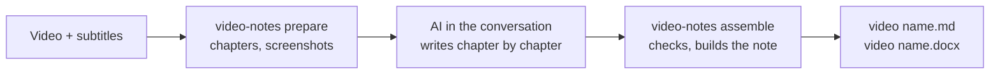
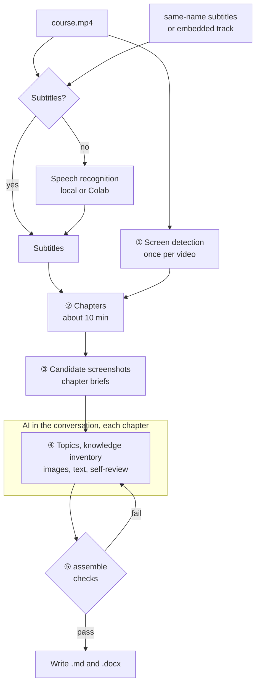
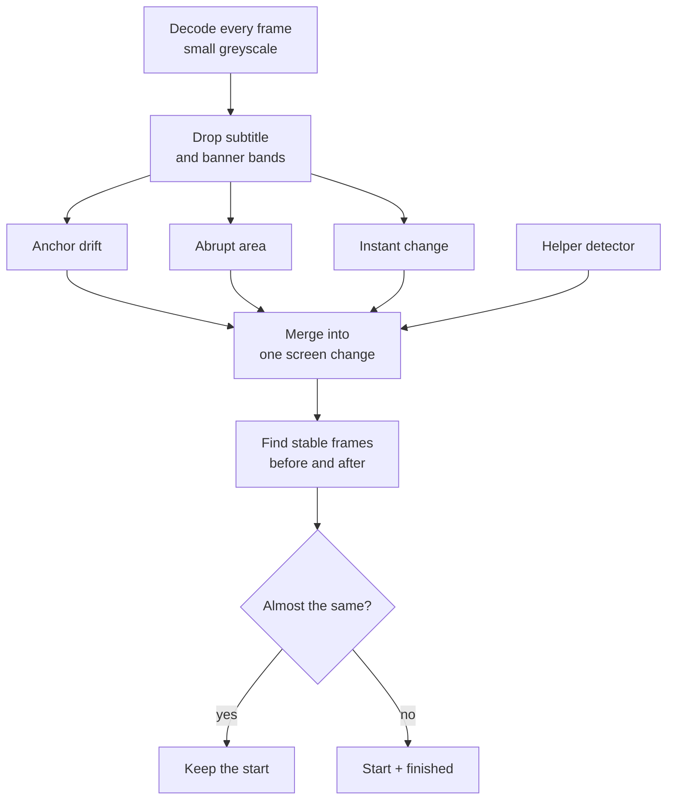
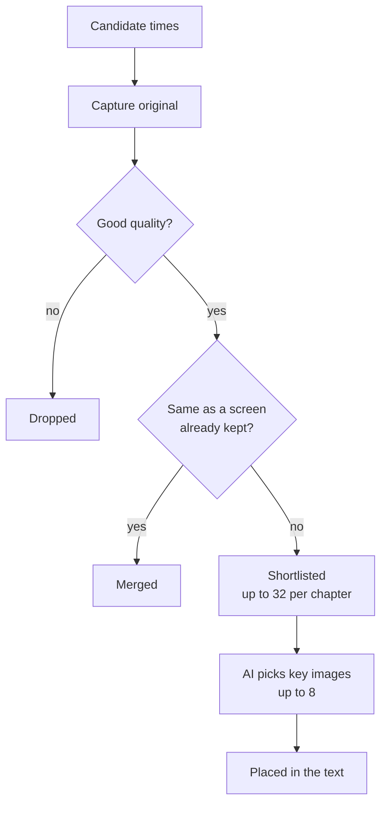

# video-notes

[中文](README.md) | **English** | [Magyar](README.hu.md)

Turn a local lecture, course or training video into a **shareable study note with screenshots from the original video** (Markdown and Word).

- The note is written by the AI you talk to in the Claude or Codex app: it explains reasons, mechanisms, conditions, steps and examples in the original teaching order. It is not a summary or a transcript.
- video-notes does the rest: checks the subtitles, finds screen changes, splits chapters, picks candidate screenshots, checks the chapters the AI wrote, and produces Markdown and Word.
- At most 8 key screenshots per chapter, captioned with what they show and the original video time; the note is named after the video and saved next to it.



> Version 0.2. The workflow and its checks are covered by unit tests and real video clips; the quality of the text depends on the writing AI and its self-review.

## Contents

1. [Example output](#example-output)
2. [Preparation (once)](#preparation-once)
3. [Step 1: Get subtitles](#step-1-get-subtitles)
4. [Step 2: Let the AI write the notes](#step-2-let-the-ai-write-the-notes)
5. [Step 3: Get the notes](#step-3-get-the-notes)
6. [FAQ](#faq)
7. [Advanced](#advanced)
8. [Development and tests](#development-and-tests)

---

## Example output

The note follows the original teaching order, chapter by chapter and topic by topic, and explains each topic in full; screenshots sit next to the explanation they support, with the original video time after the caption. Structure:

```markdown
# Course title

## Chapter 1: … (named after its content)

### Topic A
A full explanation: background → mechanism → conditions → steps → result → caveats …


*Topology: how the three core devices are interconnected (source video 00:02:07.742)*

### Topic B
…
```

Copy, zip or upload `course.md` together with `course_assets/` and the images stay intact; `course.docx` has the images embedded and can be sent on its own.

---

## Preparation (once)

1. Install Python 3.10+, FFmpeg and git. On Windows run `winget install Python.Python.3.12`, `winget install Gyan.FFmpeg` and `winget install Git.Git` (without git you can download the ZIP from the GitHub page and unpack it).
2. Install video-notes:

   ```bash
   git clone https://github.com/songyang8964/video-notes.git
   cd video-notes
   powershell -ExecutionPolicy Bypass -File install.ps1 -AddToPath   # macOS/Linux: sh install.sh
   ```

3. **Quit and reopen** the Claude or Codex app completely so that it finds the newly installed `video-notes` command.
4. Optional: run `video-notes doctor` in a terminal to check that FFmpeg, pandoc (for Word) and the rest are ready.

---

## Step 1: Get subtitles

If you already have subtitles with the **same name** as the video (for example `course.srt` next to `course.mp4`), skip to step 2.

Without subtitles, Google Colab's free T4 GPU is recommended (without an NVIDIA GPU, recognising a 2-hour video locally can take hours):

1. (Recommended) Extract only the audio locally; the file is small and uploads quickly. Keep the same file name as the video:

   ```bash
   ffmpeg -i "course.mp4" -vn -ac 1 -c:a aac -b:a 64k "course.m4a"
   ```

2. Open the [Colab subtitle notebook](https://colab.research.google.com/github/songyang8964/video-notes/blob/main/colab/whisperx_for_uploading_file.ipynb). You can also open it in Colab by hand: **File → Open notebook → GitHub**:

   

   Type `songyang8964` in the search box, choose the repository `songyang8964/video-notes` and open `colab/whisperx_for_uploading_file.ipynb`:

   

3. Choose **Runtime → Change runtime type**, select **T4 GPU** and click **Save**:

   

4. Click the folder icon on the left and drag the audio (or video) file there to upload it.
5. Optional: in the first cell, write the course's technical terms into **Initial prompt** to improve recognition.
6. Choose **Runtime → Run all**. When it finishes, the browser downloads a `.srt` with the same name as the uploaded file (if the browser asks whether to allow several downloads, allow it).
7. Put `course.srt` next to `course.mp4`.

You can also skip Colab: install local speech recognition (`pip install faster-whisper` or WhisperX) and step 2 transcribes automatically, though it is slow without a GPU.

---

## Step 2: Let the AI write the notes

1. Open **Claude desktop → Code**, or the **Codex desktop app**, and choose the folder that holds the video.
2. Send the AI this text as it is:

   ```text
   Use video-notes to turn the video in this folder into notes: run video-notes prepare, read the brief instructions it prints, write topics.csv, knowledge.csv, chapter.md and review.md for each chapter following its brief.md, then run video-notes assemble until every check passes.
   ```

3. The AI first splits the chapters and captures screenshots, then writes and self-reviews each chapter, and finally checks everything and builds the note. Long videos can be done over several conversations: the chapters already written are kept; in a new conversation say "continue the unfinished chapters, then run video-notes assemble".

---

## Step 3: Get the notes

```
<folder of the video>/
  <video name>.md          Markdown note
  <video name>.docx        Word note (images embedded, can be sent on its own)
  <video name>_assets/     screenshots used by the Markdown
```

- The original video and subtitles are never modified.
- A `.work` folder (cache and intermediate files) also appears next to the video; it can be deleted once the note is done.
- If you edited the previously generated note, building it again **does not overwrite** it; the new result is saved with a timestamp.

---

## FAQ

- **`video-notes` is not found**: it was installed without `-AddToPath`, or the terminal / app was opened before the installation. Open a new terminal, or quit and reopen the Claude / Codex app completely.
- **`assemble` did not pass**: the reasons are in `check.md` in the brief folder (for example a subtitle line without a section, a missing important knowledge item, text that is too brief). Ask the AI to fix those chapters and run `assemble` again.
- **I corrected the subtitles or the video context**: run `video-notes prepare` again first. Chapters already written are kept; affected chapters are flagged and the AI has to re-check them.
- **It was interrupted**: run the same command again; finished work is not lost.
- **How long does it take**: the first `prepare` takes roughly a fifth to a third of the video's length; later runs use a cache. Writing happens in the conversation and uses the conversation's own quota, roughly in proportion to the video's length; for videos over two hours, use several conversations.
- **I want notes in English or another language**: `video-notes setup --language English`, or set `note_language` in the video context (see "Advanced").

---

## Advanced

### Video context (optional)

Put a `<video name>.context.md` next to the video with the course's background, terms and what to leave out; the AI uses it for every chapter:

```markdown
---
title: Introduction to distributed systems (lecture 3)
note_language: English
include_times: 00:12:30, 00:41:05.500
forbid: the speaker, this video
---
This lecture is about consensus algorithms. Write the terms as Raft, Paxos, Leader.
"rafting" in the subtitles is a recognition error for Raft. The equipment check before the lecture is off topic.
```

| Field | Purpose |
| --- | --- |
| `title` | Note title (default: the video file name) |
| `note_language` | Note language for this video (overrides `setup --language`) |
| `language` | Preferred subtitle language; passed to speech recognition when there are no subtitles |
| `include_times` | Screen times that must become candidates, comma separated, `HH:MM:SS(.mmm)` or seconds |
| `forbid` | Words that must not appear in the text, comma separated (checked by the program) |
| `asr_preset` | Term hints for local transcription (currently `networking`) |

### Running it in a terminal

```bash
video-notes                          # same as prepare: processes the only .mp4 in the folder
video-notes prepare "course.mp4" --srt "subs.srt" --context background.md
video-notes assemble "course.mp4"    # after all chapters are written
video-notes assemble "course.mp4" --output D:\notes   # write to another folder
```

When `prepare` finishes it shows the brief folder (`briefs/` inside `.work`): its `README.md` lists all chapters, and each chapter has a subfolder whose `brief.md` contains the writing rules, the chapter's subtitles and the candidate screenshots. The writer puts four files in the same subfolder:

| File | Content |
| --- | --- |
| `topics.csv` | Consecutive topics by meaning, covering every subtitle line of the chapter; off-topic parts marked excluded with a reason |
| `knowledge.csv` | Fine-grained knowledge inventory: definitions, mechanisms, conditions, reasons, examples, commands, steps, risks, Q&A |
| `chapter.md` | The chapter text; images as `[[frame:frame ID\|caption]]` placeholders, ending with the knowledge map |
| `review.md` | Self-review record: what was checked on the original for every image, where every important item is explained |

### Quality checks

`assemble` runs these checks on every chapter; if any fails, no note is built:

| Check | Rule |
| --- | --- |
| Full subtitle coverage | Every subtitle line belongs to exactly one section, in order, or is marked excluded with a reason |
| Images | At most 8 per chapter, no repeats; each image only in the section of its topic |
| Knowledge coverage | Every important knowledge item maps to an existing section in the knowledge map, or carries an exclusion reason |
| Level of detail | At least 100 characters per minute of teaching (English counted in words); sections of 1 minute or more at least 50 per minute |
| Writing style | No narration such as "the lecturer mentions" or "in the video", no `forbid` words, no internal IDs such as C01 or frame IDs |
| Self-review record | `review.md` states what was checked on the original for every image and covers every important knowledge item |
| Format | Every chapter has a title; no raw image paths, no unbalanced code blocks; no placeholders left in the note |

The program checks format, coverage and that the self-review record is complete, but it cannot tell whether the technical content is right; that depends on the writing AI comparing carefully with the subtitles and the original images. For important material, spot-check the key chapters yourself, especially commands, addresses and numbers.

### Exit codes

| Exit code | Meaning |
| --- | --- |
| 0 | Success: briefs written, or every chapter passed the checks and the note was written |
| 1 | Dependency or processing failure; or chapters failed the checks (reasons in `briefs/check.md`, no note written) |
| 2 | Ambiguous or invalid input: no video, several videos, file not found, online link, unusable subtitles |
| 130 | Interrupted by the user (progress is kept) |

### Configuration

The config file is `~/.video-notes/config.json` (Windows: `%USERPROFILE%\.video-notes\config.json`); common items can be changed with `video-notes setup`.

| Key | Default | Description |
| --- | --- | --- |
| `output_language` | `中文` | Note language |
| `max_images` | 8 | Maximum images per chapter |
| `shortlist` | 32 | Maximum distinct screens listed in a chapter brief |
| `chapter_minutes` | 10 | Target chapter length (minutes) |
| `use_adaptive` | true | Use the PySceneDetect helper detector (more complete, slightly slower) |
| `parallel_chapters` | 3 | Chapters whose candidate frames are captured at the same time |
| `min_chars_per_minute` | 100 | Minimum level of detail |
| `tesseract` / `ocr_langs` | empty / `eng` | OCR program path and languages (optional, better candidate ranking) |
| `asr_backend` / `asr_model` / `whisperx` | auto / `large-v3` / empty | Local transcription settings |

### How it works

`prepare` and `assemble` are local programs (FFmpeg, PyAV, image processing) and call no model; understanding the content, choosing images, writing and self-review are done by the AI in the conversation.



#### Subtitle choice and transcription

The tool finds the dialogue that really belongs to this video:

- Candidates, in order: the file given with `--srt`; `.srt` / `.vtt` files with the same name as the video (such as `course.srt`, `course.en.vtt`); text subtitle tracks embedded in the video. Same-name subtitles are ranked by language: requested language → untagged → other languages.
- These subtitles are refused and the reason is recorded: fewer than 5 lines; covering less than 30% of the running time (often "forced" subtitles that only translate foreign-language parts); times far beyond the video's length (made for a different edit); more than 30% of lines starting with the previous line's text (rolling auto-captions that were not de-duplicated).
- WebVTT rolling captions are de-duplicated while parsing (each cue repeats the previous one).
- Subtitles given with `--srt` are an explicit demand: if they are unusable the run stops instead of quietly switching to another source. Subtitles that merely run past the picture (a damaged recording whose audio is longer than its video) are still used.
- Without usable subtitles, the video is transcribed locally (WhisperX → faster-whisper → openai-whisper, whichever is installed). Without an NVIDIA GPU local transcription is slow; Colab is recommended (see step 1).

#### ① Screen-change detection

The core images of a lecture are slides, topology diagrams, code and command lines. Detection answers one question: **when did the screen change**.

- **Excluding overlay bands**: first the change frequency of every pixel row is measured. Bands at the top or bottom edge that change far more often than the content (burnt-in subtitles, scrolling banners) are excluded; otherwise every new subtitle line would look like a new slide.
- **Three signals** (measured frame by frame on small greyscale images):
  - *anchor drift*: mean difference between the current frame and the last stable screen, catching a board that fills up or code that appears line by line;
  - *abrupt area*: share of pixels that change clearly between neighbouring frames, catching page turns and switches;
  - *instant change*: mean difference between neighbouring frames, used both to detect motion and to decide that the screen has settled and can be captured.
- **Helper detector**: the optional adaptive detector of PySceneDetect adds more switch times.
- **Events and capture points**: peaks of the signals within 0.5 s are merged into one screen-change event. For each event two stable frames are found: before the change (the **finished state** of the old screen) and after it (the **start** of the new one). When the start and the finished state of a screen are almost the same (SSIM ≥ 0.93), only the start is kept, as for a static slide; when they clearly differ both are kept, as for a diagram that builds up or a command that has been typed.
- **Frame rate from real timestamps**: screen recordings often have a variable frame rate, nominally 60 fps but really about 15 fps. All times follow the real timestamps.
- **Damaged recordings**: when the picture can only be decoded up to some point, that end is recorded and no screenshots are taken after it; the subtitles are still used.

Detection flow:



Which screenshots one slide change yields (a slide whose bullet points appear one by one):

| Moment | On screen | Screenshot |
| --- | --- | --- |
| Slide A just appeared | only the title | ① A start |
| Bullets appear one by one | changes accumulate slowly, not a page turn | — |
| Before the page turn | all bullets visible | ② A finished |
| Stable after the turn | slide B | ③ B start |

- ① and ② differ clearly, so both become candidates; the AI usually picks ②, which carries the most information.
- If A is a static slide, ① and ② are almost identical and only ① is kept.
- When A stays on screen for a long time, a "heartbeat" screenshot is added every 20 seconds so that small changes are not missed.

The whole video is decoded only twice for measuring and once for the helper detector; all start/finished comparisons happen in **one sequential decode**, not in thousands of random seeks. The results are cached and used chapter by chapter.

#### ② Chapters

The target is about 10 minutes per chapter (configurable). In the last quarter of each window the cut is made at the subtitle boundary with the **longest pause**, preferably **close to a screen change**, so that a topic is not split in the middle.

#### ③ Candidate screenshots

- Candidate times come from: the start and finished frames of screen changes; one frame every 20 seconds inside screens that stay unchanged for long (catching small changes such as one more line in a terminal); times listed in `include_times` in the video context.
- Every candidate is **captured from the original video at full resolution by its real timestamp**, and the actual frame time is recorded.
- **Quality filter**: frames that are too dark, too bright, blurred (low Laplacian variance, as in fades) or almost blank are dropped, with the reason recorded.
- **OCR (optional, needs Tesseract)**: the central content area and the bottom subtitle area are read separately to compute "text novelty": content text that appears and stays weighs most; brief flickers and subtitle changes weigh little.
- **Merging duplicate screens**: candidates are shrunk to 320×180 greyscale and compared; if fewer than 1% of pixels change clearly they are the same screen and only one is kept (requested times first, then finished states); a slide shown for only about a second and flipped past quickly is still kept. All distinct screens go into the brief; only when a chapter has more than 32 are they trimmed to 32 by a diversity selection using change strength, text novelty, sharpness, similarity to already chosen frames and spread over time.
- Every candidate carries **what was said while that screen was shown** (a range of subtitle numbers), so the AI can judge whether picture and text belong together.
- The brief gives the original, a reading copy with a 1280-pixel long edge and contact sheets (thumbnail overviews); for commands, parameters and numbers the AI opens the original.



#### ④ Writing and self-review (the AI in the conversation)

Following each chapter's `brief.md`, the AI:

- assigns every subtitle line to a **topic**, or marks it off topic with a reason (`topics.csv`);
- builds a fine-grained **knowledge inventory**: definitions, mechanisms, conditions, reasons, comparisons, examples, commands, configuration steps, verification results, risks, rollback and worthwhile Q&A, each marked important or supporting (`knowledge.csv`);
- **picks key images**: only structure diagrams, flowcharts, comparisons, tables, key commands or results needed for understanding; one image per slide, the most complete one; no title, agenda, text-only or speaker-only screens; at most 8 per chapter, and a chapter may have none; important information on screens that were not chosen goes into the text;
- **writes the text** in the original teaching order, one section per topic, with images next to their explanation (`chapter.md`);
- **reviews itself**: what was checked on the original for each image, and where each important item is explained (`review.md`).

#### ⑤ Checks and output

`assemble` first confirms that the subtitles and the video context are the same as at `prepare` and that each chapter's review is newer than its brief, then runs the [quality checks](#quality-checks) on every chapter. When all pass, the chapters are joined into one note, image placeholders become relative links to the original screenshots with the original video time after each caption, the chosen originals are copied to `<video name>_assets/`, and pandoc writes a Word file with the images embedded. If the previous output was edited by hand it is not overwritten; the new result is saved separately.

### Internal files

```
<folder where the command runs>/.work/video-notes/<hash>/    ← can be deleted (the cache is lost)
  source.json        input hashes, subtitle source and why it was chosen, media info
  detect/            screen-detection signals and cached results
  C01/ C02/ ...      candidate screenshots per chapter: originals, reading copies, contact sheets, candidates.csv
  briefs/
    README.md        chapter list and writing instructions
    chapters.json    chapter ranges and input fingerprints
    C01/ C02/ ...    brief.md, plus topics.csv, knowledge.csv, chapter.md, review.md written by the AI
    check.md         assemble check results
  output.sha256      fingerprints of the last output, to tell whether the note was edited by hand
```

On Windows, when the video's folder is very deep (such as a meeting app's recording folder), the internal files go to `%USERPROFILE%\.video-notes\work\<hash>` to stay within the 260-character path limit. Only one run at a time is allowed per work folder.

### Time and resources

For a recording of about 2 hours 40 minutes, 1080p, with subtitles (ordinary laptop CPU):

| Stage | Time |
| --- | --- |
| Screen signal measurement (two decodes) | about 10 minutes |
| Helper detector (one decode) | about 20 minutes |
| Start/finished comparison (one sequential decode) | about 10 minutes |
| Candidate screenshots and filtering | 10 to 30 minutes, depending on the number of screen changes |
| Writing chapter by chapter in the conversation | depends on the AI's speed and the conversation's quota |

- Screen detection runs only at the first `prepare`; later runs use the cache. Turning off `use_adaptive` skips the helper detector but may miss a few switches.
- By default 3 chapters capture candidates at the same time; the computer is kept awake while `prepare` runs.
- Memory: detection streams frame by frame, so memory use does not grow with the video's length.

---

## Development and tests

```bash
python -m unittest discover -s tests -v                    # unit tests
python tests/integration_prepare_assemble.py <folder>      # prepare → written chapters → assemble on a real clip
```

```
src/video_notes/
  cli.py          command line: video discovery, prepare / assemble, setup, doctor, exit codes
  pipeline.py     detection, chapters, briefs, checks and output
  subtitles.py    subtitle candidates and refusal rules, VTT parsing
  transcribe.py   local speech recognition (WhisperX / faster-whisper / openai-whisper)
  detect/         screen-change detection and the decodable end of the picture
  vision/         quality filter, OCR and text novelty, diversity selection
  candidates.py   per-chapter candidate screenshots, reading copies, contact sheets
  render.py       checks, Markdown and Word output
  prompts/        writing rules (rules.md) and the chapter brief template (brief.md)
colab/whisperx_for_uploading_file.ipynb   Colab T4 GPU subtitle notebook
```
