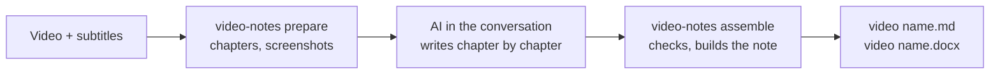

# video-notes

[中文](README.md) | **English** | [Magyar](README.hu.md)

Turn a local lecture, course or training video into a **shareable study note with screenshots from the original video** (Markdown and Word).

- The note is written by the AI you talk to in the Claude or Codex app: it explains reasons, mechanisms, conditions, steps and examples in the original teaching order. It is not a summary or a transcript.
- video-notes does the rest: checks the subtitles, finds screen changes, splits chapters, picks candidate screenshots, checks the chapters the AI wrote, and produces Markdown and Word.
- At most 8 key screenshots per chapter, captioned with what they show and the original video time; the note is named after the video and saved next to it.



> Version 0.2. The workflow and its checks are covered by unit tests and real video clips; the quality of the text depends on the writing AI and its self-review.

## Contents

1. [Preparation (once)](#preparation-once)
2. [Step 1: Get subtitles](#step-1-get-subtitles)
3. [Step 2: Let the AI write the notes](#step-2-let-the-ai-write-the-notes)
4. [Step 3: Get the notes](#step-3-get-the-notes)
5. [FAQ](#faq)
6. [Advanced](#advanced)
7. [Development and tests](#development-and-tests)

---

## Preparation (once)

1. Install Python 3.10+, FFmpeg and git. On Windows run `winget install Python.Python.3.12`, `winget install Gyan.FFmpeg` and `winget install Git.Git` (without git you can download the ZIP from the GitHub page and unpack it).
2. Install video-notes:

   ```bash
   git clone https://github.com/songyang8964/video-notes.git
   cd video-notes
   powershell -ExecutionPolicy Bypass -File install.ps1 -AddToPath   # macOS/Linux: sh install.sh
   ```

3. **Quit and reopen** the Claude or Codex app completely so that it finds the newly installed `video-notes` command.
4. Optional: run `video-notes doctor` in a terminal to check that FFmpeg, pandoc (for Word) and the rest are ready.

---

## Step 1: Get subtitles

If you already have subtitles with the **same name** as the video (for example `course.srt` next to `course.mp4`), skip to step 2.

Without subtitles, Google Colab's free T4 GPU is recommended (without an NVIDIA GPU, recognising a 2-hour video locally can take hours):

1. (Recommended) Extract only the audio locally; the file is small and uploads quickly. Keep the same file name as the video:

   ```bash
   ffmpeg -i "course.mp4" -vn -ac 1 -c:a aac -b:a 64k "course.m4a"
   ```

2. Open the [Colab subtitle notebook](https://colab.research.google.com/github/songyang8964/video-notes/blob/main/colab/whisperx_for_uploading_file.ipynb). You can also open it in Colab by hand: **File → Open notebook → GitHub**:

   

   Type `songyang8964` in the search box, choose the repository `songyang8964/video-notes` and open `colab/whisperx_for_uploading_file.ipynb`:

   

3. Choose **Runtime → Change runtime type**, select **T4 GPU** and click **Save**:

   

4. Click the folder icon on the left and drag the audio (or video) file there to upload it.
5. Optional: in the first cell, write the course's technical terms into **Initial prompt** to improve recognition.
6. Choose **Runtime → Run all**. When it finishes, the browser downloads a `.srt` with the same name as the uploaded file (if the browser asks whether to allow several downloads, allow it).
7. Put `course.srt` next to `course.mp4`.

You can also skip Colab: install local speech recognition (`pip install faster-whisper` or WhisperX) and step 2 transcribes automatically, though it is slow without a GPU.

---

## Step 2: Let the AI write the notes

1. Open **Claude desktop → Code**, or the **Codex desktop app**, and choose the folder that holds the video.
2. Send the AI this text as it is:

   ```text
   Use video-notes to turn the video in this folder into notes: run video-notes prepare, read the brief instructions it prints, write topics.csv, knowledge.csv, chapter.md and review.md for each chapter following its brief.md, then run video-notes assemble until every check passes.
   ```

3. The AI first splits the chapters and captures screenshots, then writes and self-reviews each chapter, and finally checks everything and builds the note. Long videos can be done over several conversations: the chapters already written are kept; in a new conversation say "continue the unfinished chapters, then run video-notes assemble".

---

## Step 3: Get the notes

```
<folder of the video>/
  <video name>.md          Markdown note
  <video name>.docx        Word note (images embedded, can be sent on its own)
  <video name>_assets/     screenshots used by the Markdown
```

- The original video and subtitles are never modified.
- A `.work` folder (cache and intermediate files) also appears next to the video; it can be deleted once the note is done.
- If you edited the previously generated note, building it again **does not overwrite** it; the new result is saved with a timestamp.

---

## FAQ

- **`video-notes` is not found**: it was installed without `-AddToPath`, or the terminal / app was opened before the installation. Open a new terminal, or quit and reopen the Claude / Codex app completely.
- **`assemble` did not pass**: the reasons are in `check.md` in the brief folder (for example a subtitle line without a section, a missing important knowledge item, text that is too brief). Ask the AI to fix those chapters and run `assemble` again.
- **I corrected the subtitles or the video context**: run `video-notes prepare` again first. Chapters already written are kept; affected chapters are flagged and the AI has to re-check them.
- **It was interrupted**: run the same command again; finished work is not lost.
- **How long does it take**: the first `prepare` takes roughly a fifth to a third of the video's length; later runs use a cache. Writing happens in the conversation and uses the conversation's own quota, roughly in proportion to the video's length; for videos over two hours, use several conversations.
- **I want notes in English or another language**: `video-notes setup --language English`, or set `note_language` in the video context (see "Advanced").

---

## Advanced

### Video context (optional)

Put a `<video name>.context.md` next to the video with the course's background, terms and what to leave out; the AI uses it for every chapter:

```markdown
---
title: Introduction to distributed systems (lecture 3)
note_language: English
include_times: 00:12:30, 00:41:05.500
forbid: the speaker, this video
---
This lecture is about consensus algorithms. Write the terms as Raft, Paxos, Leader.
"rafting" in the subtitles is a recognition error for Raft. The equipment check before the lecture is off topic.
```

| Field | Purpose |
| --- | --- |
| `title` | Note title (default: the video file name) |
| `note_language` | Note language for this video (overrides `setup --language`) |
| `language` | Preferred subtitle language; passed to speech recognition when there are no subtitles |
| `include_times` | Screen times that must become candidates, comma separated, `HH:MM:SS(.mmm)` or seconds |
| `forbid` | Words that must not appear in the text, comma separated (checked by the program) |
| `asr_preset` | Term hints for local transcription (currently `networking`) |

### Running it in a terminal

```bash
video-notes                          # same as prepare: processes the only .mp4 in the folder
video-notes prepare "course.mp4" --srt "subs.srt" --context background.md
video-notes assemble "course.mp4"    # after all chapters are written
video-notes assemble "course.mp4" --output D:\notes   # write to another folder
```

When `prepare` finishes it shows the brief folder (`briefs/` inside `.work`): its `README.md` lists all chapters, and each chapter has a subfolder whose `brief.md` contains the writing rules, the chapter's subtitles and the candidate screenshots. The writer puts four files in the same subfolder:

| File | Content |
| --- | --- |
| `topics.csv` | Consecutive topics by meaning, covering every subtitle line of the chapter; off-topic parts marked excluded with a reason |
| `knowledge.csv` | Fine-grained knowledge inventory: definitions, mechanisms, conditions, reasons, examples, commands, steps, risks, Q&A |
| `chapter.md` | The chapter text; images as `[[frame:frame ID\|caption]]` placeholders, ending with the knowledge map |
| `review.md` | Self-review record: what was checked on the original for every image, where every important item is explained |

### Quality checks

`assemble` runs these checks on every chapter; if any fails, no note is built:

| Check | Rule |
| --- | --- |
| Full subtitle coverage | Every subtitle line belongs to exactly one section, in order, or is marked excluded with a reason |
| Images | At most 8 per chapter, no repeats; each image only in the section of its topic |
| Knowledge coverage | Every important knowledge item maps to an existing section in the knowledge map, or carries an exclusion reason |
| Level of detail | At least 100 characters per minute of teaching (English counted in words); sections of 1 minute or more at least 50 per minute |
| Writing style | No narration such as "the lecturer mentions" or "in the video", no `forbid` words, no internal IDs such as C01 or frame IDs |
| Self-review record | `review.md` states what was checked on the original for every image and covers every important knowledge item |
| Format | Every chapter has a title; no raw image paths, no unbalanced code blocks; no placeholders left in the note |

The program checks format, coverage and that the self-review record is complete, but it cannot tell whether the technical content is right; that depends on the writing AI comparing carefully with the subtitles and the original images. For important material, spot-check the key chapters yourself, especially commands, addresses and numbers.

### Exit codes

| Exit code | Meaning |
| --- | --- |
| 0 | Success: briefs written, or every chapter passed the checks and the note was written |
| 1 | Dependency or processing failure; or chapters failed the checks (reasons in `briefs/check.md`, no note written) |
| 2 | Ambiguous or invalid input: no video, several videos, file not found, online link, unusable subtitles |
| 130 | Interrupted by the user (progress is kept) |

### Configuration

The config file is `~/.video-notes/config.json` (Windows: `%USERPROFILE%\.video-notes\config.json`); common items can be changed with `video-notes setup`.

| Key | Default | Description |
| --- | --- | --- |
| `output_language` | `中文` | Note language |
| `max_images` | 8 | Maximum images per chapter |
| `shortlist` | 32 | Maximum distinct screens listed in a chapter brief |
| `chapter_minutes` | 10 | Target chapter length (minutes) |
| `parallel_chapters` | 3 | Chapters whose candidate frames are captured at the same time |
| `min_chars_per_minute` | 100 | Minimum level of detail |
| `tesseract` / `ocr_langs` | empty / `eng` | OCR program path and languages (optional, better candidate ranking) |
| `asr_backend` / `asr_model` / `whisperx` | auto / `large-v3` / empty | Local transcription settings |

---

## Development and tests

```bash
python -m unittest discover -s tests -v                    # unit tests
python tests/integration_prepare_assemble.py <folder>      # prepare → written chapters → assemble on a real clip
```

```
src/video_notes/
  cli.py          command line: video discovery, prepare / assemble, setup, doctor, exit codes
  pipeline.py     detection, chapters, briefs, checks and output
  subtitles.py    subtitle candidates and refusal rules, VTT parsing
  transcribe.py   local speech recognition (WhisperX / faster-whisper / openai-whisper)
  detect/         screen-change detection and the decodable end of the picture
  vision/         quality filter, OCR and text novelty, diversity selection
  candidates.py   per-chapter candidate screenshots, reading copies, contact sheets
  render.py       checks, Markdown and Word output
  prompts/        writing rules (rules.md) and the chapter brief template (brief.md)
colab/whisperx_for_uploading_file.ipynb   Colab T4 GPU subtitle notebook
```

Third-party license notices are in [NOTICE](NOTICE).
