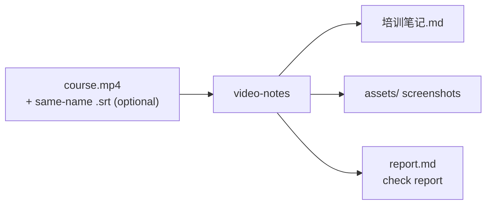
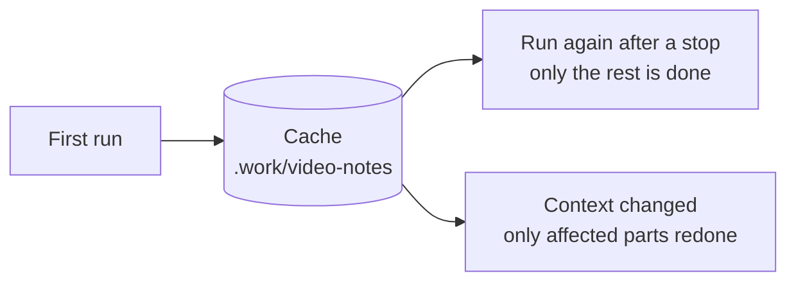
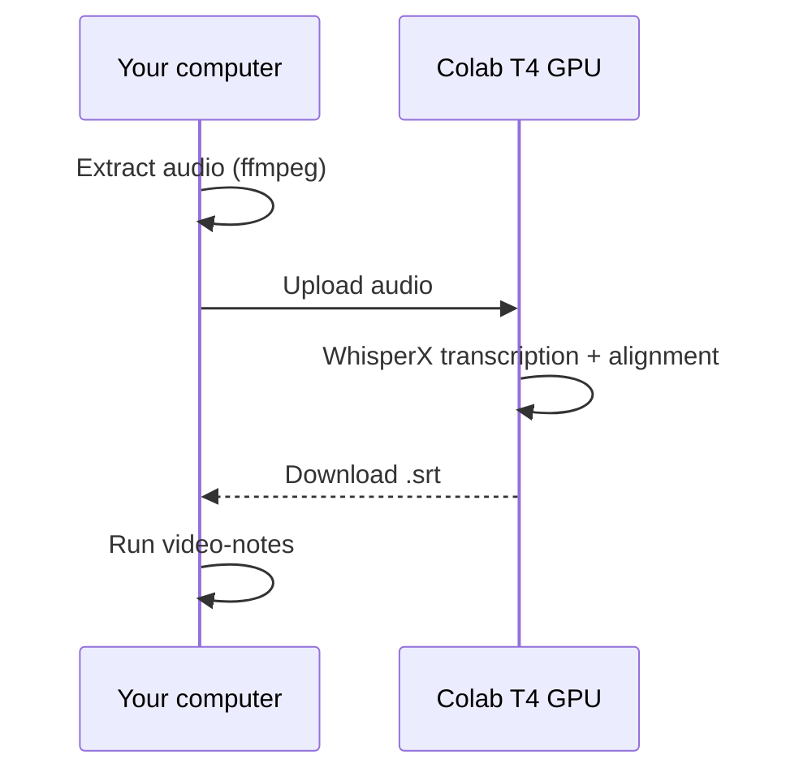
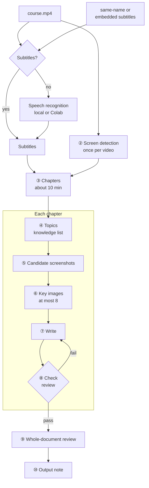
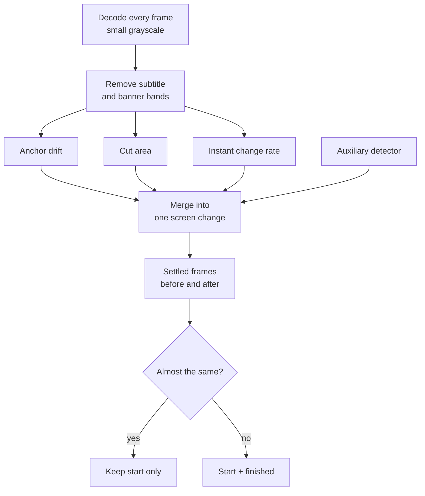
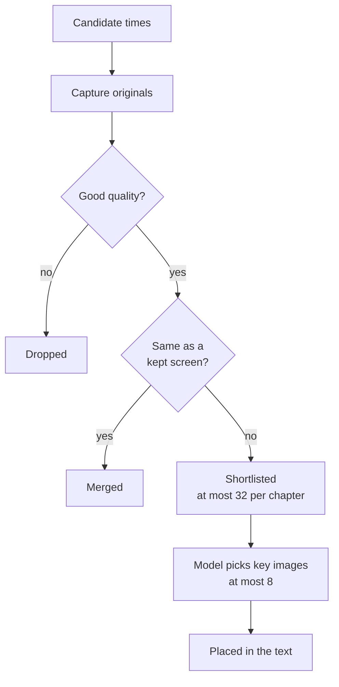
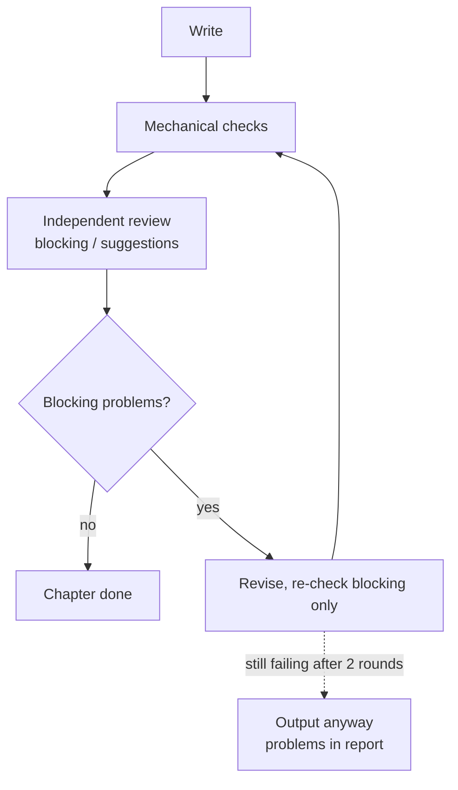

# video-notes

[中文](README.md) | **English** | [Magyar](README.hu.md)

Turns a local lecture, course or training video into a **shareable Markdown study note illustrated with screenshots from the original video**.

- Written in the original teaching order and line of reasoning, fully explaining causes, mechanisms, conditions, steps and examples — not a summary and not a transcript.
- Automatically picks **key screenshots** from the original video (at most 8 per chapter, each slide used once) and places them next to the explanation they support, with captions that describe the picture and give the original video time.
- Corrects obvious speech-recognition errors, removes small talk, meeting logistics and off-topic demos, and never writes "the lecturer mentions…"-style narration.
- Every chapter goes through mechanical checks and an independent review, then the whole document is reviewed once more; an interrupted run resumes where it stopped.

> Version 0.1. The pipeline and its checks are verified with unit tests and real video clips; the quality of the written text depends on the chosen large language model and has not been systematically benchmarked yet.

## Quick start

```bash
# 1. Install (once)
git clone https://github.com/songyang8964/video-notes.git
cd video-notes
powershell -ExecutionPolicy Bypass -File install.ps1 -AddToPath   # macOS/Linux: sh install.sh

# 2. Sign in to one model CLI (once): run `claude` and then /login; or `codex login`
video-notes doctor            # check the environment

# 3. Every time: go to the folder with the video (and a same-name .srt)
cd D:\course
video-notes                   # creates output\course\培训笔记.md and the assets folder
```



---

## Contents

1. [Quick start](#quick-start)
2. [Result](#result)
3. [Installation](#installation)
4. [Usage](#usage)
5. [Generating subtitles on a Colab T4 GPU](#generating-subtitles-on-a-colab-t4-gpu)
6. [Video context (optional)](#video-context-optional)
7. [FAQ](#faq)
8. [How it works](#how-it-works)
9. [Quality assurance](#quality-assurance)
10. [Output and internal records](#output-and-internal-records)
11. [Configuration](#configuration)
12. [Time and resources](#time-and-resources)
13. [Development and tests](#development-and-tests)

---

## Result

Run one command in the folder that holds the video and you get:

```
output/<video name>/
  培训笔记.md      ← the complete note, standard Markdown, images referenced by relative paths
  assets/          ← original-resolution screenshots used by the note
```

The whole `output/<video name>/` folder can be copied, zipped or uploaded as is; no image goes missing.

Example note structure:

```markdown
# Course title

## Chapter 1: … (named automatically from the content)

### Topic A
A complete explanation: background → principle → conditions → steps → result → caveats …


*Topology: how the three core devices interconnect (original video 00:02:07.797)*

### Topic B
…
```

---

## Installation

### Requirements

- Python 3.10 or newer
- FFmpeg: `ffmpeg` and `ffprobe` on PATH
- At least one signed-in model command-line tool:
  - [Claude Code](https://docs.anthropic.com/claude-code): after installing, run `claude` once in a terminal and sign in with `/login`
  - or Codex CLI: after installing, run `codex login`

### Using the desktop apps (Claude desktop / Codex desktop)

The tool calls models through a command-line program, but **you do not need to install the CLI separately**: the desktop apps ship the same program and the tool finds it automatically. Search order:

1. the program set with `video-notes setup --claude-path <path>` / `--codex-path <path>`;
2. `claude` / `codex` on the system PATH;
3. the copy bundled with the desktop app:
   - Claude desktop: `%APPDATA%\Claude\claude-code\<version>\claude.exe` (newest version is chosen)
   - Codex desktop: `%LOCALAPPDATA%\OpenAI\Codex\bin\codex.exe`

When no path is set and several versions are found (e.g. one on PATH and one in the desktop app), the **newest version** is used, because older versions may not know current model names. `video-notes doctor` shows which program is used and where it comes from.

Note: the sign-in inside a desktop app is only valid inside that app. When the bundled program is called from a terminal it needs its own sign-in, once:

```bash
"%APPDATA%\Claude\claude-code\<version>\claude.exe"        # then type /login
"%LOCALAPPDATA%\OpenAI\Codex\bin\codex.exe" login
```

#### Using it from a desktop-app conversation (agent mode, recommended)

In a Claude desktop or Codex desktop conversation, let the AI in the conversation read the subtitles, look at the images and write **itself**; `video-notes` only does the steps that need no model (detection, chapters, screenshots, mechanical checks, assembly). No `claude` / `codex` CLI is started, no separate sign-in is needed, and the same subtitles and images are not sent to a model again and again.

1. Open **Claude desktop → Code**, or the **Codex desktop app**, and choose the folder that holds the video as the working folder.
2. Type in the conversation, for example:

   ```text
   Use video-notes agent mode to turn the video in this folder into notes: run video-notes prepare, write topics.csv, knowledge.csv, chapter.md and review.md for each chapter following its brief.md, then run video-notes assemble until every check passes.
   ```

3. The AI completes the chapters one by one and gives you the note's path.

Notes:

- Do not ask the AI in the conversation to run `video-notes` (automatic mode) and watch its progress: the conversation and the CLI would both use your quota and the same content would be processed twice. For unattended runs, run `video-notes` in your own terminal.
- Long videos can be done over several conversations: the briefs and the chapters already written stay in the work folder, and `assemble` names the chapters that are missing or fail the checks.

Optional:

- Tesseract OCR: improves candidate ranking (most useful for terminals, code and tables)
- Local speech recognition (only needed without subtitles and without Colab): `pip install faster-whisper`, or install WhisperX

### Installation steps

```bash
git clone https://github.com/songyang8964/video-notes.git
cd video-notes
```

Windows (PowerShell):

```powershell
powershell -ExecutionPolicy Bypass -File install.ps1 -AddToPath
```

`-AddToPath` adds the tool to your user PATH so `video-notes` works in any folder (open a new terminal afterwards). Without it the tool is only installed into this folder's `.venv`.

macOS / Linux:

```bash
sh install.sh
```

Add `.venv/bin` to PATH as instructed.

### First-time setup

```bash
video-notes setup --backend claude       # or codex
video-notes setup --model claude-opus-5-5 --effort medium   # optional: model and reasoning effort of the current backend
video-notes setup --language English     # note language, default 中文 (Chinese)
video-notes setup --tesseract "C:\Program Files\Tesseract-OCR\tesseract.exe" --ocr-langs eng+chi_sim   # optional
video-notes doctor                        # check the environment, including a real model sign-in test
```

Default models (used when nothing is set):

| Backend | Model | Reasoning effort |
| --- | --- | --- |
| `claude` (Claude Code / Claude desktop) | `claude-opus-5-5` (Claude Opus 5.5) | `medium` |
| `codex` (Codex CLI / Codex desktop) | `gpt-6.1-sol` (GPT sol 6.1) | `medium` |

Each backend remembers its own model and effort, so switching backends keeps both settings. After changing the model or effort, previously cached model results are not reused (the cache key includes model and effort).

`doctor` reports: FFmpeg, Python dependencies, whether the model CLI is installed and signed in, OCR, speech-recognition backends, and the config file location. If something required is missing it exits non-zero and says how to fix it.

---

## Usage

1. Put the video in a folder (with subtitles, put the `.srt` with the same name next to it).
2. Open a terminal in that folder and run:

```bash
video-notes                         # processes the only .mp4 in the folder
video-notes "course.mp4"            # choose one when there are several videos
video-notes "course.mp4" --srt "subs.srt"
video-notes "course.mp4" --backend codex          # use the other model this time
video-notes "course.mp4" --output D:\notes        # output root (default ./output)
video-notes "course.mp4" --context background.md  # video context file
video-notes "course.mp4" --fallback-backend codex  # continue with Codex when Claude reaches its usage limit
```

3. Progress is shown in the terminal (stderr); the last line (stdout) is the path of the note.
4. After an interruption (Ctrl+C, network loss, usage limit, shutdown) **run the same command again** to resume: screen detection, screenshots and every model call are cached, so nothing is recomputed or billed twice.

How resuming works:



Every model call is cached by a hash of "prompt text + image content": unchanged input reuses the previous result; changed input (for example an edited video context) triggers a new call.

Rules:

- Without a video argument only top-level `.mp4` files in the current folder are considered (case-insensitive), sub-folders are not searched; with no video or several videos the tool explains and exits instead of guessing.
- Online links (http/https) are not supported yet; download the video first.
- The original video and subtitles are read-only and never modified.
- If you edited the previously generated `培训笔记.md` by hand, a new run **does not overwrite** it; the new result is saved as `培训笔记.<time>.md`.

### Agent mode: prepare / assemble

```bash
video-notes prepare "course.mp4"    # checks, chapters, candidate screenshots; one brief.md per chapter (no model calls)
video-notes assemble "course.mp4"   # the same mechanical checks as automatic mode; assembles only if all pass (no model calls)
```

- `prepare` writes each chapter's brief to `agent/Cnn/brief.md` in the work folder: the general writing rules, the chapter's subtitles, the candidate table (time, subtitles shown meanwhile, original image path) and contact sheets.
- The writer (the AI in a conversation, or a person) writes `topics.csv`, `knowledge.csv` and `chapter.md` in the same folder (same format as automatic mode), plus a self-review record `review.md`: what was checked against the original for every inserted image, and where every important knowledge item is explained.
- When `assemble` fails it writes each chapter's problems to `agent/check.md` and outputs nothing; fix them and run it again.

### Exit codes

| Exit code | Meaning |
| --- | --- |
| 0 | Success, every chapter passed the checks and the review |
| 1 | Dependency, model or processing failure; or the note was written but some chapters did not pass review (see the report) |
| 2 | Ambiguous or invalid input: no video, several videos, missing file, online link, subtitle refused |
| 130 | Interrupted by the user (progress saved) |

---

## Generating subtitles on a Colab T4 GPU

Without a local NVIDIA GPU, local speech recognition for a 2-hour video can take hours. Google Colab's free T4 GPU is recommended:



1. (Recommended) Extract only the audio locally — small and quick to upload — keeping the video's file name:

   ```bash
   ffmpeg -i "course.mp4" -vn -ac 1 -c:a aac -b:a 64k "course.m4a"
   ```

2. Open [`colab/transcribe.ipynb`](colab/transcribe.ipynb) from this repository in Colab (Colab → File → Open notebook → GitHub, or upload the file).
3. Menu **Runtime → Change runtime type → T4 GPU**.
4. Choose the source in the "parameters" cell:
   - `SOURCE = 'upload'`: pick a file from your computer when the cell runs; the SRT is downloaded automatically at the end;
   - `SOURCE = 'drive'`: read a file from Google Drive; the SRT is written to the same folder (with the Google Drive desktop client it can sync straight next to your local video).
   Optionally fill in `INITIAL_PROMPT` (domain terms) and `LANGUAGE`.
5. Run all cells from top to bottom. The notebook uses WhisperX: transcription first (large-v3 by default), then word-level alignment, finally an `.srt` with the same name as the input.
6. Put `course.srt` next to your local `course.mp4` and run `video-notes`.

Note: WhisperX uses NVIDIA GPUs; a TPU runtime does not speed it up, because it actually runs on the CPU there.

---

## Video context (optional)

Put a `<video name>.context.md` next to the video (or `video-notes.context.md` in the current folder, or pass `--context`) describing the course. Every model step uses it. Without it the model infers subject, scope and terminology from the subtitles.

```markdown
---
title: Introduction to Distributed Systems (lecture 3)
language: en
include_times: 00:12:30, 00:41:05.500
forbid: the speaker, this video
asr_preset: networking
---
This lecture is about consensus algorithms. Write the terms as Raft, Paxos, Leader.
"rafting" in the subtitles is a recognition error for Raft.
Equipment setup in the first ten minutes and sign-up questions after class are off-topic.
```

| Field | Purpose |
| --- | --- |
| `title` | Note title (default: the video file name) |
| `language` | Subtitle language preference (chooses among same-name subtitles; passed to speech recognition) |
| `include_times` | Screen times that must become candidates, comma-separated, `HH:MM:SS(.mmm)` or seconds |
| `forbid` | Words that must not appear in the text, comma-separated (mechanically checked) |
| `asr_preset` | Vocabulary preset for local transcription (currently `networking`); or write the prompt directly with `asr_prompt` |

The body (after `---`) is free text: subject, scope, confirmed terms and common recognition errors, content to exclude.

---

## FAQ

**I want to use the desktop app, not install a CLI**: just run `video-notes doctor`; the tool finds the program bundled with the desktop app. If it says you are not signed in, sign in once with the commands in [Using the desktop apps](#using-the-desktop-apps-claude-desktop--codex-desktop).

**`doctor` says the model is "not usable" / sign-in expired**: run `claude` and `/login` (or `codex login`) in a terminal, then run `video-notes` again; it resumes where it stopped.

**"Several videos found"**: the folder contains more than one `.mp4`; name one: `video-notes "file.mp4"`.

**Subtitle refused**: read the reason in the terminal (too few cues, low coverage, wrong length, rolling captions). Use the right subtitle, or delete it to let the tool transcribe.

**A chapter's review shows REVISE**: the note is still generated. Read `.work/video-notes/…/<chapter>/review.md` and edit the note by hand if needed; a new run will not overwrite your edits.

**Small text in a screenshot is hard to read**: `assets/` holds original-resolution screenshots. If a key screen was not chosen, add its time to `include_times` in the video context and run again (only the affected parts are redone).

**The note is not in my language**: `video-notes setup --language English`, or set `output_language` in the config.

---

## How it works

The whole pipeline is orchestrated locally. Only "understanding the content, choosing images, writing and reviewing" call a large language model (Claude Code CLI or Codex CLI, using your own signed-in account).



Steps marked "model" call a large language model; everything else is local processing (FFmpeg, PyAV, image processing).

### 1. Subtitle choice and transcription

The tool finds "the dialogue that really belongs to this video":

- Candidate sources, in order: the file given with `--srt`; `.srt` / `.vtt` files with the same name as the video (e.g. `course.srt`, `course.en.vtt`); text subtitle tracks embedded in the video. Same-name subtitles are ranked by language: requested language → untagged → other languages.
- These subtitles are refused, with the reason recorded: fewer than 5 cues; covering less than 30% of the running time (usually a "forced" track that only translates foreign-language moments); times far beyond the video length (made for a different edit); more than 30% of cues starting with the previous cue's text (rolling auto-captions that were not de-duplicated).
- WebVTT rolling captions are de-duplicated while parsing (each cue repeats the previous one).
- A subtitle given with `--srt` is an explicit demand: if it fails the checks the run stops instead of silently using something else.
- If no usable subtitle exists, speech is transcribed locally (WhisperX → faster-whisper → openai-whisper, whichever is installed). Without an NVIDIA GPU local transcription is slow; use a [Colab T4 GPU](#generating-subtitles-on-a-colab-t4-gpu) instead.

### 2. Screen-change detection

The core visuals of a lecture are slides, diagrams, code and terminals. Detection answers one question only: **when does the picture change?**

- **Overlay bands are excluded**: the change frequency of every pixel row is measured first. Bands at the top or bottom edge that change far more often than the body (burned-in subtitles, scrolling banners) are excluded; otherwise every new subtitle line would look like a new slide.
- **Three signals** (measured per frame on low-resolution grayscale):
  - *Anchor drift*: average difference between the current frame and "the last settled screen" — catches a board that fills up gradually or code that appears line by line;
  - *Cut area*: share of pixels that changed sharply between neighbouring frames — catches slide changes and cuts;
  - *Instant change rate*: average difference between neighbouring frames — detects motion and also decides "the picture has settled, it can be captured".
- **Auxiliary detector**: an optional PySceneDetect adaptive pass adds more cut times.
- **Events and capture points**: signal peaks within 0.5 s are merged into one "screen change". For each change two settled frames are found: before the change (the **finished state** of the old screen) and after it (the **start** of the new screen). If a screen's start and finished state are nearly identical (SSIM ≥ 0.93), only the start is kept — e.g. a static slide; if they differ clearly, both are kept — e.g. a diagram that builds up step by step, or a command that has been typed.
- **Frame rate from real timestamps**: screen recordings often have variable frame rates (nominally 60 fps, actually about 15 fps). All times use the real timestamps.
Detection flow:



Which screenshots a slide change produces (a slide whose bullet points appear one by one):

| Moment | On screen | Screenshot |
| --- | --- | --- |
| Slide A appears | title only | ① A start |
| Points appear one by one | change builds up slowly, not a new slide | — |
| Just before the slide change | all points shown | ② A finished |
| Settled after the change | slide B | ③ B start |

- ① and ② differ clearly, so both become candidates; the model usually picks the more complete ②.
- If A is a static slide, ① and ② are almost identical and only ① is kept.
- If A stays on screen for a long time, a "heartbeat" screenshot is added every 20 seconds so small changes are not missed.

- **Performance**: the whole video is decoded twice for measurement and once for the auxiliary detector; all start/finished comparisons happen in **one sequential decode** rather than thousands of random seeks. Results are cached and reused per chapter.

### 3. Chapters

The target is about 10 minutes per chapter (configurable). Within the last quarter of each window the cut is made at the subtitle boundary with the **longest pause**, preferably **close to a screen change**, so a topic is not split in the middle.

### 4. Topics and knowledge inventory

The model reads the chapter's subtitles (plus a few lines before and after as context) and does two things:

- assigns every subtitle line to a **topic**, or marks it as off-topic with a reason; nothing may be missing, overlapping or out of order (checked by the program; invalid output must be redone);
- builds a fine-grained **knowledge inventory**: definitions, mechanisms, conditions, causes, comparisons, examples, commands, configuration steps, verification results, risks, rollbacks and valuable Q&A, each marked important or supporting.

### 5. Candidate screenshots

- Candidate times come from: start and finished frames of screen changes; a sample every 20 seconds inside long unchanged screens (to catch small changes such as one more line in a terminal); required times from the video context; extra times requested by the model.
- Every candidate is **captured from the original video at full resolution using the real timestamp**, and the actual frame time is recorded.
- **Quality filter**: frames that are too dark, too bright, blurry (low Laplacian variance, e.g. fades) or almost blank are removed, with the reason recorded.
- **OCR (optional, needs Tesseract)**: the content area and the subtitle band are recognised separately to compute "text novelty": new content text that persists scores high; text that flashes by or subtitle changes score low.
- **Merging duplicate screens**: candidates are compared as 320×180 grayscale images; if fewer than 1% of pixels changed clearly they are the same screen and only one is kept (preferring required times, then the finished state). Slides that were flipped past in about a second are kept too. All distinct screens go to the model; only when a chapter has more than 32 does a diversity selection (change strength, text novelty, sharpness, similarity to frames already chosen, spread over time) trim it to 32. Frames the model requests are added on top of the existing candidates.
- Each candidate carries **what was said while that screen was displayed** (a range of subtitle numbers), so the model can judge whether picture and text match.
- The model looks at 1280-pixel reading copies to save usage; writing and review use the originals so commands and numbers stay legible.



### 6. Choosing key images

The model looks at every candidate together with the topics and the matching speech and picks key images for the **whole chapter**:

- only structure diagrams, flowcharts, comparisons, tables, key commands or results that the reader needs;
- one image per slide, the most complete one (usually the finished state); no title pages, tables of contents, text-only slides or speaker-only shots;
- at most 8 per chapter, a chapter may have none; each image belongs to the topic it explains;
- important information in images that were not chosen (numbers, configuration, relationships) is handed to the writing step to be expressed in text;
- if the speech clearly refers to a key screen that is missing from the candidates, the model may request up to 3 extra moments; they are captured and judged once more.

### 7. Writing

The model writes the chapter in the original teaching order from the subtitles, the knowledge inventory and the chosen original images: one section per topic, images next to the matching explanation; off-topic material is only recorded in internal comments with the reason.

### 8. Checks, review and revision

See [Quality assurance](#quality-assurance). The review sorts problems into "blocking" (wrong facts, numbers or commands, missing important knowledge, image/text mismatch, unsupported inference, narration) and "suggestions" (wording). Only blocking problems or failed mechanical checks trigger a revision; after a revision only the previous blocking problems and anything the revision introduced are re-checked, at most 2 rounds.

### 9. Whole-document review

After all chapters are done the model reads the whole document and checks transitions between chapters, consistency of terms and coverage of the important knowledge. This pass sees no images, so it must not ask to "unify" numbers: different availability zones, devices or examples may legitimately use different values. Repeated images are handled while writing: every chapter's writing and review get the list of images already inserted in earlier chapters. Problems are fixed per chapter; a revised chapter must still pass the mechanical checks, otherwise the previous version is kept and the event is recorded in the report.

### 10. Output

Everything is assembled into one Markdown file, chosen original images are copied to `assets/`, captions get the original video time, and an internal report `report.md` is written.

---

## Quality assurance

### Mechanical checks (after every chapter; failing chapters go back for revision)

| Check | Rule |
| --- | --- |
| Full subtitle coverage | Every subtitle line belongs to exactly one section, in order, or is marked excluded with a reason; nothing missing, repeated or out of order |
| Image count | At most 8 per chapter (configurable), no image inserted twice |
| Image placement | Each image appears only in the section of its own topic; image IDs must exist |
| Knowledge coverage | Every important knowledge item must map to an existing section in the "knowledge map", or carry an exclusion reason |
| Level of detail | Text characters (excluding headings, code blocks and images) ≥ 100 per minute of teaching (configurable); sections covering at least 1 minute ≥ 50 per minute. Stops chapters written as summaries |
| Writing style | No narration such as "the lecturer / speaker / the video mentions / according to the subtitles", nor any `forbid` word from the context |
| Internal IDs | No internal IDs such as C01, Chapter 8 or frame IDs in the text; refer to earlier sections by their title |
| Format | Every chapter has a title; no raw image paths, no unbalanced code blocks; no placeholders left after assembly |

The per-chapter check-and-revise loop:



### Model review

- **Independent per-chapter review**: the reviewer gets the subtitles, knowledge inventory, chosen original images, the list of images already inserted in earlier chapters and the draft, and sorts problems into blocking and suggestions: is important knowledge fully explained (a keyword is not enough), do facts and numbers match the subtitles and images, does every image support the neighbouring text, are image rules broken (including repeats across chapters), is there narration or off-topic material.
- **Re-check**: after a revision only the previous blocking problems and errors the revision introduced are checked; there is no fresh full review, which used to keep producing new wording remarks forever.
- **Whole-document review**: chapter transitions, consistency of terms, coverage of important knowledge.

### Limitations

- Reviews are also done by a large language model. They catch obvious omissions, errors and formatting problems but are not a substitute for human checking.
- "Is this image really essential" and "was this recognition error corrected properly" ultimately rely on the model; for important material, spot-check the chapters flagged in `report.md`.
- Agent mode has no independent reviewer: `assemble` can only verify what a program can check and that `review.md` records a check for every image and every important knowledge item; whether those checks were really done depends on the writer.

---

## Output and internal records

```
<current folder>/
  output/<video name>/培训笔记.md  + assets/      ← for sharing
  .work/video-notes/<hash>/                       ← internal records, can be deleted (loses the resume cache)
    source.json            input hashes, subtitle source and why it was chosen, model
    detect/                screen-detection signals and result cache
    C01/ C02/ ...          per chapter: topics, knowledge inventory, candidates and reasons, image choice, draft, review, checkpoint
    agent/                 agent mode: brief.md per chapter, the files the agent wrote, check.md
    model-calls/           full prompt, response, log and real token usage of every model call
    global-review.csv      problems found by the whole-document review
    report.md              run report: per-chapter review results, unresolved problems, degradations, calls, tokens, time
```

On Windows, when the video's folder path is very deep (for example a meeting app's recording folder), internal records go to `%USERPROFILE%\.video-notes\work\<hash>` so that paths stay under the 260-character limit. Only one run at a time may use a work folder.

`report.md` lists degradations explicitly, e.g. OCR not installed, automatic transcription used, subtitle health problems, the picture decodes only up to some point, a whole-document revision rejected by the checks.

---

## Configuration

The config file is `~/.video-notes/config.json` (Windows: `%USERPROFILE%\.video-notes\config.json`; the old location `%APPDATA%\video-notes\config.json` is still read). It is not under AppData because desktop apps such as Claude and Codex desktop redirect AppData to a private folder each, so runs started from different apps would see different settings. Common items can be changed with `video-notes setup`; edit the JSON for the rest.

| Key | Default | Description |
| --- | --- | --- |
| `backend` | `claude` | Model backend: `claude` or `codex` |
| `claude_model` / `claude_effort` | `claude-opus-5-5` / `medium` | Model and reasoning effort of the Claude backend (low, medium, high, xhigh, max) |
| `codex_model` / `codex_effort` | `gpt-6.1-sol` / `medium` | Model and reasoning effort of the Codex backend (minimal, low, medium, high) |
| `claude_path` / `codex_path` | empty | Explicit CLI path (empty = PATH first, then the desktop app's bundled copy) |
| `output_language` | `中文` | Note language |
| `max_images` | 8 | Maximum images per chapter |
| `shortlist` | 32 | Maximum distinct screens shown to the model per chapter (trimmed only above that) |
| `chapter_minutes` | 10 | Target chapter length (minutes) |
| `use_adaptive` | true | Use the PySceneDetect auxiliary detector (better recall, a bit slower) |
| `review_cycles` | 2 | Maximum "revise → re-check" rounds after the first review |
| `parallel_chapters` | 3 | Chapters processed at the same time |
| `fallback_backend` | empty | Backend that takes over on a usage limit (`claude` or `codex`); checked for usability when a run starts |
| `min_chars_per_minute` | 100 | Level-of-detail floor |
| `tesseract` / `ocr_langs` | empty / `eng` | OCR program path and languages |
| `asr_backend` / `asr_model` / `whisperx` | auto / `large-v3` / empty | Local transcription settings |

---

## Time and resources

Example: a roughly 2 h 40 min, 1080p screen recording with subtitles (ordinary laptop CPU):

| Stage | Time |
| --- | --- |
| Signal measurement (two decodes) | about 10 minutes |
| Auxiliary detector (one decode) | about 20 minutes |
| Start/finished comparison (one sequential decode) | about 10 minutes |
| Candidate capture and filtering | fifteen minutes to half an hour, depending on the number of screen changes |
| Model calls (about 5–8 per chapter plus one whole-document review) | several hours, depending on model speed and usage limits |

- Screen detection runs only on the first run; afterwards the cache is reused completely.
- 3 chapters run in parallel by default; every model call loads only the image-reading tool and a short system prompt, and `report.md` records the real token usage. After an interruption completed calls are not repeated (results of both backends are reused).
- Memory: detection streams frame by frame, so memory use does not grow with video length. Close other memory-hungry programs to avoid decode failures from low memory (the tool retries and records them in the report).

---

## Development and tests

```bash
python -m unittest tests.test_video_notes -v      # unit tests: subtitle parsing and choice, chapters, check rules, algorithms, output protection
python tests/integration_scripted.py <folder>      # run the full pipeline on a real clip with a scripted model (no real model calls)
python tests/integration_agent_mode.py <folder>    # agent mode: prepare → scripted chapters → assemble (no model calls)
```

Source layout:

```
src/video_notes/
  cli.py          command line: video discovery, arguments, setup, doctor, exit codes
  pipeline.py     orchestration, chapters, image choice, writing, review, whole-document review, output protection
  subtitles.py    subtitle candidates and refusal rules, VTT parsing
  transcribe.py   local speech recognition (WhisperX / faster-whisper / openai-whisper)
  detect/         screen-change detection (overlay band, three signals, events, start/finished pairs)
  vision/         quality filter, OCR and text novelty, diversity selection
  candidates.py   per-chapter candidates, reading copies, contact sheets
  llm.py          model backends (Claude Code CLI / Codex CLI), desktop-app discovery, cache, retries, sign-in check
  render.py       mechanical checks and assembly
  config.py       configuration and video context
  checkpoint.py   per-chapter checkpoints (content hashes) for safe resumed review and handoffs
  prompts/        prompts for each stage (general rules, topics, image choice, writing, review, re-check, revision, whole-document review, agent brief)
colab/transcribe.ipynb   Colab T4 GPU subtitle notebook
```

Third-party license notices are in [NOTICE](NOTICE).
