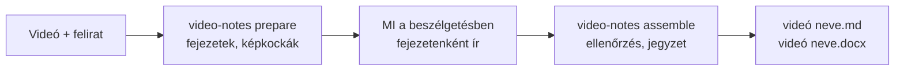

# video-notes

[中文](README.md) | [English](README.en.md) | **Magyar**

Helyi előadás-, kurzus- vagy képzésvideóból **megosztható tanulási jegyzetet készít az eredeti videó képkockáival** (Markdown és Word változatban).

- A jegyzetet a Claude vagy Codex alkalmazásban veled beszélgető MI írja: az eredeti magyarázat sorrendjében fejti ki az okokat, működést, feltételeket, lépéseket és példákat. Nem összefoglaló és nem leirat.
- A video-notes végzi a többit: ellenőrzi a feliratot, megkeresi a képernyőváltásokat, fejezetekre bont, jelölt képkockákat választ, ellenőrzi az MI által megírt fejezeteket, és elkészíti a Markdown és Word fájlt.
- Fejezetenként legfeljebb 8 kulcskép, a képaláírás leírja a tartalmukat és az eredeti videóbeli időt; a jegyzet a videóval azonos nevű, és a videó mellé kerül.



> 0.2-es verzió. A folyamatot és az ellenőrzéseket egységtesztek és valódi videórészletek igazolják; a szöveg minősége az író MI-től és az önellenőrzésétől függ.

## Tartalom

1. [Előkészületek (egyszer)](#előkészületek-egyszer)
2. [1. lépés: Felirat készítése](#1-lépés-felirat-készítése)
3. [2. lépés: Az MI megírja a jegyzetet](#2-lépés-az-mi-megírja-a-jegyzetet)
4. [3. lépés: A kész jegyzet](#3-lépés-a-kész-jegyzet)
5. [Gyakori kérdések](#gyakori-kérdések)
6. [Haladó](#haladó)
7. [Fejlesztés és tesztek](#fejlesztés-és-tesztek)

---

## Előkészületek (egyszer)

1. Telepítsd a Python 3.10+, az FFmpeg és a git programot. Windowson futtasd: `winget install Python.Python.3.12`, `winget install Gyan.FFmpeg`, `winget install Git.Git` (git nélkül a GitHub-oldalról letöltheted és kicsomagolhatod a ZIP-et).
2. Telepítsd a video-notes eszközt:

   ```bash
   git clone https://github.com/songyang8964/video-notes.git
   cd video-notes
   powershell -ExecutionPolicy Bypass -File install.ps1 -AddToPath   # macOS/Linux: sh install.sh
   ```

3. **Lépj ki teljesen és nyisd meg újra** a Claude vagy Codex alkalmazást, hogy megtalálja az újonnan telepített `video-notes` parancsot.
4. Opcionális: futtasd terminálban a `video-notes doctor` parancsot, amely ellenőrzi az FFmpeg, a pandoc (a Wordhöz) és a többi összetevő meglétét.

---

## 1. lépés: Felirat készítése

Ha már van a videóval **azonos nevű** felirat (például `kurzus.srt` a `kurzus.mp4` mellett), ugorj a 2. lépésre.

Felirat nélkül a Google Colab ingyenes T4 GPU-ja ajánlott (NVIDIA GPU nélkül egy 2 órás videó helyi felismerése órákig tarthat):

1. (Ajánlott) Helyben csak a hangot bontsd ki; a fájl kicsi, gyorsan feltölthető. Tartsd meg a videó fájlnevét:

   ```bash
   ffmpeg -i "kurzus.mp4" -vn -ac 1 -c:a aac -b:a 64k "kurzus.m4a"
   ```

2. Nyisd meg a [Colab feliratkészítő jegyzetfüzetet](https://colab.research.google.com/github/songyang8964/video-notes/blob/main/colab/whisperx_for_uploading_file.ipynb). Colabban kézzel is megnyithatod: **File → Open notebook → GitHub**:

   

   A keresőmezőbe írd be: `songyang8964`, válaszd a `songyang8964/video-notes` tárolót, és nyisd meg a `colab/whisperx_for_uploading_file.ipynb` fájlt:

   

3. Válaszd a **Runtime → Change runtime type** menüpontot, jelöld ki a **T4 GPU**-t, majd kattints a **Save** gombra:

   

4. Kattints a bal oldali mappa ikonra, és húzd oda a hang- (vagy videó)fájlt a feltöltéshez.
5. Opcionális: az első cella **Initial prompt** mezőjébe írd be a kurzus szakkifejezéseit; ez javítja a felismerést.
6. Válaszd a **Runtime → Run all** menüpontot. A végén a böngésző letölti a feltöltött fájllal azonos nevű `.srt` fájlt (ha a böngésző rákérdez, engedélyezd a több fájl letöltését).
7. Tedd a `kurzus.srt` fájlt a `kurzus.mp4` mellé.

Colab nélkül is megy: telepíts helyi beszédfelismerést (`pip install faster-whisper` vagy WhisperX), és a 2. lépés automatikusan átírja, de GPU nélkül lassú.

---

## 2. lépés: Az MI megírja a jegyzetet

1. Nyisd meg a **Claude asztali → Code** lapot vagy a **Codex asztali alkalmazást**, és válaszd ki a videót tartalmazó mappát.
2. Küldd el az MI-nek változtatás nélkül ezt a szöveget:

   ```text
   Készíts jegyzetet a mappában lévő videóból a video-notes segítségével: futtasd a video-notes prepare parancsot, olvasd el a kiírt csomagleírást, minden fejezethez írd meg a brief.md alapján a topics.csv, knowledge.csv, chapter.md és review.md fájlt, majd futtasd a video-notes assemble parancsot, amíg minden ellenőrzés sikeres.
   ```

3. Az MI először fejezetekre bont és képkockákat rögzít, majd fejezetenként ír és önellenőriz, végül mindent ellenőriz és elkészíti a jegyzetet. Hosszú videó több beszélgetésben is elkészülhet: a már megírt fejezetek megmaradnak; új beszélgetésben mondd: „folytasd a még kész nem lévő fejezeteket, majd futtasd a video-notes assemble parancsot”.

---

## 3. lépés: A kész jegyzet

```
<a videó mappája>/
  <videó neve>.md          Markdown jegyzet
  <videó neve>.docx        Word jegyzet (beágyazott képekkel, önállóan elküldhető)
  <videó neve>_assets/     a Markdown által használt képkockák
```

- Az eredeti videó és felirat soha nem módosul.
- A videó mellett egy `.work` mappa (gyorsítótár és köztes fájlok) is megjelenik; a jegyzet elkészülte után törölhető.
- Ha kézzel módosítottad a korábban készült jegyzetet, az újbóli elkészítés **nem írja felül**; az új eredmény időbélyeges néven kerül mentésre.

---

## Gyakori kérdések

- **A `video-notes` parancs nem található**: a telepítés `-AddToPath` nélkül történt, vagy a terminált / alkalmazást a telepítés előtt nyitottad meg. Nyiss új terminált, vagy lépj ki teljesen a Claude / Codex alkalmazásból, és nyisd meg újra.
- **Az `assemble` nem sikerült**: az okok a csomagmappa `check.md` fájljában vannak (például egy feliratsor nem tartozik szakaszhoz, hiányzik egy fontos tudáselem, túl rövid a szöveg). Kérd meg az MI-t, hogy javítsa azokat a fejezeteket, és futtasd újra az `assemble` parancsot.
- **Javítottam a feliratot vagy a videókontextust**: előbb futtasd újra a `video-notes prepare` parancsot. A már megírt fejezetek megmaradnak; az érintett fejezeteket a program megjelöli, ezeket az MI-nek újra ellenőriznie kell.
- **Megszakadt**: futtasd újra ugyanazt a parancsot; a már elkészült munka nem vész el.
- **Mennyi ideig tart**: az első `prepare` nagyjából a videó hosszának ötöde-harmada; a későbbi futások gyorsítótárat használnak. Az írás a beszélgetésben történik, és a beszélgetés saját keretét fogyasztja, nagyjából a videó hosszával arányosan; két óránál hosszabb videóknál használj több beszélgetést.
- **Angol vagy más nyelvű jegyzetet szeretnék**: `video-notes setup --language English`, vagy add meg a `note_language` értéket a videókontextusban (lásd: „Haladó”).

---

## Haladó

### Videókontextus (opcionális)

Tegyél a videó mellé egy `<videó neve>.context.md` fájlt a kurzus hátterével, szakkifejezéseivel és a kihagyandó részekkel; az MI minden fejezetnél figyelembe veszi:

```markdown
---
title: Bevezetés az elosztott rendszerekbe (3. előadás)
note_language: Magyar
include_times: 00:12:30, 00:41:05.500
forbid: az előadó, ez a videó
---
Az előadás témája a konszenzus-algoritmusok. A fogalmak írásmódja: Raft, Paxos, Leader.
A feliratban szereplő "rafting" a Raft felismerési hibája. Az előadás előtti eszközpróba nem tartozik a témához.
```

| Mező | Szerep |
| --- | --- |
| `title` | A jegyzet címe (alapértelmezés: a videó fájlneve) |
| `note_language` | A jegyzet nyelve ehhez a videóhoz (felülírja a `setup --language` beállítást) |
| `language` | Előnyben részesített feliratnyelv; felirat hiányában a beszédfelismerés is megkapja |
| `include_times` | Képernyőidők, amelyekből jelöltnek kell lennie, vesszővel elválasztva, `HH:MM:SS(.mmm)` vagy másodperc |
| `forbid` | A szövegben tiltott szavak, vesszővel elválasztva (a program ellenőrzi) |
| `asr_preset` | Szakkifejezés-tippek a helyi átíráshoz (jelenleg `networking`) |

### Futtatás terminálból

```bash
video-notes                          # ugyanaz, mint a prepare: a mappában lévő egyetlen .mp4 feldolgozása
video-notes prepare "kurzus.mp4" --srt "felirat.srt" --context hatter.md
video-notes assemble "kurzus.mp4"    # miután minden fejezet elkészült
video-notes assemble "kurzus.mp4" --output D:\jegyzetek   # kimenet másik mappába
```

A `prepare` a végén kiírja a csomagmappa helyét (`briefs/` a `.work` mappán belül): az ottani `README.md` felsorolja a fejezeteket, és minden fejezetnek van egy almappája, amelynek `brief.md` fájlja tartalmazza az írási szabályokat, a fejezet feliratait és a jelölt képkockákat. Az író ugyanabba az almappába négy fájlt ír:

| Fájl | Tartalom |
| --- | --- |
| `topics.csv` | Jelentés szerinti, egymást követő témakörök, a fejezet minden feliratsorát lefedve; a témán kívüli részek indoklással kizártként jelölve |
| `knowledge.csv` | Részletes tudásleltár: definíciók, működés, feltételek, okok, példák, parancsok, lépések, kockázatok, kérdések és válaszok |
| `chapter.md` | A fejezet szövege; a képek `[[frame:képkocka-azonosító\|aláírás]]` helyőrzők, a végén a tudástérkép |
| `review.md` | Önellenőrzési napló: mit ellenőrzött az eredetin minden képnél, hol van kifejtve minden fontos tudáselem |

### Minőségellenőrzés

Az `assemble` minden fejezeten lefuttatja az alábbi ellenőrzéseket; ha bármelyik sikertelen, nem készül jegyzet:

| Ellenőrzés | Szabály |
| --- | --- |
| Teljes feliratlefedettség | Minden feliratsor pontosan egy szakaszhoz tartozik, sorrendben, vagy indoklással kizártként jelölt |
| Képek | Fejezetenként legfeljebb 8, ismétlés nélkül; minden kép csak a saját témakörének szakaszában |
| Tudáslefedettség | Minden fontos tudáselem a tudástérképen egy létező szakaszra mutat, vagy kizárási indoklással rendelkezik |
| Részletesség | Legalább 100 karakter a magyarázat minden percére (angolnál szavakban számolva); a legalább 1 perces szakaszokban legalább 50 percenként |
| Írásmód | Nincs „az előadó megemlíti”, „a videóban” típusú közvetítés, nincsenek `forbid` szavak, sem belső azonosítók, például C01 vagy képkocka-azonosító |
| Önellenőrzési napló | A `review.md` minden képnél leírja, mit ellenőrzött az eredetin, és lefed minden fontos tudáselemet |
| Formátum | Minden fejezetnek van címe; nincs nyers képútvonal, nincs páratlan kódblokk; a jegyzetben nem marad helyőrző |

A program ellenőrzi a formátumot, a lefedettséget és az önellenőrzési napló teljességét, de azt nem tudja megítélni, hogy a szakmai tartalom helyes-e; ez azon múlik, hogy az író MI gondosan összevetette-e a feliratokkal és az eredeti képekkel. Fontos anyagoknál nézd át magad a kulcsfejezeteket, különösen a parancsokat, címeket és számokat.

### Kilépési kódok

| Kilépési kód | Jelentés |
| --- | --- |
| 0 | Sikeres: a csomagok elkészültek, vagy minden fejezet átment az ellenőrzésen és a jegyzet elkészült |
| 1 | Függőségi vagy feldolgozási hiba; vagy fejezetek nem mentek át az ellenőrzésen (okok a `briefs/check.md` fájlban, jegyzet nem készült) |
| 2 | Kétértelmű vagy érvénytelen bemenet: nincs videó, több videó, nem létező fájl, online hivatkozás, használhatatlan felirat |
| 130 | Felhasználói megszakítás (a haladás megmarad) |

### Beállítások

A beállítófájl: `~/.video-notes/config.json` (Windows: `%USERPROFILE%\.video-notes\config.json`); a gyakori elemek a `video-notes setup` paranccsal módosíthatók.

| Kulcs | Alapértelmezés | Leírás |
| --- | --- | --- |
| `output_language` | `中文` | A jegyzet nyelve |
| `max_images` | 8 | Képek maximális száma fejezetenként |
| `shortlist` | 32 | Egy fejezetcsomagban felsorolt különböző képernyők legnagyobb száma |
| `chapter_minutes` | 10 | Célzott fejezethossz (perc) |
| `parallel_chapters` | 3 | Egyszerre rögzített jelöltképű fejezetek száma |
| `min_chars_per_minute` | 100 | A részletesség alsó határa |
| `tesseract` / `ocr_langs` | üres / `eng` | Az OCR program útvonala és nyelvei (opcionális, jobb jelöltrangsor) |
| `asr_backend` / `asr_model` / `whisperx` | automatikus / `large-v3` / üres | Helyi átírás beállításai |

---

## Fejlesztés és tesztek

```bash
python -m unittest discover -s tests -v                    # egységtesztek
python tests/integration_prepare_assemble.py <mappa>       # prepare → megírt fejezetek → assemble valódi videórészleten
```

```
src/video_notes/
  cli.py          parancssor: videókeresés, prepare / assemble, setup, doctor, kilépési kódok
  pipeline.py     felismerés, fejezetek, csomagok, ellenőrzés és kimenet
  subtitles.py    feliratjelöltek és elutasítási szabályok, VTT-feldolgozás
  transcribe.py   helyi beszédfelismerés (WhisperX / faster-whisper / openai-whisper)
  detect/         képernyőváltások felismerése és a kép dekódolható vége
  vision/         minőségszűrés, OCR és szövegújdonság, változatos kiválasztás
  candidates.py   fejezetenkénti jelölt képkockák, olvasási másolatok, áttekintő lapok
  render.py       ellenőrzés, Markdown és Word kimenet
  prompts/        írási szabályok (rules.md) és a fejezetcsomag sablonja (brief.md)
colab/whisperx_for_uploading_file.ipynb   Colab T4 GPU feliratkészítő jegyzetfüzet
```

A harmadik féltől származó licencnyilatkozatok a [NOTICE](NOTICE) fájlban vannak.
