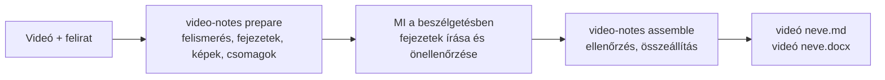

# video-notes

[中文](README.md) | [English](README.en.md) | **Magyar**

Helyi előadás-, kurzus- vagy képzésvideóból **megosztható tanulási jegyzetet készít az eredeti videó képkockáival** (Markdown és Word változatban).

- A jegyzetet a Claude vagy Codex alkalmazásban veled beszélgető MI **maga** írja: a feliratokat egyszer olvassa el, minden képet egyszer néz meg, és az eredeti magyarázat sorrendjében fejti ki az okokat, működést, feltételeket, lépéseket és példákat. Nem összefoglaló és nem leirat.
- Az eszköz végzi az összes munkát, amelyhez nem kell nagy nyelvi modell: feliratellenőrzés, képernyőváltások felismerése, fejezetek, jelölt képkockák és minőségszűrés, gépi ellenőrzés, Markdown és Word kimenet. **Az eszköz maga nem hív modellt**, így a háttérben nem fogyaszt plusz keretet.
- Fejezetenként legfeljebb 8 kulcskép, minden dia csak egyszer, a képaláírás leírja a kép tartalmát és az eredeti videóbeli időt.
- A jegyzet a videóval azonos nevű, és a videó mellé kerül: `<videó neve>.md`, `<videó neve>.docx`, `<videó neve>_assets/`.

> 0.2-es verzió. A folyamatot és az ellenőrzéseket egységtesztek és valódi videórészletek igazolják; a szöveg minősége az író MI-től és az önellenőrzésétől függ.

## Gyors kezdés

Szükséges: Python 3.10+, FFmpeg és git (Windows: futtasd egymás után: `winget install Python.Python.3.12`, `winget install Gyan.FFmpeg`, `winget install Git.Git`; git nélkül a GitHub-oldalról letöltheted és kicsomagolhatod a ZIP-et).

1. Telepítés (egyszer):

```bash
git clone https://github.com/songyang8964/video-notes.git
cd video-notes
powershell -ExecutionPolicy Bypass -File install.ps1 -AddToPath   # macOS/Linux: sh install.sh
```

2. **Lépj ki teljesen és nyisd meg újra** a Claude vagy Codex alkalmazást, hogy megtalálja az újonnan telepített `video-notes` parancsot.
3. Tedd a videót (és opcionálisan az azonos nevű `.srt` feliratot) egy mappába.
4. Nyisd meg a mappát az alkalmazásban (a Claude asztali alkalmazásban a **Code** lapon), és küldd el az MI-nek változtatás nélkül ezt a szöveget:

   ```text
   Készíts jegyzetet a mappában lévő videóból a video-notes segítségével: futtasd a video-notes prepare parancsot, olvasd el a kiírt csomagleírást, minden fejezethez írd meg a brief.md alapján a topics.csv, knowledge.csv, chapter.md és review.md fájlt, majd futtasd a video-notes assemble parancsot, amíg minden ellenőrzés sikeres.
   ```

5. Ha elkészült, a videó mellett megjelenik a `<videó neve>.md` és a `<videó neve>.docx`.



---

## Tartalom

1. [Gyors kezdés](#gyors-kezdés)
2. [Telepítés](#telepítés)
3. [Használat](#használat)
4. [Feliratok készítése Colab T4 GPU-n](#feliratok-készítése-colab-t4-gpu-n)
5. [Videókontextus (opcionális)](#videókontextus-opcionális)
6. [Minőségbiztosítás](#minőségbiztosítás)
7. [Gyakori kérdések](#gyakori-kérdések)
8. [Beállítások](#beállítások)
9. [Fejlesztés és tesztek](#fejlesztés-és-tesztek)

---

## Telepítés

### Követelmények

- Python 3.10 vagy újabb
- FFmpeg: az `ffmpeg` és az `ffprobe` legyen a PATH-ban
- Egy író MI: Claude asztali (Code), Claude Code, vagy a Codex asztali alkalmazás / Codex CLI. Az eszköz nem hívja őket, ezért nem kell hozzá külön bejelentkezés.
- Opcionális: Tesseract OCR (jobb jelöltrangsor, terminálok és táblázatok esetén a leghasznosabb); helyi beszédfelismerés (csak felirat nélkül kell): `pip install faster-whisper` vagy WhisperX

### Telepítési lépések

Windows (PowerShell):

```powershell
powershell -ExecutionPolicy Bypass -File install.ps1 -AddToPath
```

A `-AddToPath` hozzáadja az eszközt a felhasználói PATH-hoz, így a `video-notes` bármely mappában működik (nyiss új terminált). A Word változatot a pandoc készíti, amely az eszközzel együtt települ.

macOS / Linux:

```bash
sh install.sh
```

### Első beállítás

```bash
video-notes setup --language Magyar       # a jegyzet nyelve, alapértelmezés 中文
video-notes setup --tesseract "C:\Program Files\Tesseract-OCR\tesseract.exe" --ocr-langs eng+chi_sim   # opcionális
video-notes doctor                         # ellenőrzi az FFmpeg-et, a Python-függőségeket, a pandocot, az OCR-t és a beszédfelismerést
```

---

## Használat

### A Claude / Codex alkalmazásban (ajánlott)

1. Nyisd meg a **Claude asztali → Code** lapot vagy a **Codex asztali alkalmazást**, és válaszd munkamappának a videót tartalmazó mappát.
2. Küldd el a gyors kezdés 4. lépésében szereplő szöveget.
3. Az MI egymás után elkészíti a fejezeteket, és az `assemble` sikere után megadja a jegyzet útvonalát. Hosszú videó több beszélgetésben is elkészülhet: a csomagok és a már megírt fejezetek megmaradnak; új beszélgetésben mondd: „folytasd a még kész nem lévő fejezeteket, majd futtasd a video-notes assemble parancsot”.

### Terminálból

```bash
video-notes                          # ugyanaz, mint a prepare: a mappában lévő egyetlen .mp4 feldolgozása
video-notes prepare "kurzus.mp4" --srt "felirat.srt" --context hatter.md
video-notes assemble "kurzus.mp4"    # miután minden fejezet elkészült
video-notes assemble "kurzus.mp4" --output D:\jegyzetek   # kimenet másik mappába
```

A `prepare` a végén kiírja a csomagok mappáját (a belső naplók `agent/` mappáját): az ottani `README.md` felsorolja a fejezeteket, és minden fejezetnek van egy `Cnn/` almappája, amelynek `brief.md` fájlja tartalmazza az általános írási szabályokat, a videókontextust, a fejezet feliratait, a jelöltek táblázatát (idő, közben látható feliratok, eredeti kép útvonala) és az áttekintő lapokat. Az író ugyanabba az almappába négy fájlt ír:

| Fájl | Tartalom |
| --- | --- |
| `topics.csv` | Jelentés szerinti, egymást követő témakörök, a fejezet minden feliratsorát lefedve; a témán kívüli részek indoklással kizártként jelölve |
| `knowledge.csv` | Részletes tudásleltár: definíciók, működés, feltételek, okok, példák, parancsok, lépések, kockázatok, kérdések és válaszok |
| `chapter.md` | A fejezet szövege; a képek `[[frame:képkocka-azonosító\|aláírás]]` helyőrzők, a végén a tudástérkép |
| `review.md` | Önellenőrzési napló: mit ellenőrzött az eredetin minden képnél, hol van kifejtve minden fontos tudáselem |

### Kimenet

```
<a videó mappája>/
  <videó neve>.md          Markdown jegyzet
  <videó neve>.docx        Word jegyzet (beágyazott képekkel, önállóan elküldhető)
  <videó neve>_assets/     a Markdown által használt képkockák
```

- Az eredeti videó és felirat csak olvasható, soha nem módosul.
- A videó mellett egy `.work` mappa is megjelenik a képernyőfelismerési gyorsítótárral, a jelölt képkockákkal és a csomagokkal; a jegyzet elkészülte után törölhető (ugyanannak a videónak az újabb feldolgozásakor a képernyőfelismerés ekkor újra lefut).
- Ha kézzel módosítottad a korábban készült jegyzetet, az újabb összeállítás **nem írja felül**; az új eredmény időbélyeges néven kerül mentésre.
- Ha egy Windows-útvonal 260 karakternél hosszabb lenne, a fájlnevek automatikusan rövidülnek, és erről üzenet szól.

### Kilépési kódok

| Kilépési kód | Jelentés |
| --- | --- |
| 0 | Sikeres: a csomagok elkészültek, vagy minden fejezet átment az ellenőrzésen és a jegyzet elkészült |
| 1 | Függőségi vagy feldolgozási hiba; vagy fejezetek nem mentek át az ellenőrzésen (okok az `agent/check.md` fájlban, jegyzet nem készült) |
| 2 | Kétértelmű vagy érvénytelen bemenet: nincs videó, több videó, nem létező fájl, online hivatkozás, használhatatlan felirat |
| 130 | Felhasználói megszakítás (a haladás megmarad) |

---

## Feliratok készítése Colab T4 GPU-n

NVIDIA GPU nélkül egy 2 órás videó helyi beszédfelismerése órákig tarthat. A Google Colab ingyenes T4 GPU-ja ajánlott:

1. (Ajánlott) Helyben csak a hangot bontsd ki; a fájl kicsi, gyorsan feltölthető, és a fájlnév törzse megegyezik a videóéval:

   ```bash
   ffmpeg -i "kurzus.mp4" -vn -ac 1 -c:a aac -b:a 64k "kurzus.m4a"
   ```

2. Nyisd meg Colabban a tároló [`colab/transcribe.ipynb`](colab/transcribe.ipynb) jegyzetfüzetét, és válaszd a **Futtatókörnyezet → Futtatókörnyezet típusának módosítása → T4 GPU** menüpontot.
3. A „paraméterek” cellában válaszd ki a forrást (feltöltés vagy Google Drive), opcionálisan add meg a szakkifejezéseket és a nyelvet, majd futtasd az összes cellát fentről lefelé.
4. Tedd a kapott `kurzus.srt` fájlt a helyi `kurzus.mp4` mellé, és futtasd a `video-notes prepare` parancsot.

---

## Videókontextus (opcionális)

Tegyél a videó mellé egy `<videó neve>.context.md` fájlt (vagy add meg a `--context` kapcsolóval) a kurzus hátterével; ez minden fejezetcsomagba bekerül.

```markdown
---
title: Bevezetés az elosztott rendszerekbe (3. előadás)
note_language: Magyar
include_times: 00:12:30, 00:41:05.500
forbid: az előadó, ez a videó
---
Az előadás témája a konszenzus-algoritmusok. A fogalmak írásmódja: Raft, Paxos, Leader.
A feliratban szereplő "rafting" a Raft felismerési hibája. Az előadás előtti eszközpróba nem tartozik a témához.
```

| Mező | Szerep |
| --- | --- |
| `title` | A jegyzet címe (alapértelmezés: a videó fájlneve) |
| `note_language` | A jegyzet nyelve ehhez a videóhoz (felülírja a `setup --language` beállítást) |
| `language` | Előnyben részesített feliratnyelv; felirat hiányában a beszédfelismerés is megkapja |
| `include_times` | Képernyőidők, amelyekből jelöltnek kell lennie, vesszővel elválasztva, `HH:MM:SS(.mmm)` vagy másodperc |
| `forbid` | A szövegben tiltott szavak, vesszővel elválasztva (a program ellenőrzi) |
| `asr_preset` | Szakkifejezés-tippek a helyi átíráshoz (jelenleg `networking`) |

---

## Minőségbiztosítás

### Gépi ellenőrzések (az `assemble` minden fejezeten lefuttatja; amíg nem mind sikeres, nem készül jegyzet)

| Ellenőrzés | Szabály |
| --- | --- |
| Teljes feliratlefedettség | Minden feliratsor pontosan egy szakaszhoz tartozik, sorrendben, vagy indoklással kizártként jelölt |
| Képek | Fejezetenként legfeljebb 8, ismétlés nélkül; minden kép csak a saját témakörének szakaszában, a képkocka-azonosítóknak létezniük kell |
| Tudáslefedettség | Minden fontos tudáselem a tudástérképen egy létező szakaszra mutat, vagy kizárási indoklással rendelkezik |
| Részletesség | Legalább 100 karakter a magyarázat minden percére (angolnál szavakban számolva); a legalább 1 perces szakaszokban legalább 50 percenként |
| Írásmód | Nincs „az előadó megemlíti”, „a videóban” típusú közvetítés, nincsenek `forbid` szavak, sem belső azonosítók, például C01 vagy képkocka-azonosító |
| Önellenőrzési napló | A `review.md` minden képnél leírja, mit ellenőrzött az eredetin, és lefed minden fontos tudáselemet |
| Formátum | Minden fejezetnek van címe; nincs nyers képútvonal, nincs páratlan kódblokk; az összeállítás után nem marad helyőrző |

### Korlátok

- Nincs független áttekintő: a program ellenőrzi a formátumot, a lefedettséget és az önellenőrzési napló teljességét, de azt nem tudja megítélni, hogy a szakmai tartalom helyes-e; ez azon múlik, hogy az író MI gondosan összevetette-e a feliratokkal és az eredeti képekkel.
- Fontos anyagoknál nézd át magad a kulcsfejezeteket, különösen a parancsokat, címeket és számokat.

---

## Gyakori kérdések

- **A `video-notes` parancs nem található**: a telepítés `-AddToPath` nélkül történt, vagy a terminált / alkalmazást a telepítés előtt nyitottad meg. Nyiss új terminált, vagy lépj ki teljesen a Claude / Codex alkalmazásból, és nyisd meg újra.
- **Az `assemble` nem sikerült**: a fejezetenkénti okok a csomagmappa `check.md` fájljában vannak (például egy feliratsor nem tartozik szakaszhoz, hiányzik egy fontos tudáselem, túl rövid a szöveg, egy képhez hiányzik az önellenőrzési sor). Add oda az MI-nek, javíttasd vele azokat a fejezeteket, és futtasd újra az `assemble` parancsot.
- **Megszakadt**: futtasd újra ugyanazt a parancsot. A képernyőfelismerés és a képkockák gyorsítótárban vannak, a már megírt fejezetfájlok nem vesznek el.
- **Mennyi ideig tart**: az első `prepare` nagyjából a videó hosszának ötöde-harmada (főleg a képernyőfelismerés); a későbbi futások a gyorsítótárat használják. Az írás a beszélgetésben történik, és a beszélgetés saját keretét fogyasztja, nagyjából a videó hosszával arányosan; két óránál hosszabb videóknál használj több beszélgetést.
- **Nincs felirat**: készítsd el az alábbi Colab-módszerrel, vagy telepíts helyi beszédfelismerést, és a `prepare` automatikusan átírja.
- **Angol vagy más nyelvű jegyzetet szeretnék**: `video-notes setup --language English`, vagy add meg a `note_language` értéket a videókontextusban.

---

## Beállítások

A beállítófájl: `~/.video-notes/config.json` (Windows: `%USERPROFILE%\.video-notes\config.json`). Nem az AppData alatt van, mert a Claude és a Codex asztali alkalmazás mind saját privát mappába irányítja át az AppData-t.

| Kulcs | Alapértelmezés | Leírás |
| --- | --- | --- |
| `output_language` | `中文` | A jegyzet nyelve |
| `max_images` | 8 | Képek maximális száma fejezetenként |
| `shortlist` | 32 | Egy fejezetcsomagban felsorolt különböző képernyők legnagyobb száma |
| `chapter_minutes` | 10 | Célzott fejezethossz (perc) |
| `parallel_chapters` | 3 | Egyszerre rögzített jelöltképű fejezetek száma |
| `min_chars_per_minute` | 100 | A részletesség alsó határa |
| `tesseract` / `ocr_langs` | üres / `eng` | Az OCR program útvonala és nyelvei |
| `asr_backend` / `asr_model` / `whisperx` | automatikus / `large-v3` / üres | Helyi átírás beállításai |

A belső naplók a videó mappájának `.work/video-notes/<hash>/` könyvtárában vannak, vagy a `%USERPROFILE%\.video-notes\work\<hash>` mappában, ha az útvonal túl mély lenne. A képernyőfelismerés csak egyszer fut; a későbbi futások újrahasználják a gyorsítótárát.

---

## Fejlesztés és tesztek

```bash
python -m unittest discover -s tests -v            # egységtesztek
python tests/integration_agent_mode.py <mappa>     # prepare → megírt fejezetek → assemble valódi videórészleten (modellhívás nélkül)
```

```
src/video_notes/
  cli.py          parancssor: videókeresés, prepare / assemble, setup, doctor, kilépési kódok
  pipeline.py     felismerés, fejezetek, csomagok, gépi ellenőrzés és összeállítás
  subtitles.py    feliratjelöltek és elutasítási szabályok, VTT-feldolgozás
  transcribe.py   helyi beszédfelismerés (WhisperX / faster-whisper / openai-whisper)
  detect/         képernyőváltások felismerése és a kép dekódolható vége
  vision/         minőségszűrés, OCR és szövegújdonság, változatos kiválasztás
  candidates.py   fejezetenkénti jelölt képkockák, olvasási másolatok, áttekintő lapok
  render.py       gépi ellenőrzés, összeállítás, Word kimenet
  prompts/        írási szabályok (rules.md) és a fejezetcsomag sablonja (agent.md)
colab/transcribe.ipynb   Colab T4 GPU feliratkészítő jegyzetfüzet
```

A harmadik féltől származó licencnyilatkozatok a [NOTICE](NOTICE) fájlban vannak.
