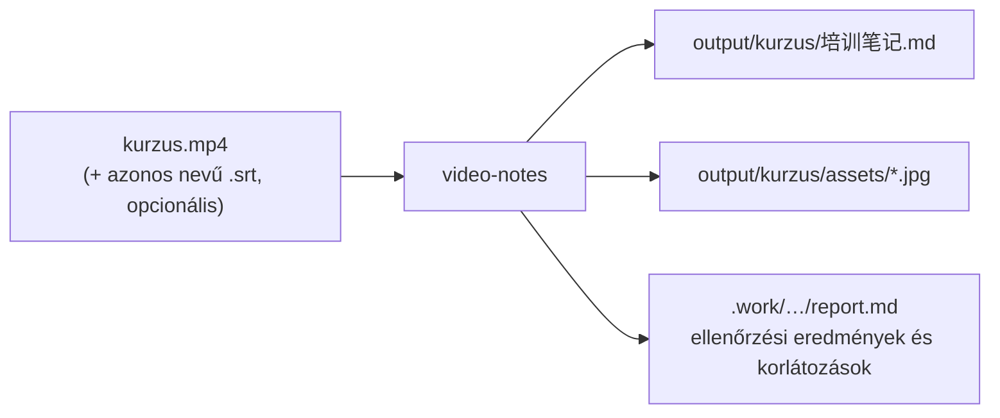
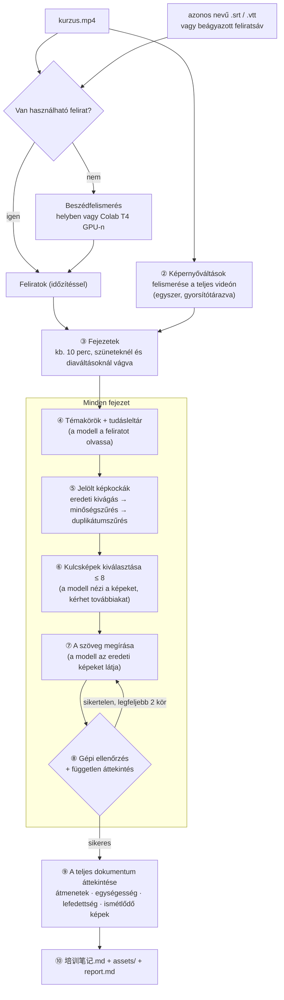
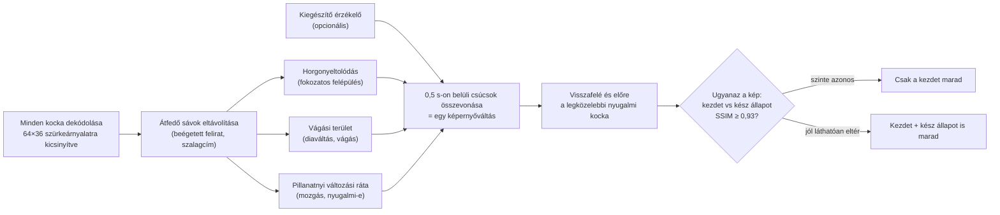
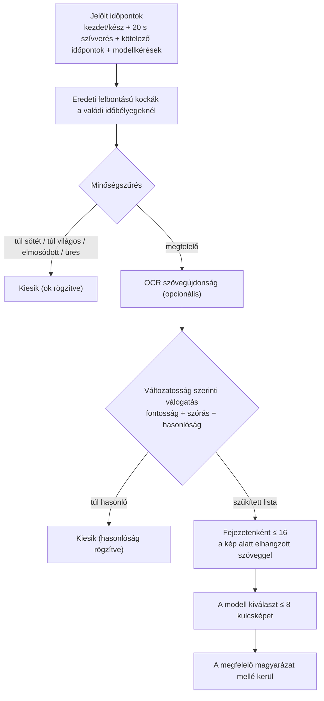
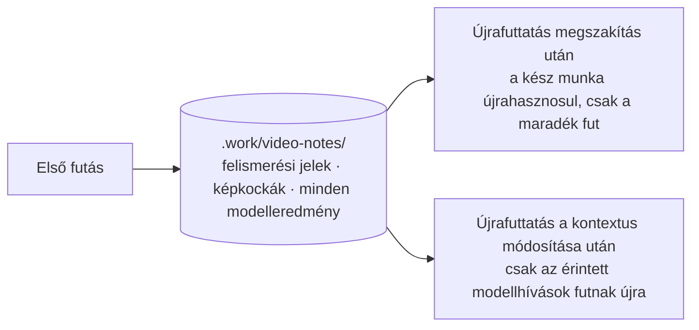
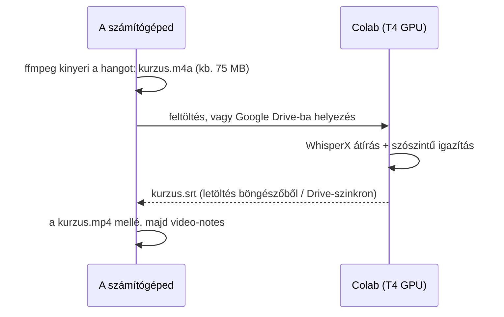
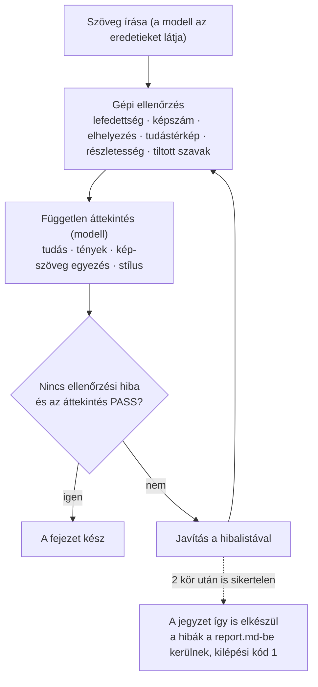

# video-notes

[中文](README.md) | [English](README.en.md) | **Magyar**

Egy helyi előadás-, kurzus- vagy oktatóvideóból automatikusan **megosztható, az eredeti videó képkockáival illusztrált Markdown jegyzetet** készít.

- Az eredeti magyarázat sorrendjét és gondolatmenetét követi, teljes körűen kifejti az okokat, működést, feltételeket, lépéseket és példákat — nem összefoglaló és nem leirat.
- Automatikusan kiválasztja a **kulcsfontosságú képkockákat** az eredeti videóból (fejezetenként legfeljebb 8, minden dia csak egyszer), és az általuk alátámasztott magyarázat mellé helyezi őket; a képaláírás leírja a kép tartalmát és megadja az eredeti videóbeli időpontot.
- Javítja a nyilvánvaló beszédfelismerési hibákat, kihagyja a csevegést, a szervezési részeket és a témához nem tartozó bemutatókat, és soha nem ír „az előadó megemlíti…” típusú közvetítő mondatokat.
- Minden fejezet gépi ellenőrzésen és független áttekintésen megy át, utána a teljes dokumentumot még egyszer átnézi; egy megszakított futás ott folytatódik, ahol abbamaradt.

> 0.1-es verzió. A folyamatot és az ellenőrzéseket egységtesztek és valódi videórészletek igazolják; a szöveg minősége a választott nagy nyelvi modelltől függ, és még nem készült róla rendszeres kiértékelés.

## Gyors kezdés

```bash
# 1. Telepítés (egyszer)
git clone https://github.com/songyang8964/video-notes.git
cd video-notes
powershell -ExecutionPolicy Bypass -File install.ps1 -AddToPath   # macOS/Linux: sh install.sh

# 2. Jelentkezz be egy modell-CLI-be (egyszer): `claude`, majd /login; vagy `codex login`
video-notes doctor            # a környezet ellenőrzése

# 3. Minden alkalommal: lépj be a videót (és az azonos nevű .srt-t) tartalmazó mappába
cd D:\kurzus
video-notes                   # elkészül az output\kurzus\培训笔记.md és az assets mappa
```



---

## Tartalom

1. [Gyors kezdés](#gyors-kezdés)
2. [Eredmény](#eredmény)
3. [Működés](#működés)
4. [Telepítés](#telepítés)
5. [Használat](#használat)
6. [Feliratok készítése Colab T4 GPU-n](#feliratok-készítése-colab-t4-gpu-n)
7. [Videókontextus (opcionális)](#videókontextus-opcionális)
8. [Minőségbiztosítás](#minőségbiztosítás)
9. [Kimenet és belső naplók](#kimenet-és-belső-naplók)
10. [Beállítások](#beállítások)
11. [Időigény és erőforrások](#időigény-és-erőforrások)
12. [Gyakori kérdések](#gyakori-kérdések)
13. [Fejlesztés és tesztek](#fejlesztés-és-tesztek)

---

## Eredmény

A videót tartalmazó mappában futtatott egyetlen parancs eredménye:

```
output/<videó neve>/
  培训笔记.md      ← a teljes jegyzet, szabványos Markdown, a képek relatív útvonallal
  assets/          ← a jegyzetben használt képkockák eredeti felbontásban
```

A teljes `output/<videó neve>/` mappa változtatás nélkül másolható, tömöríthető vagy feltölthető; egyetlen kép sem vész el.

Példa a jegyzet szerkezetére:

```markdown
# A kurzus címe

## 1. fejezet: … (a tartalom alapján automatikusan elnevezve)

### A témakör
Teljes magyarázat: háttér → elv → feltételek → lépések → eredmény → buktatók …


*Topológia: a három központi eszköz összekapcsolása (eredeti videó 00:02:07.797)*

### B témakör
…
```

---

## Működés

A teljes folyamatot helyben vezérli a program. Csak „a tartalom megértése, a képek kiválasztása, az írás és az ellenőrzés” hív nagy nyelvi modellt (Claude Code CLI vagy Codex CLI, a saját, bejelentkezett fiókoddal).



A „modell” jelölésű lépések nagy nyelvi modellt hívnak; minden más helyi feldolgozás (FFmpeg, PyAV, képfeldolgozás).

### 1. Feliratválasztás és átírás

Az eszköz megkeresi „a videóhoz valóban tartozó szöveget”:

- A jelölt források sorrendben: a `--srt` kapcsolóval megadott fájl; a videóval azonos nevű `.srt` / `.vtt` fájlok (pl. `kurzus.srt`, `kurzus.en.vtt`); a videóba ágyazott szöveges feliratsávok. Az azonos nevű feliratok nyelv szerint rangsorolódnak: kért nyelv → nyelvjelölés nélküli → egyéb nyelvek.
- Ezeket a feliratokat elutasítja, és az okot rögzíti: 5-nél kevesebb sor; a játékidő kevesebb mint 30%-át fedi le (általában csak az idegen nyelvű részeket fordító „kényszerített” sáv); az időpontok messze túlnyúlnak a videón (másik vágáshoz készült); a sorok több mint 30%-a az előző sor szövegével kezdődik (duplikátumszűrés nélküli, gördülő automatikus felirat).
- A WebVTT gördülő feliratait már beolvasáskor megtisztítja (minden sor megismétli az előzőt).
- A `--srt` kapcsolóval megadott felirat kifejezett kérés: ha nem felel meg, a futás leáll, ahelyett hogy csendben mást használna.
- Ha nincs használható felirat, helyben átírja a beszédet (WhisperX → faster-whisper → openai-whisper, ami telepítve van). NVIDIA GPU nélkül a helyi átírás lassú; használd inkább a [Colab T4 GPU](#feliratok-készítése-colab-t4-gpu-n) lehetőséget.

### 2. Képernyőváltások felismerése

Egy előadás fő vizuális elemei a diák, ábrák, kódok és terminálok. A felismerés egyetlen kérdésre felel: **mikor változik a kép?**

- **Az átfedő sávok kizárása**: először minden képpontsor változási gyakoriságát méri. A kép felső vagy alsó szélén lévő, a tartalomnál sokkal gyakrabban változó sávokat (beégetett feliratok, futó szalagcímek) kizárja; különben minden új feliratsor új diának tűnne.
- **Három jel** (képkockánként, kis felbontású szürkeárnyalatos képen mérve):
  - *Horgonyeltolódás*: az aktuális kocka átlagos eltérése „az utolsó nyugalmi képtől” — a fokozatosan betelő táblát vagy a soronként megjelenő kódot fogja meg;
  - *Vágási terület*: a szomszédos kockák között erősen megváltozott képpontok aránya — diaváltásokat és vágásokat fog meg;
  - *Pillanatnyi változási ráta*: a szomszédos kockák átlagos eltérése — mozgást érzékel, és eldönti, hogy „a kép megnyugodott, rögzíthető”.
- **Kiegészítő érzékelő**: egy opcionális PySceneDetect adaptív menet további vágási időpontokat ad.
- **Események és rögzítési pontok**: a 0,5 másodpercen belüli csúcsok egy „képernyőváltássá” olvadnak össze. Minden váltáshoz két nyugalmi kockát keres: a váltás előttit (a régi kép **kész állapota**) és utánit (az új kép **kezdete**). Ha egy kép kezdete és kész állapota szinte azonos (SSIM ≥ 0,93), csak a kezdetet tartja meg — pl. statikus dia; ha jól láthatóan eltérnek, mindkettőt — pl. lépésenként felépülő ábra vagy begépelt parancs.
- **Képkockasebesség a valódi időbélyegekből**: a képernyőfelvételek gyakran változó képkockasebességűek (névlegesen 60 fps, valójában kb. 15 fps). Minden időpont a valódi időbélyeget használja.
A felismerés menete:



Milyen képkockák keletkeznek egy diaváltáskor (egy dia, amelynek pontjai egyenként jelennek meg):

```
idő ───────────────────────────────────────────────────────────────────▶

kép    │ A dia: cím → 1. pont → 2. pont → 3. pont │ B dia …
       │                                         │
váltás │  ▁▁▁▁▁▃▁▁▁▁▁▁▃▁▁▁▁▁▁▃▁▁▁▁▁▁▁▁▁▁▁▁▁▁▁▁▁▁▁▁█▁▁▁▁▁▁▁▁▁▁
jel    │       ↑ pontok megjelenése (horgonyeltolódás nő)   ↑ diaváltás (vágási csúcs)
       │                                         │
kocka  │ ① A kezdete                  ② A kész   │ ③ B kezdete
       │  (épp megjelent, nyugalmi)   (váltás előtt, minden pont) │ (váltás után, nyugalmi)
```

- ① és ② jól láthatóan eltér, így mindkettő jelölt lesz; a modell általában a teljesebb ②-t választja.
- Ha A statikus dia, ① és ② szinte azonos, és csak ① marad meg.
- Ha A sokáig marad a képernyőn, 20 másodpercenként egy „szívverés” kocka is készül, hogy apró változások se maradjanak ki.

- **Teljesítmény**: a teljes videót kétszer dekódolja a méréshez és egyszer a kiegészítő érzékelőhöz; minden kezdet/kész összehasonlítás **egyetlen soros dekódolással** történik, nem több ezer véletlenszerű ugrással. Az eredmények gyorsítótárba kerülnek, és fejezetenként újrahasznosulnak.

### 3. Fejezetek

A cél fejezetenként kb. 10 perc (állítható). Minden ablak utolsó negyedében a **leghosszabb szünetnél**, lehetőleg **képernyőváltás közelében** lévő felirathatáron vág, hogy egy témakört ne vágjon ketté.

### 4. Témakörök és tudásleltár

A modell elolvassa a fejezet feliratait (előtte és utána néhány sor kontextussal), és két dolgot végez el:

- minden feliratsort egy **témakörhöz** rendel, vagy indoklással témán kívülinek jelöl; semmi nem hiányozhat, fedhet át vagy állhat rossz sorrendben (a program ellenőrzi; hibás kimenetet újra kell írni);
- részletes **tudásleltárt** készít: definíciók, működés, feltételek, okok, összehasonlítások, példák, parancsok, konfigurációs lépések, ellenőrzési eredmények, kockázatok, visszaállítás és értékes kérdések-válaszok, mindegyik fontos (important) vagy kiegészítő jelöléssel.

### 5. Jelölt képkockák

- A jelölt időpontok forrásai: a képernyőváltások kezdő és kész kockái; hosszan változatlan képeken belül 20 másodpercenként egy minta (hogy az olyan apró változás se vesszen el, mint egy új sor a terminálban); a videókontextusban megadott kötelező időpontok; a modell által kért további időpontok.
- Minden jelöltet **az eredeti videóból, teljes felbontásban, a valódi időbélyeg alapján** rögzít, és feljegyzi a tényleges kocka időpontját.
- **Minőségszűrés**: a túl sötét, túl világos, elmosódott (alacsony Laplace-variancia, pl. áttűnés) vagy szinte üres kockákat kiszűri, és az okot rögzíti.
- **OCR (opcionális, Tesseract kell hozzá)**: a tartalmi területet és a feliratsávot külön ismeri fel, és „szövegújdonságot” számol: a megmaradó új tartalmi szöveg sokat ér; a felvillanó vagy feliratbeli változás keveset.
- **Változatosság szerinti válogatás**: a változás erősségét, a szövegújdonságot és az élességet összesítő pontszám, büntetéssel a már kiválasztottakhoz túl hasonló kockákra (kis felbontású bélyegkép-vektorok koszinusz-hasonlósága) és jutalommal az időbeli szórásért; fejezetenként legfeljebb 16 kerül a modell elé.
- Minden jelölthöz csatolja, **mi hangzott el, amíg az a kép a képernyőn volt** (feliratsorszám-tartomány), hogy a modell megítélhesse, illik-e a kép a szöveghez.
- A modell 1280 képpontos olvasási másolatokat lát a keret kímélése érdekében; az írás és az ellenőrzés az eredetiket használja, hogy a parancsok és számok olvashatók maradjanak.



### 6. Kulcsképek kiválasztása

A modell minden jelöltet megnéz a témakörökkel és a hozzájuk tartozó szöveggel együtt, és a **teljes fejezethez** választ kulcsképeket:

- csak az olvasó számára szükséges szerkezeti ábrákat, folyamatábrákat, összehasonlításokat, táblázatokat, kulcsparancsokat vagy eredményeket;
- diánként egyet, a legteljesebbet (általában a kész állapotot); címlap, tartalomjegyzék, csak szöveges dia és csak az előadót mutató kép nem kerül be;
- fejezetenként legfeljebb 8, egy fejezetnek lehet kép nélkül is; minden kép ahhoz a témakörhöz tartozik, amelyet magyaráz;
- a ki nem választott képek fontos információit (számok, konfiguráció, kapcsolatok) az írási lépés szövegben fejezi ki;
- ha a szöveg egyértelműen egy olyan kulcsfontosságú képre utal, amely hiányzik a jelöltek közül, a modell legfeljebb 3 további időpontot kérhet; ezeket rögzíti és még egyszer elbírálja.

### 7. Írás

A modell a feliratok, a tudásleltár és a kiválasztott eredeti képek alapján, az eredeti sorrendben írja meg a fejezetet: témakörönként egy szakasz, a képek a megfelelő magyarázat mellett; a témán kívüli anyag csak belső megjegyzésben, indoklással szerepel.

### 8. Ellenőrzés, áttekintés és javítás

Lásd: [Minőségbiztosítás](#minőségbiztosítás). Ha a gépi ellenőrzés vagy az áttekintés sikertelen, a modell a hibalistával javít, legfeljebb 2 körben.

### 9. A teljes dokumentum áttekintése

Miután minden fejezet elkészült, a modell végigolvassa a teljes dokumentumot, és ellenőrzi a fejezetek közötti átmeneteket, a fogalmak és számok egységességét, a fontos tudás lefedettségét és a **fejezeteken átívelő ismétlődő képeket** (a program előbb megkeresi az ugyanannak a diának tűnő képpárokat). A hibákat fejezetenként javítja; a javított fejezetnek is át kell mennie a gépi ellenőrzésen, különben az előző változat marad meg, és ez bekerül a jelentésbe.

### 10. Kimenet

Minden egyetlen Markdown fájlba kerül, a kiválasztott eredeti képek az `assets/` mappába másolódnak, a képaláírások megkapják az eredeti videóbeli időpontot, és elkészül a belső `report.md` jelentés.

---

## Telepítés

### Követelmények

- Python 3.10 vagy újabb
- FFmpeg: `ffmpeg` és `ffprobe` a PATH-on
- Legalább egy bejelentkezett modell-parancssori eszköz:
  - [Claude Code](https://docs.anthropic.com/claude-code): telepítés után futtasd egyszer a `claude` parancsot, és jelentkezz be a `/login` paranccsal
  - vagy Codex CLI: telepítés után futtasd a `codex login` parancsot

### Az asztali alkalmazások használata (Claude asztali / Codex asztali)

Az eszköz parancssori programon keresztül hívja a modelleket, de **a CLI-t nem kell külön telepíteni**: az asztali alkalmazások ugyanezt a programot tartalmazzák, és az eszköz automatikusan megtalálja. Keresési sorrend:

1. a `video-notes setup --claude-path <útvonal>` / `--codex-path <útvonal>` beállítással megadott program;
2. a rendszer PATH-ján lévő `claude` / `codex`;
3. az asztali alkalmazáshoz mellékelt példány:
   - Claude asztali: `%APPDATA%\Claude\claude-code\<verzió>\claude.exe` (a legújabb verziót választja)
   - Codex asztali: `%LOCALAPPDATA%\OpenAI\Codex\bin\codex.exe`

Ha nincs megadott útvonal, és több verzió is található (pl. egy a PATH-on és egy az asztali alkalmazásban), a **legújabb verziót** használja, mert a régebbiek nem feltétlenül ismerik az aktuális modellneveket. A `video-notes doctor` megmutatja, melyik programot használja és honnan származik.

Megjegyzés: az asztali alkalmazásban történt bejelentkezés csak az alkalmazáson belül érvényes. Ha a mellékelt programot terminálból hívod, saját bejelentkezés kell hozzá, egyszer:

```bash
"%APPDATA%\Claude\claude-code\<verzió>\claude.exe"        # utána írd be: /login
"%LOCALAPPDATA%\OpenAI\Codex\bin\codex.exe" login
```

Opcionális:

- Tesseract OCR: javítja a jelöltek rangsorolását (terminálok, kódok és táblázatok esetén a leghasznosabb)
- Helyi beszédfelismerés (csak felirat és Colab nélkül kell): `pip install faster-whisper`, vagy a WhisperX telepítése

### Telepítési lépések

```bash
git clone https://github.com/songyang8964/video-notes.git
cd video-notes
```

Windows (PowerShell):

```powershell
powershell -ExecutionPolicy Bypass -File install.ps1 -AddToPath
```

Az `-AddToPath` hozzáadja az eszközt a felhasználói PATH-hoz, így a `video-notes` bármelyik mappában működik (utána nyiss új terminált). Nélküle az eszköz csak ennek a mappának a `.venv` környezetébe települ.

macOS / Linux:

```bash
sh install.sh
```

Az utasítás szerint add hozzá a `.venv/bin` mappát a PATH-hoz.

### Első beállítás

```bash
video-notes setup --backend claude       # vagy codex
video-notes setup --model claude-opus-5-5 --effort medium   # opcionális: az aktuális háttérrendszer modellje és gondolkodási szintje
video-notes setup --language Magyar      # a jegyzet nyelve, alapértelmezés: 中文 (kínai)
video-notes setup --tesseract "C:\Program Files\Tesseract-OCR\tesseract.exe" --ocr-langs eng+hun   # opcionális
video-notes doctor                        # a környezet ellenőrzése, valódi bejelentkezési próbával
```

Alapértelmezett modellek (ha nincs mást beállítva):

| Háttérrendszer | Modell | Gondolkodási szint |
| --- | --- | --- |
| `claude` (Claude Code / Claude asztali) | `claude-opus-5-5` (Claude Opus 5.5) | `medium` |
| `codex` (Codex CLI / Codex asztali) | `gpt-6.1-sol` (GPT sol 6.1) | `medium` |

Mindkét háttérrendszer megjegyzi a saját modelljét és szintjét, így váltáskor egyik beállítás sem vész el. A modell vagy a szint módosítása után a korábban gyorsítótárazott modelleredmények nem kerülnek újrahasználatra (a gyorsítótár kulcsa tartalmazza a modellt és a szintet).

A `doctor` jelenti: FFmpeg, Python-függőségek, telepítve és bejelentkezve van-e a modell-CLI, OCR, beszédfelismerő háttérrendszerek és a beállítófájl helye. Ha valami kötelező hiányzik, nem nulla kóddal lép ki, és leírja a javítás módját.

---

## Használat

1. Tedd a videót egy mappába (ha van felirat, az azonos nevű `.srt` mellé).
2. Nyiss terminált abban a mappában, és futtasd:

```bash
video-notes                         # a mappában lévő egyetlen .mp4 feldolgozása
video-notes "kurzus.mp4"            # több videó esetén válassz egyet
video-notes "kurzus.mp4" --srt "felirat.srt"
video-notes "kurzus.mp4" --backend codex          # most a másik modellel
video-notes "kurzus.mp4" --output D:\jegyzetek    # kimeneti gyökérmappa (alapértelmezés ./output)
video-notes "kurzus.mp4" --context hatter.md      # videókontextus fájl
```

3. Az előrehaladás a terminálban látszik (stderr); az utolsó sor (stdout) a jegyzet útvonala.
4. Megszakítás után (Ctrl+C, hálózati hiba, keretkimerülés, leállítás) **futtasd újra ugyanazt a parancsot**: a képernyőfelismerés, a képkockák és minden modellhívás gyorsítótárban van, semmi nem fut és nem számlázódik kétszer.

Hogyan működik a folytatás:



Minden modellhívás a „prompt szövege + képek tartalma” hash-e szerint kerül gyorsítótárba: változatlan bemenetnél az előző eredmény jön; megváltozott bemenetnél (pl. módosított videókontextus) új hívás történik.

Szabályok:

- Videó megadása nélkül csak az aktuális mappa legfelső szintjén lévő `.mp4` fájlokat veszi figyelembe (kis- és nagybetű mindegy), az almappákat nem; ha nincs videó vagy több is van, tájékoztat és kilép, nem találgat.
- Online hivatkozások (http/https) még nem támogatottak; előbb töltsd le a videót.
- Az eredeti videó és a felirat csak olvasható, soha nem módosul.
- Ha kézzel szerkesztetted a korábban elkészült `培训笔记.md` fájlt, az új futás **nem írja felül**; az új eredmény `培训笔记.<idő>.md` néven kerül mentésre.

### Kilépési kódok

| Kilépési kód | Jelentés |
| --- | --- |
| 0 | Siker, minden fejezet átment az ellenőrzésen és az áttekintésen |
| 1 | Függőségi, modell- vagy feldolgozási hiba; vagy a jegyzet elkészült, de egyes fejezetek nem mentek át az áttekintésen (lásd a jelentést) |
| 2 | Kétértelmű vagy érvénytelen bemenet: nincs videó, több videó, hiányzó fájl, online hivatkozás, elutasított felirat |
| 130 | A felhasználó megszakította (az előrehaladás mentve) |

---

## Feliratok készítése Colab T4 GPU-n

Helyi NVIDIA GPU nélkül egy 2 órás videó helyi beszédfelismerése órákig tarthat. A Google Colab ingyenes T4 GPU-ja ajánlott:



1. (Ajánlott) Helyben csak a hangot nyerd ki — kicsi, gyorsan feltölthető —, a videó fájlnevét megtartva:

   ```bash
   ffmpeg -i "kurzus.mp4" -vn -ac 1 -c:a aac -b:a 64k "kurzus.m4a"
   ```

2. Nyisd meg a tároló [`colab/transcribe.ipynb`](colab/transcribe.ipynb) jegyzetfüzetét a Colabban (Colab → Fájl → Jegyzetfüzet megnyitása → GitHub, vagy töltsd fel a fájlt).
3. Menü: **Futtatókörnyezet → Futtatókörnyezet típusának módosítása → T4 GPU**.
4. Válaszd ki a forrást a „paraméterek” cellában:
   - `SOURCE = 'upload'`: a cella futásakor a számítógépedről választasz fájlt; a végén az SRT automatikusan letöltődik;
   - `SOURCE = 'drive'`: fájl a Google Drive-ról; az SRT ugyanabba a mappába kerül (a Google Drive asztali kliensével egyenesen a helyi videó mellé szinkronizálható).
   Opcionálisan töltsd ki az `INITIAL_PROMPT` (szakkifejezések) és a `LANGUAGE` értéket.
5. Futtasd az összes cellát fentről lefelé. A jegyzetfüzet WhisperX-et használ: először átírás (alapértelmezés: large-v3), majd szószintű igazítás, végül a bemenettel azonos nevű `.srt`.
6. Tedd a `kurzus.srt` fájlt a helyi `kurzus.mp4` mellé, és futtasd a `video-notes` parancsot.

Megjegyzés: a WhisperX NVIDIA GPU-t használ; a TPU futtatókörnyezet nem gyorsítja, mert ott valójában a CPU-n fut.

---

## Videókontextus (opcionális)

Tegyél a videó mellé egy `<videó neve>.context.md` fájlt (vagy `video-notes.context.md` fájlt az aktuális mappába, vagy add meg `--context` kapcsolóval), amely leírja a kurzust. Minden modelllépés használja. Nélküle a modell a feliratokból következtet a témára, a terjedelemre és a szakkifejezésekre.

```markdown
---
title: Bevezetés az elosztott rendszerekbe (3. előadás)
language: hu
include_times: 00:12:30, 00:41:05.500
forbid: az előadó, ebben a videóban
asr_preset: networking
---
Az előadás témája a konszenzusalgoritmusok. A fogalmak írásmódja: Raft, Paxos, Leader.
A feliratban szereplő „rafting” a Raft felismerési hibája.
Az első tíz perc eszközbeállítása és az óra utáni jelentkezési kérdések nem tartoznak a témához.
```

| Mező | Szerep |
| --- | --- |
| `title` | A jegyzet címe (alapértelmezés: a videó fájlneve) |
| `language` | Feliratnyelv-preferencia (az azonos nevű feliratok közüli választáshoz; a beszédfelismerés is megkapja) |
| `include_times` | Képernyő-időpontok, amelyeknek jelöltté kell válniuk, vesszővel elválasztva, `HH:MM:SS(.mmm)` vagy másodperc |
| `forbid` | Szavak, amelyek nem szerepelhetnek a szövegben, vesszővel elválasztva (gépileg ellenőrizve) |
| `asr_preset` | Szókincs-előbeállítás a helyi átíráshoz (jelenleg `networking`); vagy írd meg közvetlenül az `asr_prompt` mezőben |

A törzs (a `---` után) szabad szöveg: téma, terjedelem, megerősített szakkifejezések és gyakori felismerési hibák, kizárandó tartalom.

---

## Minőségbiztosítás

### Gépi ellenőrzések (minden fejezet után; a hibás fejezet visszamegy javításra)

| Ellenőrzés | Szabály |
| --- | --- |
| Teljes feliratlefedettség | Minden feliratsor pontosan egy szakaszhoz tartozik, sorrendben, vagy indoklással kizártként jelölt; semmi nem hiányzik, ismétlődik vagy áll rossz helyen |
| Képek száma | Fejezetenként legfeljebb 8 (állítható), egy kép sem szerepel kétszer |
| Képek helye | Minden kép csak a saját témakörének szakaszában jelenhet meg; a képazonosítóknak létezniük kell |
| Tudáslefedettség | Minden fontos tudáselemnek egy létező szakaszra kell mutatnia a „tudástérképen”, vagy kizárási indoklással kell rendelkeznie |
| Részletesség | Szöveges karakterek (címek, kódblokkok és képek nélkül) ≥ 100 a magyarázat minden percére (állítható); a legalább 1 perces szakaszokban ≥ 50 percenként. Megállítja az összefoglalóként megírt fejezeteket |
| Írásmód | Nem lehet benne „az előadó / a beszélő / a videó megemlíti / a felirat szerint” típusú közvetítés, sem a kontextus `forbid` szavai |
| Formátum | Minden fejezetnek van címe; nincs nyers képútvonal, nincs páratlan kódblokk; az összeállítás után nem marad helyőrző |

A fejezetenkénti ellenőrzési és javítási kör:



### Modellalapú áttekintés

- **Független fejezetenkénti áttekintés**: az áttekintő megkapja a feliratokat, a tudásleltárt, a kiválasztott eredeti képeket és a vázlatot, és ellenőrzi, hogy a fontos tudás teljesen ki van-e fejtve (egy kulcsszó nem elég), a tények és számok egyeznek-e a feliratokkal és a képekkel, minden kép alátámasztja-e a mellette lévő szöveget, sérülnek-e a képszabályok, és van-e közvetítő vagy témán kívüli tartalom.
- **A teljes dokumentum áttekintése**: fejezetek közötti átmenetek, fogalmak és számok egységessége, a fontos tudás lefedettsége, fejezeteken átívelő ismétlődő képek.

### Korlátok

- Az áttekintést is nagy nyelvi modell végzi. A nyilvánvaló hiányokat, hibákat és formai problémákat észreveszi, de nem helyettesíti az emberi ellenőrzést.
- Az, hogy „tényleg kulcsfontosságú-e ez a kép” és „jól javította-e ki ezt a felismerési hibát”, végső soron a modellen múlik; fontos anyagoknál szúrópróbaszerűen nézd át a `report.md` által jelzett fejezeteket.

---

## Kimenet és belső naplók

```
<aktuális mappa>/
  output/<videó neve>/培训笔记.md  + assets/      ← megosztásra
  .work/video-notes/<videó neve>-<hash>/          ← belső naplók, törölhetők (a folytatási gyorsítótár elvész)
    source.json            bemeneti hash-ek, a felirat forrása és a választás oka, modell
    detect/                képernyőfelismerési jelek és eredmény-gyorsítótár
    C01/ C02/ ...          fejezetenként: témakörök, tudásleltár, jelöltek és indoklás, képválasztás, vázlat, áttekintés
    model-calls/           minden modellhívás teljes promptja, válasza és naplója
    global-review.csv      a teljes dokumentum áttekintésének megállapításai
    report.md              futási jelentés: fejezetenkénti eredmények, megoldatlan problémák, korlátozások, időigény
```

A `report.md` kifejezetten felsorolja a korlátozott működést, pl. hiányzó OCR, automatikus átírás használata, feliratproblémák, a gépi ellenőrzés által elutasított teljes dokumentumbeli javítás.

---

## Beállítások

A beállítófájl: `%APPDATA%\video-notes\config.json` (Windows) vagy `~/.config/video-notes/config.json`. A gyakori elemek a `video-notes setup` paranccsal módosíthatók; a többihez szerkeszd a JSON-t.

| Kulcs | Alapértelmezés | Leírás |
| --- | --- | --- |
| `backend` | `claude` | Modell-háttérrendszer: `claude` vagy `codex` |
| `claude_model` / `claude_effort` | `claude-opus-5-5` / `medium` | A Claude háttérrendszer modellje és gondolkodási szintje (low, medium, high, xhigh, max) |
| `codex_model` / `codex_effort` | `gpt-6.1-sol` / `medium` | A Codex háttérrendszer modellje és gondolkodási szintje (minimal, low, medium, high) |
| `claude_path` / `codex_path` | üres | A CLI útvonala (üres = előbb a PATH, aztán az asztali alkalmazás mellékelt példánya) |
| `output_language` | `中文` | A jegyzet nyelve |
| `max_images` | 8 | Képek maximális száma fejezetenként |
| `shortlist` | 16 | A modellnek fejezetenként mutatott jelöltek száma |
| `chapter_minutes` | 10 | Célzott fejezethossz (perc) |
| `use_adaptive` | true | A PySceneDetect kiegészítő érzékelő használata (jobb lefedés, kicsit lassabb) |
| `review_cycles` | 2 | Javítási körök maximális száma fejezetenként |
| `min_chars_per_minute` | 100 | A részletesség alsó határa |
| `tesseract` / `ocr_langs` | üres / `eng` | Az OCR program útvonala és nyelvei |
| `asr_backend` / `asr_model` / `whisperx` | automatikus / `large-v3` / üres | Helyi átírási beállítások |

---

## Időigény és erőforrások

Példa: egy kb. 2 óra 40 perces, 1080p felbontású, felirattal rendelkező képernyőfelvétel (átlagos laptop CPU):

| Szakasz | Idő |
| --- | --- |
| Jelmérés (két dekódolás) | kb. 10 perc |
| Kiegészítő érzékelő (egy dekódolás) | kb. 20 perc |
| Kezdet/kész összehasonlítás (egy soros dekódolás) | kb. 10 perc |
| Jelöltek rögzítése és szűrése | negyedórától félóráig, a képernyőváltások számától függően |
| Modellhívások (fejezetenként kb. 5–8, plusz egy teljes dokumentum-áttekintés) | több óra, a modell sebességétől és a keretektől függően |

- A képernyőfelismerés csak az első futáskor történik meg; utána a gyorsítótár teljesen újrahasznosul.
- A modellhívások fejezetenként követik egymást; megszakítás után a kész hívások nem ismétlődnek.
- Memória: a felismerés kockánként, folyamatosan dolgozik, így a memóriahasználat nem nő a videó hosszával. Zárd be a sok memóriát használó programokat, hogy elkerüld a memóriahiány miatti dekódolási hibákat (az eszköz újrapróbálkozik, és rögzíti őket a jelentésben).

---

## Gyakori kérdések

**Az asztali alkalmazást szeretném használni, nem akarok CLI-t telepíteni**: futtasd a `video-notes doctor` parancsot; az eszköz megtalálja az asztali alkalmazáshoz mellékelt programot. Ha azt írja, hogy nem vagy bejelentkezve, jelentkezz be egyszer az [Az asztali alkalmazások használata](#az-asztali-alkalmazások-használata-claude-asztali--codex-asztali) részben leírt parancsokkal.

**A `doctor` szerint a modell „not usable” / lejárt a bejelentkezés**: futtasd a `claude` és `/login` (vagy `codex login`) parancsot egy terminálban, majd ismét a `video-notes` parancsot; ott folytatja, ahol abbahagyta.

**„Several videos found”**: a mappában egynél több `.mp4` van; nevezz meg egyet: `video-notes "fajl.mp4"`.

**Elutasított felirat**: olvasd el az okot a terminálban (túl kevés sor, alacsony lefedettség, rossz hossz, gördülő felirat). Használd a megfelelő feliratot, vagy töröld, hogy az eszköz maga írja át.

**Egy fejezet áttekintése REVISE eredményt mutat**: a jegyzet így is elkészül. Olvasd el a `.work/video-notes/…/<fejezet>/review.md` fájlt, és ha kell, javítsd kézzel a jegyzetet; egy új futás nem írja felül a módosításaidat.

**Egy képkockán nehezen olvasható az apró szöveg**: az `assets/` eredeti felbontású képeket tartalmaz. Ha egy kulcsfontosságú kép nem került kiválasztásra, add hozzá az időpontját a videókontextus `include_times` mezőjéhez, és futtasd újra (csak az érintett részek futnak újra).

**A jegyzet nem a kívánt nyelven készült**: `video-notes setup --language Magyar`, vagy állítsd be az `output_language` értékét a beállítófájlban.

---

## Fejlesztés és tesztek

```bash
python -m unittest tests.test_video_notes -v      # egységtesztek: feliratok beolvasása és választása, fejezetek, ellenőrzési szabályok, algoritmusok, kimenetvédelem
python -m unittest tests.test_readme_sync          # a három nyelvű README szerkezete egyezik-e
python tests/integration_scripted.py <mappa>       # a teljes folyamat futtatása valódi videórészleten, szkriptelt modellel (valódi modellhívás nélkül)
```

A forráskód szerkezete:

```
src/video_notes/
  cli.py          parancssor: videó keresése, kapcsolók, setup, doctor, kilépési kódok
  pipeline.py     vezérlés, fejezetek, képválasztás, írás, áttekintés, teljes dokumentum-áttekintés, kimenetvédelem
  subtitles.py    feliratjelöltek és elutasítási szabályok, VTT beolvasás
  transcribe.py   helyi beszédfelismerés (WhisperX / faster-whisper / openai-whisper)
  detect/         képernyőváltás-felismerés (átfedő sáv, három jel, események, kezdet/kész párok)
  vision/         minőségszűrés, OCR és szövegújdonság, változatosság szerinti válogatás
  candidates.py   fejezetenkénti jelöltek, olvasási másolatok, kontaktlapok
  llm.py          modell-háttérrendszerek (Claude Code CLI / Codex CLI), asztali alkalmazás keresése, gyorsítótár, újrapróbálás, bejelentkezés-ellenőrzés
  render.py       gépi ellenőrzések és összeállítás
  config.py       beállítások és videókontextus
  prompts/        promptok minden szakaszhoz (általános szabályok, témakörök, képválasztás, írás, áttekintés, javítás, teljes áttekintés)
colab/transcribe.ipynb   Colab T4 GPU feliratkészítő jegyzetfüzet
```

A README kínai, angol és magyar nyelven létezik, és **minden módosítást mindhárom nyelven el kell végezni**; a `tests/test_readme_sync.py` összeveti a három fájl címsorait, ábráit és kódblokkjait, és eltérés esetén hibát jelez.

A harmadik féltől származó licencnyilatkozatok a [NOTICE](NOTICE) fájlban vannak.
