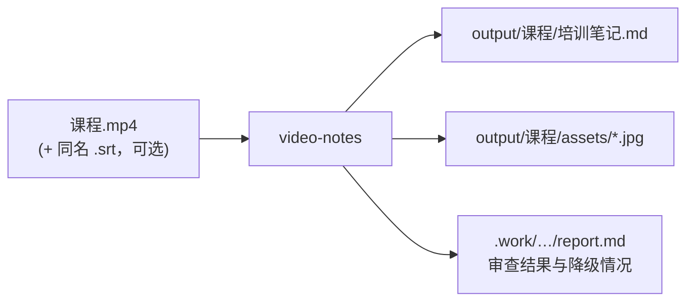
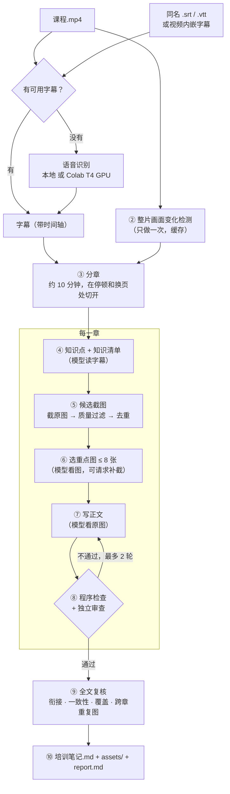
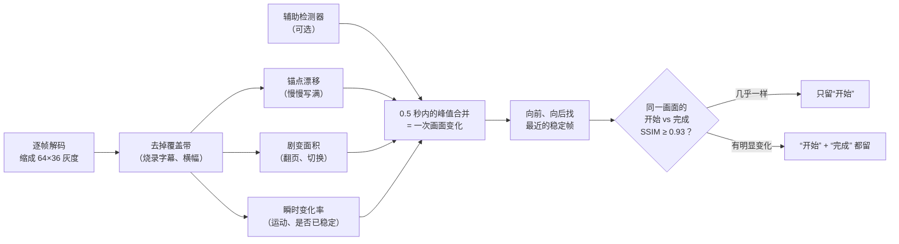
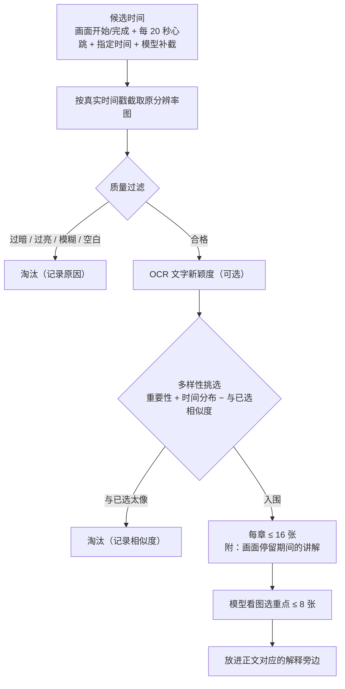
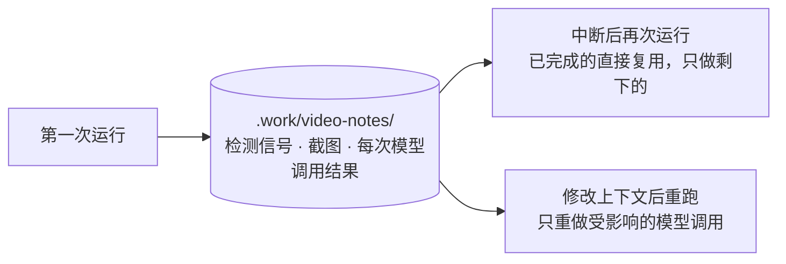
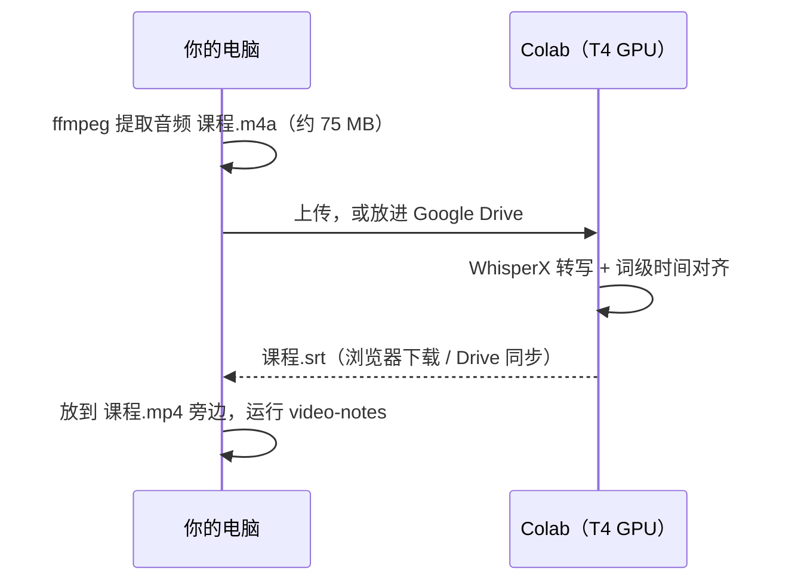
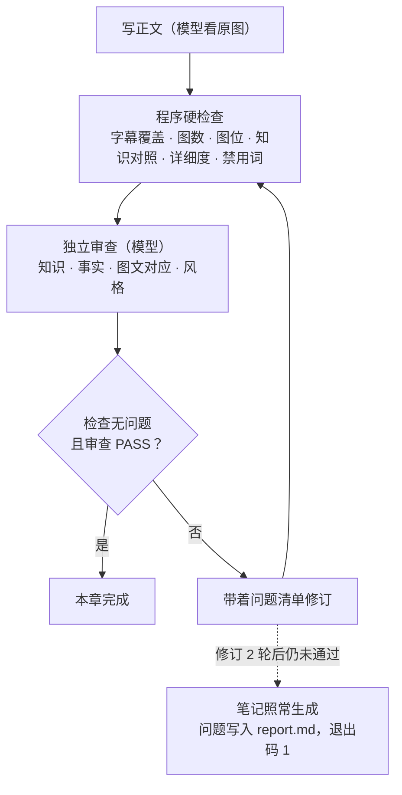

# video-notes

**中文** | [English](README.en.md) | [Magyar](README.hu.md)

把本地的讲座、课程或培训视频，自动整理成**带原视频截图、可以直接分享的 Markdown 学习笔记**。

- 按原讲解顺序和思路成文，完整解释原因、机制、条件、步骤和例子，不是摘要或逐字稿。
- 自动从原视频中挑选**重点截图**（每章最多 8 张，同一页只用一次），放在对应解释旁边，图注写明图中内容和原视频时间。
- 纠正明显的语音识别错误，去掉寒暄、会议组织、离题演示等无关内容，不写“讲师提到”之类的转述。
- 每章经过程序检查和独立审查，全文再做一次整体复核；中断后重新运行会从断点继续。

> 当前版本 0.1。流程与检查已用单元测试和真实视频片段验证；笔记文字质量取决于所选的大模型，尚未做系统的评测。

## 快速开始

```bash
# 1. 安装（一次）
git clone https://github.com/songyang8964/video-notes.git
cd video-notes
powershell -ExecutionPolicy Bypass -File install.ps1 -AddToPath   # macOS/Linux: sh install.sh

# 2. 登录一个模型命令行（一次）：Claude Code 运行 `claude` 后 /login；或 `codex login`
video-notes doctor            # 检查环境

# 3. 每次使用：进入放视频（和同名 .srt）的文件夹
cd D:\课程
video-notes                   # 生成 output\课程\培训笔记.md 和 assets 文件夹
```



---

## 目录

1. [快速开始](#快速开始)
2. [效果](#效果)
3. [工作原理](#工作原理)
4. [安装](#安装)
5. [使用](#使用)
6. [在 Colab T4 GPU 上生成字幕](#在-colab-t4-gpu-上生成字幕)
7. [视频上下文（可选）](#视频上下文可选)
8. [质量保证](#质量保证)
9. [输出与内部记录](#输出与内部记录)
10. [配置](#配置)
11. [耗时与资源](#耗时与资源)
12. [常见问题](#常见问题)
13. [开发与测试](#开发与测试)

---

## 效果

在视频所在文件夹运行一次命令，得到：

```
output/<视频名>/
  培训笔记.md      ← 完整笔记，标准 Markdown，图片用相对路径
  assets/          ← 笔记引用的原视频截图（原分辨率）
```

整个 `output/<视频名>/` 文件夹可以直接复制、压缩或上传分享，图片不会丢。

笔记结构示例：

```markdown
# 课程标题

## 第一章：……（按内容自动命名）

### 知识点 A
完整的解释：背景 → 原理 → 条件 → 步骤 → 结果 → 注意事项……


*拓扑：三台核心设备之间的互联关系（原视频 00:02:07.797）*

### 知识点 B
……
```

---

## 工作原理

整个流程完全在本地编排，只有“读懂内容、选图、写作、审查”这几步调用大模型（Claude Code CLI 或 Codex CLI，使用你自己已登录的账号）。



图中标“模型”的步骤调用大模型，其余全部是本地程序（FFmpeg、PyAV、图像处理）。

### 1. 字幕选择与转写

工具会自动找出“真正属于这个视频的对白”：

- 候选来源依次是：`--srt` 指定的文件；与视频同名的 `.srt` / `.vtt`（如 `课程.srt`、`课程.en.vtt`）；视频内嵌的文字字幕轨。同名字幕按语言排序：指定语言 → 未标语言 → 其他语言。
- 以下字幕会被拒绝并记录原因：少于 5 条；覆盖不到视频时长的 30%（往往是只翻译外语片段的“强制字幕”）；时间远超视频长度（对应的是另一个剪辑版本）；超过 30% 的条目以前一条的文字开头（未去重的自动滚动字幕）。
- WebVTT 的滚动字幕在解析时就去重（每条会重复上一条的内容）。
- `--srt` 指定的字幕是“明确要求”：不合格时直接停止，而不是悄悄改用别的来源。
- 都没有可用字幕时，在本地自动转写（WhisperX → faster-whisper → openai-whisper，按已安装情况选择）。没有 NVIDIA 显卡时本地转写很慢，建议用 [Colab T4 GPU](#在-colab-t4-gpu-上生成字幕) 生成字幕。

### 2. 画面变化检测

讲座视频的核心画面是幻灯片、拓扑图、代码和命令行。检测只回答一个问题：**画面什么时候变了**。

- **排除覆盖带**：先统计每一行像素的变化频率。屏幕上下边缘那种变化远比正文频繁的条带（烧录字幕、滚动横幅）会被排除，否则字幕每换一句都会被当成换页。
- **三种信号**（在低分辨率灰度图上逐帧测量）：
  - *锚点漂移*：当前帧与“上一个稳定画面”的平均差异，用来捕捉逐步写满的板书、逐行出现的代码；
  - *剧变面积*：相邻两帧中明显变化的像素占比，用来捕捉翻页和切换；
  - *瞬时变化率*：相邻两帧的平均差异，既用于检测运动，也用于判断“画面已经稳定、可以截图”。
- **辅助检测器**：可选的 PySceneDetect 自适应检测补充一批切换时间。
- **事件与截图点**：各信号的峰值在 0.5 秒内合并为一个“画面变化事件”。每个事件找两个稳定帧：变化前（旧画面的**完成状态**）和变化后（新画面的**开始**）。同一画面的开始和完成状态非常相似（SSIM ≥ 0.93）时只保留开始那张，例如静态幻灯片；明显不同时两张都保留，例如逐步展开的图、敲完的命令。
- **帧率取自实际时间戳**：屏幕录制常是可变帧率，标称 60 fps、实际约 15 fps。所有时间都以真实时间戳为准。
检测流程：



一次换页时取哪几张截图（以逐条出现要点的幻灯片为例）：

```
时间轴 ────────────────────────────────────────────────────────────────▶

屏幕   │ 幻灯片 A：标题 → 要点 1 → 要点 2 → 要点 3 │ 幻灯片 B ……
       │                                          │
变化   │  ▁▁▁▁▁▃▁▁▁▁▁▁▃▁▁▁▁▁▁▃▁▁▁▁▁▁▁▁▁▁▁▁▁▁▁▁▁▁▁▁█▁▁▁▁▁▁▁▁▁▁
信号   │       ↑ 逐条出现（锚点漂移累积）            ↑ 翻页（剧变面积峰值）
       │                                          │
截图   │ ① A 开始                    ② A 完成     │ ③ B 开始
       │  （刚出现，稳定后）          （翻页前，要点已全）│ （翻页后，稳定后）
```

- ① 和 ② 差别明显，两张都进入候选；模型选图时通常选信息最完整的 ②。
- 如果 A 是一页静态幻灯片，① 和 ② 几乎相同，只保留 ①。
- A 停留很久时，中间每 20 秒还会补一张“心跳”截图，防止漏掉细小变化。

- **性能**：全片解码只做两遍测量和一遍辅助检测；所有“开始/完成”比对在**一次顺序解码**中完成，不做成千上万次随机定位。结果缓存，之后按章取用。

### 3. 分章

目标约 10 分钟一章（可配置）。在每个窗口的最后四分之一里，选**停顿最长**、且尽量**靠近画面切换**的字幕边界切开，避免把一个知识点从中间切断。

### 4. 知识点与知识清单

模型阅读本章字幕（附前后几句作为上下文），完成两件事：

- 把每一条字幕归入一个**知识点**，或标为与主题无关并写明原因；不能遗漏、重叠或乱序（程序校验，不合格要求重写）。
- 建立细粒度**知识清单**：定义、机制、条件、原因、比较、例子、命令、配置步骤、验证结果、风险、回退、有价值的问答，分别标为重要（important）或辅助。

### 5. 候选截图

- 候选时间来自：画面变化的开始与完成帧；长时间不变的画面每 20 秒补一张（捕捉命令行里多出的一行之类的细小变化）；视频上下文里指定的必选时间；模型请求补截的时间。
- 每个候选都**从原视频按真实时间戳截取原分辨率图**，记录实际帧时间。
- **质量过滤**：过暗、过亮、模糊（拉普拉斯方差过低，例如淡入淡出）、几乎空白的画面被剔除，并记录原因。
- **OCR（可选，需要 Tesseract）**：分别识别画面中部内容区和底部字幕区，计算“文字新颖度”：新出现且持续存在的内容文字权重高；一闪而过的变化和字幕变化权重低。
- **多样性挑选**：综合画面变化强度、文字新颖度和清晰度打分，同时惩罚与已选图过于相似的画面（低分辨率缩略图向量的余弦相似度），并鼓励时间上分布开，每章最多保留 16 张给模型看。
- 每张候选都附上**这个画面在屏幕上停留期间说的话**（字幕编号区间），供模型判断图文是否对应。
- 给模型看的是长边 1280 像素的阅读副本，节省额度；写作和审查时使用原图，保证命令和数字看得清。



### 6. 选重点图

模型逐张查看候选图，结合知识点和对应讲解，为**整章**挑选重点图：

- 只选理解所必需的结构图、流程图、对比图、表格、关键命令或结果；
- 同一页只选信息最完整的一张（通常是完成状态）；不选标题页、目录页、纯文字页、纯讲者画面；
- 每章最多 8 张，允许整章无图；每张图归属到它解释的知识点；
- 未入选画面里的重要信息（数字、配置、关系）会转交给写作阶段用文字表达；
- 如果讲解明确在说某个关键画面而候选中没有，模型可以请求补截最多 3 个时刻，程序截取后重新评审一次。

### 7. 写作

模型依据字幕、知识清单、入选原图，按原讲解顺序写出本章正文：每个知识点一个小节，图片放在对应解释旁；无关内容只在内部注释中记录排除原因。

### 8. 检查、审查与修订

见 [质量保证](#质量保证)。程序检查或审查不通过时，带着问题清单让模型修订，最多 2 轮。

### 9. 全文复核

所有章节完成后，模型通读全文，检查章节衔接、术语和数字的一致性、全片重要知识的覆盖，以及**跨章重复插图**（程序先用图像相似度找出疑似同一页的图片对）。发现的问题按章节自动修订，修订稿仍须通过程序检查，否则保留原稿并在报告中记录。

### 10. 输出

汇编为一个 Markdown 文件，复制入选原图到 `assets/`，图注后附原视频时间。生成内部报告 `report.md`。

---

## 安装

### 需要

- Python 3.10 或更高版本
- FFmpeg：`ffmpeg` 和 `ffprobe` 在 PATH 中
- 至少一个已登录的模型命令行工具：
  - [Claude Code](https://docs.anthropic.com/claude-code)：安装后在终端运行一次 `claude`，按提示用 `/login` 登录
  - 或 Codex CLI：安装后运行 `codex login`

### 使用桌面版应用（Claude 桌面版 / Codex 桌面版）

工具通过命令行程序调用模型，但**不需要单独安装命令行**：桌面版应用里自带同一个程序，工具会自动找到它。查找顺序：

1. `video-notes setup --claude-path <路径>` / `--codex-path <路径>` 指定的程序；
2. 系统 PATH 中的 `claude` / `codex`；
3. 桌面版应用自带的副本：
   - Claude 桌面版：`%APPDATA%\Claude\claude-code\<版本>\claude.exe`（自动选最新版本）
   - Codex 桌面版：`%LOCALAPPDATA%\OpenAI\Codex\bin\codex.exe`

没有手动指定路径时，若同时找到多个版本（例如 PATH 里一个、桌面版里一个），会选**版本号最新**的那个，因为旧版本可能不认识新的模型名。`video-notes doctor` 会显示实际使用的是哪一个程序以及它的来源。

注意：桌面应用里的登录只在应用内部有效。从终端直接调用这份程序时，它需要自己的登录，运行一次即可：

```bash
"%APPDATA%\Claude\claude-code\<版本>\claude.exe"        # 进入后输入 /login
"%LOCALAPPDATA%\OpenAI\Codex\bin\codex.exe" login
```

#### 在桌面版应用的对话里运行

也可以不打开终端，直接让桌面应用里的 AI 替你运行：

1. 打开 **Claude 桌面版 → Code**，或 **Codex 桌面版**，选择视频所在的文件夹作为工作目录。
2. 在对话里输入，例如：

   ```text
   在这个文件夹运行 video-notes。完成后告诉我笔记路径，并总结 report.md 里未通过的章节和降级情况。
   ```

3. AI 会执行同一条 `video-notes` 命令，并把结果和报告读给你。

注意：

- AI 只是代你执行命令，模型调用仍由上面找到的命令行程序完成，所以同样需要先完成上面那一次单独登录。
- 2 小时以上的视频需要运行数小时，对话窗口要一直开着；长视频更建议在自己的终端里运行。中途断开也没关系，再运行一次即可从断点继续。

可选：

- Tesseract OCR：提升候选截图排序（命令行、代码、表格类内容收益最大）
- 本地语音识别（仅在没有字幕、又不用 Colab 时需要）：`pip install faster-whisper`，或安装 WhisperX

### 安装步骤

```bash
git clone https://github.com/songyang8964/video-notes.git
cd video-notes
```

Windows（PowerShell）：

```powershell
powershell -ExecutionPolicy Bypass -File install.ps1 -AddToPath
```

`-AddToPath` 会把工具加入当前用户的 PATH，之后在任何文件夹都能直接输入 `video-notes`（需要重新打开终端）。不加则只安装到本目录的 `.venv`。

macOS / Linux：

```bash
sh install.sh
```

按提示把 `.venv/bin` 加入 PATH。

### 首次配置

```bash
video-notes setup --backend claude       # 或 codex
video-notes setup --model claude-opus-5-5 --effort medium   # 可选：修改当前后端的模型和推理强度
video-notes setup --language 中文         # 笔记语言，默认中文；也可 English
video-notes setup --tesseract "C:\Program Files\Tesseract-OCR\tesseract.exe" --ocr-langs eng+chi_sim   # 可选
video-notes doctor                        # 检查环境，包括一次真实的模型登录测试
```

默认模型（不设置时使用）：

| 后端 | 模型 | 推理强度 |
| --- | --- | --- |
| `claude`（Claude Code / Claude 桌面版） | `claude-opus-5-5`（Claude Opus 5.5） | `medium` |
| `codex`（Codex CLI / Codex 桌面版） | `gpt-6.1-sol`（GPT sol 6.1） | `medium` |

两个后端各自记住自己的模型和强度，切换后端不会丢失设置。修改模型或强度后，之前缓存的模型结果不会被复用（缓存键包含模型和强度）。

`doctor` 会逐项报告：FFmpeg、Python 依赖、模型命令行是否已安装且已登录、OCR、语音识别后端、配置文件位置。必需项缺失时返回非零退出码，并给出修复方法。

---

## 使用

1. 把视频放进一个文件夹（有字幕的话，把与视频同名的 `.srt` 放在旁边）。
2. 在这个文件夹打开终端，运行：

```bash
video-notes                         # 文件夹里只有一个 .mp4 时自动处理它
video-notes "课程.mp4"               # 有多个视频时指定一个
video-notes "课程.mp4" --srt "字幕.srt"
video-notes "课程.mp4" --backend codex          # 本次改用另一个模型
video-notes "课程.mp4" --output D:\notes        # 指定输出根目录（默认 ./output）
video-notes "课程.mp4" --context 背景.md        # 指定视频上下文文件
```

3. 运行过程中，进度显示在终端（stderr）；结束时最后一行（stdout）输出笔记路径。
4. 中断（Ctrl+C、断网、额度用完、关机）后，**重新运行同一条命令**即可从断点继续：画面检测、截图、每一次模型调用的结果都已缓存，不会重复计算或重复计费。

断点续跑的原理：



每次模型调用按“提示词内容 + 图片内容”的哈希缓存：输入没变就直接用上次的结果；输入变了（例如你改了视频上下文）才重新调用。

规则：

- 不指定视频时，只查找当前文件夹顶层的 `.mp4`（大小写不敏感），不递归子文件夹；没有视频或有多个视频时会提示并退出，不会擅自选择。
- 在线链接（http/https）暂不支持，请先下载到本地。
- 原视频和字幕只读，绝不修改。
- 如果你手工修改过上次生成的 `培训笔记.md`，重新运行**不会覆盖**它，新结果另存为 `培训笔记.<时间>.md`。

### 退出码

| 退出码 | 含义 |
| --- | --- |
| 0 | 成功，所有章节通过检查和审查 |
| 1 | 依赖、模型、处理失败；或笔记已生成但有章节未通过审查（详见报告） |
| 2 | 输入不明确或无效：没有视频、多个视频、文件不存在、在线链接、字幕不合格 |
| 130 | 用户中断（进度已保存） |

---

## 在 Colab T4 GPU 上生成字幕

本地没有 NVIDIA 显卡时，2 小时视频的本地语音识别可能需要数小时。推荐用 Google Colab 的免费 T4 GPU：



1. （推荐）先在本地只提取音频，文件小、上传快，文件名主干与视频相同：

   ```bash
   ffmpeg -i "课程.mp4" -vn -ac 1 -c:a aac -b:a 64k "课程.m4a"
   ```

2. 在 Colab 打开本仓库的 [`colab/transcribe.ipynb`](colab/transcribe.ipynb)（Colab → 文件 → 打开笔记本 → GitHub，或上传该文件）。
3. 菜单 **代码执行程序 → 更改运行时类型 → T4 GPU**。
4. 在“参数”单元格里选择来源：
   - `SOURCE = 'upload'`：运行后从本机选择文件上传，结束时自动下载 SRT；
   - `SOURCE = 'drive'`：读取 Google Drive 中的文件，SRT 写在同一文件夹（配合 Google Drive 电脑客户端，可以直接同步到本地视频旁边）。
   可选填写 `INITIAL_PROMPT`（领域术语）和 `LANGUAGE`。
5. 从上到下运行所有单元格。笔记本使用 WhisperX：先转写（默认 large-v3 模型），再做词级时间对齐，最后输出与输入同名的 `.srt`。
6. 把 `课程.srt` 放到本地 `课程.mp4` 旁边，运行 `video-notes`。

说明：WhisperX 使用 NVIDIA GPU；选择 TPU 运行时并不会加速，因为它在 TPU 运行时下实际使用 CPU。

---

## 视频上下文（可选）

在视频旁放一个 `<视频名>.context.md`（或在当前文件夹放 `video-notes.context.md`，或用 `--context` 指定），写下这门课的背景。所有模型阶段都会参考它。不提供时，模型从字幕自行判断主题、范围和术语。

```markdown
---
title: 分布式系统入门（第 3 讲）
language: zh
include_times: 00:12:30, 00:41:05.500
forbid: 讲者, 本视频
asr_preset: networking
---
本讲主题是共识算法。术语统一写作 Raft、Paxos、Leader。
字幕中的 "rafting" 是 Raft 的识别错误。
课前十分钟的设备调试和课后答疑中的报名事项与主题无关，不写入笔记。
```

| 字段 | 作用 |
| --- | --- |
| `title` | 笔记标题（默认用视频文件名） |
| `language` | 字幕语言偏好（选择同名多语言字幕时优先；转写时传给语音识别） |
| `include_times` | 必须作为候选的画面时间，逗号分隔，`HH:MM:SS(.mmm)` 或秒数 |
| `forbid` | 正文中不允许出现的词，逗号分隔（程序硬检查） |
| `asr_preset` | 本地转写时使用的术语提示预设（当前提供 `networking`）；也可用 `asr_prompt` 直接写提示文本 |

正文部分（`---` 之后）是自由文字：主题、范围、已确认的术语与常见识别错误、需要排除的内容。

---

## 质量保证

### 程序硬检查（每章写完后执行，不通过即打回修订）

| 检查 | 规则 |
| --- | --- |
| 字幕全覆盖 | 每条字幕按顺序恰好归入一个小节，或标为排除并写明原因；不遗漏、不重复、不乱序 |
| 配图数量 | 每章最多 8 张（可配置），同一张图不重复插入 |
| 图文位置 | 每张图只能出现在它所属知识点的小节里；图片编号必须存在 |
| 知识覆盖 | 每个重要知识点都必须在“知识对照表”中对应到一个真实存在的小节，或写明排除原因 |
| 详细程度 | 正文字数（不计标题、代码块、图片）≥ 每分钟讲解 100 字（可配置）；讲解满 1 分钟的小节 ≥ 每分钟 50 字。用来拦截写成摘要的章节 |
| 写作风格 | 不得出现“讲师/讲者/视频中提到/根据字幕”等转述，以及上下文 `forbid` 中的词 |
| 格式 | 每章有标题；无图片路径直写、无未配对的代码块；汇编后无残留占位符 |

每章的检查与修订循环：



### 模型审查

- **逐章独立审查**：审查者拿到字幕、知识清单、入选原图和草稿，逐项核对：重要知识是否充分解释（出现关键词不算）、事实和数字是否与字幕和图片一致、每张图是否支持相邻正文、是否违反配图规则、是否有转述或离题内容。
- **全文复核**：章节衔接、术语与数字一致性、全片重要知识覆盖、跨章重复插图。

### 局限

- 审查同样由大模型完成，能发现明显的遗漏、错误和格式问题，但不等同于人工核对。
- “这张图是否真的是重点”“识别错误是否纠正对了”最终依赖模型判断；重要场合请人工抽查 `report.md` 中标出的章节。

---

## 输出与内部记录

```
<当前文件夹>/
  output/<视频名>/培训笔记.md  + assets/        ← 分享用
  .work/video-notes/<视频名>-<哈希>/            ← 内部记录，可删除（会失去断点续跑缓存）
    source.json            输入文件哈希、字幕来源与选择理由、模型
    detect/                画面检测信号与结果缓存
    C01/ C02/ ...          每章：知识点、知识清单、候选图与理由、选图结果、草稿、审查意见
    model-calls/           每次模型调用的完整提示词、回复和日志
    global-review.csv      全文复核发现的问题
    report.md              运行报告：每章审查结果、未解决问题、降级情况、耗时
```

`report.md` 会明确列出降级情况，例如未安装 OCR、使用了自动转写、字幕健康问题、全文修订被程序检查拒绝等。

---

## 配置

配置文件位于 `%APPDATA%\video-notes\config.json`（Windows）或 `~/.config/video-notes/config.json`。常用项可以用 `video-notes setup` 修改，其余可直接编辑 JSON。

| 键 | 默认值 | 说明 |
| --- | --- | --- |
| `backend` | `claude` | 模型后端：`claude` 或 `codex` |
| `claude_model` / `claude_effort` | `claude-opus-5-5` / `medium` | Claude 后端的模型与推理强度（low、medium、high、xhigh、max） |
| `codex_model` / `codex_effort` | `gpt-6.1-sol` / `medium` | Codex 后端的模型与推理强度（minimal、low、medium、high） |
| `claude_path` / `codex_path` | 空 | 指定命令行程序路径（空 = 先找 PATH，再找桌面版应用自带的副本） |
| `output_language` | `中文` | 笔记语言 |
| `max_images` | 8 | 每章最多插图数 |
| `shortlist` | 16 | 每章交给模型看的候选图数量 |
| `chapter_minutes` | 10 | 目标章节长度（分钟） |
| `use_adaptive` | true | 是否使用 PySceneDetect 辅助检测（更全，稍慢） |
| `review_cycles` | 2 | 每章最多修订轮数 |
| `min_chars_per_minute` | 100 | 详细程度下限 |
| `tesseract` / `ocr_langs` | 空 / `eng` | OCR 程序路径与语言 |
| `asr_backend` / `asr_model` / `whisperx` | 自动 / `large-v3` / 空 | 本地转写设置 |

---

## 耗时与资源

以一段约 2 小时 40 分钟、1080p、已有字幕的录屏为例（普通笔记本 CPU）：

| 阶段 | 耗时 |
| --- | --- |
| 画面信号测量（两遍解码） | 约 10 分钟 |
| 辅助检测器（一遍解码） | 约 20 分钟 |
| 画面开始/完成比对（一遍顺序解码） | 约 10 分钟 |
| 候选截图与过滤 | 十几分钟到半小时，取决于画面变化次数 |
| 模型调用（每章约 5–8 次，另加一次全文复核） | 数小时，取决于模型响应速度与额度 |

- 画面检测只在首次运行时进行，之后完全复用缓存。
- 模型调用按章顺序执行；任一阶段中断后，已完成的调用不会重复。
- 内存：检测过程逐帧流式处理，内存占用与视频长度无关。建议关闭其他占用大量内存的程序，避免解码因内存不足失败（程序会自动重试并在报告中记录）。

---

## 常见问题

**想用桌面版应用，不想装命令行**：直接运行 `video-notes doctor`，工具会自动找到桌面应用自带的程序；如果提示未登录，按 [使用桌面版应用](#使用桌面版应用claude-桌面版--codex-桌面版) 中的命令登录一次。

**`doctor` 提示模型 "not usable" / 登录过期**：在终端运行 `claude` 并 `/login`（或 `codex login`），然后重新运行 `video-notes`，会从断点继续。

**提示 "Several videos found"**：当前文件夹有多个 `.mp4`，请用 `video-notes "文件名.mp4"` 指定。

**提示字幕被拒绝**：查看终端里给出的原因（条数太少、覆盖不足、时长不符、滚动字幕）。换用正确的字幕，或删除它让工具自动转写。

**某章 review 显示 REVISE**：笔记仍会生成。打开 `.work/video-notes/…/<章节>/review.md` 查看审查意见，可手工修改笔记；重新运行不会覆盖你的修改。

**截图里的小字看不清**：`assets/` 中是原分辨率截图。如果关键画面没被选中，可在视频上下文的 `include_times` 中加入该时间后重新运行（只会重新处理受影响的部分）。

**输出不是中文**：`video-notes setup --language 中文`，或在配置中设置 `output_language`。

---

## 开发与测试

```bash
python -m unittest tests.test_video_notes -v      # 单元测试：字幕解析与选择、分章、检查规则、移植算法、输出保护等
python -m unittest tests.test_readme_sync          # 三种语言的 README 结构是否同步
python tests/integration_scripted.py <文件夹>      # 用脚本化模型在真实视频片段上跑通全流程（不调用真实模型）
```

源代码结构：

```
src/video_notes/
  cli.py          命令行：视频发现、参数、setup、doctor、退出码
  pipeline.py     全流程编排、分章、选图、写作、审查、全文复核、输出保护
  subtitles.py    字幕候选与拒绝规则、VTT 解析
  transcribe.py   本地语音识别（WhisperX / faster-whisper / openai-whisper）
  detect/         画面变化检测（覆盖带、三种信号、事件、开始/完成配对）
  vision/         质量过滤、OCR 与文字新颖度、多样性挑选
  candidates.py   每章候选截图、阅读副本、联系表
  llm.py          模型后端（Claude Code CLI / Codex CLI）、缓存、重试、登录检查
  render.py       程序检查与汇编输出
  config.py       配置与视频上下文
  prompts/        各阶段提示词（通用规则、知识点、选图、写作、审查、修订、全文复核）
colab/transcribe.ipynb   Colab T4 GPU 字幕生成笔记本
```

README 有中文、英语、匈牙利语三个版本，**每次修改必须三种语言同步更新**；`tests/test_readme_sync.py` 会检查三份文件的章节、示意图和代码块数量是否一致，不一致时测试失败。

第三方许可声明见 [NOTICE](NOTICE)。
