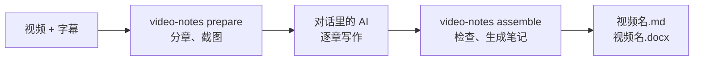

# video-notes

**中文** | [English](README.en.md) | [Magyar](README.hu.md)

把本地的讲座、课程或培训视频，整理成**带原视频截图、可以直接分享的学习笔记**（Markdown 和 Word 两个版本）。

- 笔记由你在 Claude 或 Codex 应用里对话的 AI 来写：按原讲解顺序完整解释原因、机制、条件、步骤和例子，不是摘要或逐字稿。
- video-notes 负责其余工作：检查字幕、找出画面变化、分章、挑选候选截图、检查 AI 写好的章节、生成 Markdown 和 Word。
- 每章最多 8 张重点截图，图注写明图中内容和原视频时间；笔记与视频同名，放在视频旁边。



> 当前版本 0.2。流程与检查已用单元测试和真实视频片段验证；笔记的文字质量取决于写作的 AI 和它的自查。

## 目录

1. [准备工作（只做一次）](#准备工作只做一次)
2. [第 1 步：准备字幕](#第-1-步准备字幕)
3. [第 2 步：让 AI 写笔记](#第-2-步让-ai-写笔记)
4. [第 3 步：拿到笔记](#第-3-步拿到笔记)
5. [常见问题](#常见问题)
6. [进阶](#进阶)
7. [开发与测试](#开发与测试)

---

## 准备工作（只做一次）

1. 安装 Python 3.10+、FFmpeg 和 git。Windows 上依次运行 `winget install Python.Python.3.12`、`winget install Gyan.FFmpeg`、`winget install Git.Git`（没有 git 也可以在 GitHub 页面下载 ZIP 解压）。
2. 安装 video-notes：

   ```bash
   git clone https://github.com/songyang8964/video-notes.git
   cd video-notes
   powershell -ExecutionPolicy Bypass -File install.ps1 -AddToPath   # macOS/Linux: sh install.sh
   ```

3. **完全退出并重新打开** Claude 或 Codex 应用，让它找到新安装的 `video-notes` 命令。
4. 可选：在终端运行 `video-notes doctor`，检查 FFmpeg、pandoc（生成 Word 用）等是否就绪。

---

## 第 1 步：准备字幕

如果已经有和视频**同名**的字幕（例如 `课程.mp4` 旁边的 `课程.srt`），直接跳到第 2 步。

没有字幕时，推荐用 Google Colab 的免费 T4 GPU 生成（本地没有 NVIDIA 显卡时，2 小时视频的本地识别可能要几个小时）：

1. （推荐）先在本地只提取音频，文件小、上传快。保持文件名与视频相同：

   ```bash
   ffmpeg -i "课程.mp4" -vn -ac 1 -c:a aac -b:a 64k "课程.m4a"
   ```

2. 打开 [Colab 字幕笔记本](https://colab.research.google.com/github/songyang8964/video-notes/blob/main/colab/whisperx_for_uploading_file.ipynb)。也可以在 Colab 里手动打开：菜单 **File → Open notebook → GitHub**：

   

   在搜索框输入 `songyang8964`，仓库选 `songyang8964/video-notes`，打开 `colab/whisperx_for_uploading_file.ipynb`：

   

3. 菜单 **Runtime → Change runtime type**，选择 **T4 GPU**，点 **Save**：

   

4. 点左侧的文件夹图标，把音频（或视频）拖进去上传。
5. 可选：在第一个单元格的 **Initial prompt** 里写上这门课的专业术语，能提高识别准确率。
6. 菜单 **Runtime → Run all**。完成后浏览器会自动下载与上传文件同名的 `.srt`（如果浏览器询问是否允许下载多个文件，请允许）。
7. 把 `课程.srt` 放到 `课程.mp4` 旁边。

也可以不用 Colab：安装本地语音识别（`pip install faster-whisper` 或 WhisperX），第 2 步会自动转写，只是没有 GPU 时很慢。

---

## 第 2 步：让 AI 写笔记

1. 打开 **Claude 桌面版 → Code**，或 **Codex 桌面版**，选择视频所在的文件夹。
2. 把下面这段话原样发给 AI：

   ```text
   用 video-notes 把这个文件夹里的视频整理成笔记：先运行 video-notes prepare，阅读它输出的资料包说明，按每章 brief.md 写好 topics.csv、knowledge.csv、chapter.md 和 review.md，再运行 video-notes assemble，直到全部检查通过。
   ```

3. AI 会先分章、截图，再逐章写作和自查，最后检查并生成笔记。长视频可以分几次对话完成：已写好的章节都会保留，在新对话里说“继续写还没完成的章节，然后运行 video-notes assemble”即可。

---

## 第 3 步：拿到笔记

```
<视频所在文件夹>/
  <视频名>.md          Markdown 笔记
  <视频名>.docx        Word 笔记（图片已嵌入，可单独发送）
  <视频名>_assets/     Markdown 引用的截图
```

- 原视频和字幕不会被修改。
- 视频旁还会出现一个 `.work` 文件夹（缓存和中间文件），笔记完成后可以删除。
- 如果你手工改过上次生成的笔记，重新生成**不会覆盖**它，新结果另存为带时间戳的文件。

---

## 常见问题

- **提示找不到 `video-notes` 命令**：安装时没有加 `-AddToPath`，或者终端 / 应用是在安装前打开的。重新打开终端，或完全退出并重新打开 Claude / Codex 应用。
- **`assemble` 没有通过**：原因写在资料包文件夹的 `check.md`（例如某段字幕没有归属、某个重要知识点没写、正文太简略）。让 AI 按它修改对应章节，再运行一次 `assemble`。
- **改了字幕或视频上下文**：先重新运行 `video-notes prepare`。已写好的章节会保留；受影响的章节会被标出，需要 AI 重新核对。
- **中途中断了**：再次运行同一条命令即可，已完成的部分不会丢失。
- **需要多长时间**：`prepare` 第一次运行大约是视频时长的 1/5 到 1/3，之后有缓存。写作在对话里进行，消耗的是对话本身的额度，大致与视频长度成正比；两小时以上的视频建议分几次对话完成。
- **想要英文或其他语言的笔记**：`video-notes setup --language English`，或在视频上下文里写 `note_language`（见“进阶”）。

---

## 进阶

### 视频上下文（可选）

在视频旁放一个 `<视频名>.context.md`，写下这门课的背景、术语和要排除的内容，AI 写每一章时都会参考：

```markdown
---
title: 分布式系统入门（第 3 讲）
note_language: English
include_times: 00:12:30, 00:41:05.500
forbid: 讲者, 本视频
---
本讲主题是共识算法。术语统一写作 Raft、Paxos、Leader。
字幕中的 "rafting" 是 Raft 的识别错误。课前的设备调试与主题无关，不写入笔记。
```

| 字段 | 作用 |
| --- | --- |
| `title` | 笔记标题（默认用视频文件名） |
| `note_language` | 这个视频的笔记语言（覆盖 `setup --language`） |
| `language` | 字幕语言偏好；没有字幕时传给语音识别 |
| `include_times` | 必须作为候选的画面时间，逗号分隔，`HH:MM:SS(.mmm)` 或秒数 |
| `forbid` | 正文中不允许出现的词，逗号分隔（程序检查） |
| `asr_preset` | 本地转写时使用的术语提示预设（当前提供 `networking`） |

### 在终端里运行

```bash
video-notes                          # 等同于 prepare：文件夹里只有一个 .mp4 时处理它
video-notes prepare "课程.mp4" --srt "字幕.srt" --context 背景.md
video-notes assemble "课程.mp4"      # 写完所有章节后运行
video-notes assemble "课程.mp4" --output D:\notes   # 输出到其他文件夹
```

`prepare` 结束时会显示资料包文件夹的位置（`.work` 中的 `briefs/`）：`README.md` 列出所有章节，每章一个子文件夹，其中的 `brief.md` 包括写作规则、本章字幕和候选截图。写作者在同一子文件夹写下面四个文件：

| 文件 | 内容 |
| --- | --- |
| `topics.csv` | 按语义划分的连续知识点，覆盖本章每一条字幕；无关内容标为 excluded 并写明原因 |
| `knowledge.csv` | 细粒度知识清单：定义、机制、条件、原因、例子、命令、步骤、风险、问答 |
| `chapter.md` | 本章正文；插图用 `[[frame:帧ID\|图注]]` 占位，结尾写知识对照表 |
| `review.md` | 自查记录：每张插图在原图上核对了什么，每个重要知识点讲在哪里 |

### 质量检查

`assemble` 对每一章做下面的检查，有一项不通过就不生成笔记：

| 检查 | 规则 |
| --- | --- |
| 字幕全覆盖 | 每条字幕按顺序恰好归入一个小节，或标为排除并写明原因 |
| 配图 | 每章最多 8 张，不重复；每张图只能出现在它所属知识点的小节里 |
| 知识覆盖 | 每个重要知识点都必须在知识对照表中对应到真实存在的小节，或写明排除原因 |
| 详细程度 | 每分钟讲解至少 100 字（英文按词数折算）；讲解满 1 分钟的小节至少每分钟 50 字 |
| 写作风格 | 不得出现“讲师提到”“视频中”之类的转述、`forbid` 中的词，以及 C01、帧 ID 等内部编号 |
| 自查记录 | `review.md` 必须对每张插图写明核对了原图中的什么，并覆盖每个重要知识点 |
| 格式 | 每章有标题；无图片路径直写、无未配对的代码块；生成后无残留占位符 |

程序能核对格式、覆盖和自查记录是否完整，但无法判断技术内容是否写对；这取决于写作的 AI 是否认真对照了字幕和原图。重要场合请人工抽查关键章节，特别是命令、地址和数值。

### 退出码

| 退出码 | 含义 |
| --- | --- |
| 0 | 成功：资料包已生成，或所有章节通过检查并已输出笔记 |
| 1 | 依赖或处理失败；或有章节未通过检查（原因写在 `briefs/check.md`，没有输出笔记） |
| 2 | 输入不明确或无效：没有视频、多个视频、文件不存在、在线链接、字幕不合格 |
| 130 | 用户中断（进度已保存） |

### 配置

配置文件位于 `~/.video-notes/config.json`（Windows：`%USERPROFILE%\.video-notes\config.json`），常用项可以用 `video-notes setup` 修改。

| 键 | 默认值 | 说明 |
| --- | --- | --- |
| `output_language` | `中文` | 笔记语言 |
| `max_images` | 8 | 每章最多插图数 |
| `shortlist` | 32 | 每章资料包最多列出的不同画面数 |
| `chapter_minutes` | 10 | 目标章节长度（分钟） |
| `parallel_chapters` | 3 | 同时截取候选图的章节数 |
| `min_chars_per_minute` | 100 | 详细程度下限 |
| `tesseract` / `ocr_langs` | 空 / `eng` | OCR 程序路径与语言（可选，改善候选截图排序） |
| `asr_backend` / `asr_model` / `whisperx` | 自动 / `large-v3` / 空 | 本地转写设置 |

---

## 开发与测试

```bash
python -m unittest discover -s tests -v                    # 单元测试
python tests/integration_prepare_assemble.py <文件夹>       # 在真实视频片段上跑通 prepare → 写章节 → assemble
```

```
src/video_notes/
  cli.py          命令行：视频发现、prepare / assemble、setup、doctor、退出码
  pipeline.py     检测、分章、资料包、程序检查与生成
  subtitles.py    字幕候选与拒绝规则、VTT 解析
  transcribe.py   本地语音识别（WhisperX / faster-whisper / openai-whisper）
  detect/         画面变化检测与可解码终点
  vision/         质量过滤、OCR 与文字新颖度、多样性挑选
  candidates.py   每章候选截图、阅读副本、联系表
  render.py       程序检查、Markdown 与 Word 输出
  prompts/        写作规则（rules.md）与每章资料包模板（brief.md）
colab/whisperx_for_uploading_file.ipynb   Colab T4 GPU 字幕笔记本
```

第三方许可声明见 [NOTICE](NOTICE)。
