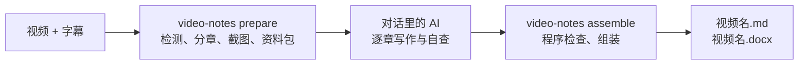

# video-notes

**中文** | [English](README.en.md) | [Magyar](README.hu.md)

把本地的讲座、课程或培训视频，整理成**带原视频截图、可以直接分享的学习笔记**（Markdown 和 Word 两个版本）。

- 由你在 Claude 或 Codex 应用里对话的 AI 写笔记：字幕读一次、每张图看一次，按原讲解顺序和思路完整解释原因、机制、条件、步骤和例子，不是摘要或逐字稿。
- 工具负责所有不需要大模型的工作：字幕检查、画面变化检测、分章、候选截图与质量过滤、程序检查、生成 Markdown 和 Word。
- 每章最多 8 张重点截图，同一页只用一次，图注写明图中内容和原视频时间。
- 笔记与视频同名，放在视频旁边：`<视频名>.md`、`<视频名>.docx`、`<视频名>_assets/`。

> 当前版本 0.2。流程与检查已用单元测试和真实视频片段验证；笔记的文字质量取决于写作的 AI 和它的自查。

## 快速开始

需要先装好 Python 3.10+、FFmpeg 和 git（Windows：依次运行 `winget install Python.Python.3.12`、`winget install Gyan.FFmpeg`、`winget install Git.Git`；没有 git 也可以在 GitHub 页面下载 ZIP 解压）。

1. 安装（一次）：

```bash
git clone https://github.com/songyang8964/video-notes.git
cd video-notes
powershell -ExecutionPolicy Bypass -File install.ps1 -AddToPath   # macOS/Linux: sh install.sh
```

2. **完全退出并重新打开** Claude 或 Codex 应用，让它找到新安装的 `video-notes` 命令。
3. 把视频（和同名 `.srt` 字幕，可选）放进一个文件夹。
4. 在应用里打开这个文件夹（Claude 桌面版选 **Code**），把下面这段话原样发给 AI：

   ```text
   用 video-notes 把这个文件夹里的视频整理成笔记：先运行 video-notes prepare，阅读它输出的资料包说明，按每章 brief.md 写好 topics.csv、knowledge.csv、chapter.md 和 review.md，再运行 video-notes assemble，直到全部检查通过。
   ```

5. 完成后，视频旁边会出现 `<视频名>.md` 和 `<视频名>.docx`。



---

## 目录

1. [快速开始](#快速开始)
2. [安装](#安装)
3. [使用](#使用)
4. [在 Colab T4 GPU 上生成字幕](#在-colab-t4-gpu-上生成字幕)
5. [视频上下文（可选）](#视频上下文可选)
6. [质量保证](#质量保证)
7. [常见问题](#常见问题)
8. [配置](#配置)
9. [开发与测试](#开发与测试)

---

## 安装

### 需要

- Python 3.10 或更高版本
- FFmpeg：`ffmpeg` 和 `ffprobe` 在 PATH 中
- 用来写作的 AI：Claude 桌面版（Code）、Claude Code，或 Codex 桌面版 / Codex CLI
- 可选：Tesseract OCR（改善候选截图排序，命令行和表格类内容收益最大）；本地语音识别（仅在没有字幕时需要）：`pip install faster-whisper` 或安装 WhisperX

### 安装步骤

Windows（PowerShell）：

```powershell
powershell -ExecutionPolicy Bypass -File install.ps1 -AddToPath
```

`-AddToPath` 会把工具加入当前用户的 PATH，之后在任何文件夹都能直接输入 `video-notes`（需要重新打开终端）。Word 版由安装时一并装好的 pandoc 生成。

macOS / Linux：

```bash
sh install.sh
```

### 首次配置

```bash
video-notes setup --language English      # 笔记语言，默认中文
video-notes setup --tesseract "C:\Program Files\Tesseract-OCR\tesseract.exe" --ocr-langs eng+chi_sim   # 可选
video-notes doctor                         # 检查 FFmpeg、Python 依赖、pandoc、OCR、语音识别
```

---

## 使用

### 在 Claude / Codex 应用里使用

1. 打开 **Claude 桌面版 → Code**，或 **Codex 桌面版**，选择视频所在的文件夹作为工作目录。
2. 发送“快速开始”第 4 步中的那段话。
3. AI 依次完成每一章；`assemble` 通过后给出笔记路径。长视频可以分几次对话完成，资料包和已写好的章节都会保留，新对话里说“继续写还没完成的章节，然后运行 video-notes assemble”即可。

### 在终端里使用

```bash
video-notes                          # 等同于 prepare：文件夹里只有一个 .mp4 时处理它
video-notes prepare "课程.mp4" --srt "字幕.srt" --context 背景.md
video-notes assemble "课程.mp4"      # 写完所有章节后运行
video-notes assemble "课程.mp4" --output D:\notes   # 输出到其他文件夹
```

`prepare` 结束时会显示资料包所在的文件夹（内部记录中的 `briefs/`）：那里的 `README.md` 列出所有章节，每章一个子文件夹 `Cnn/`，其中的 `brief.md` 包括通用写作规则、视频上下文、本章字幕、候选截图表（时间、显示期间的字幕、原图路径）和联系表。写作者在同一子文件夹写下面四个文件：

| 文件 | 内容 |
| --- | --- |
| `topics.csv` | 按语义划分的连续知识点，覆盖本章每一条字幕；无关内容标为 excluded 并写明原因 |
| `knowledge.csv` | 细粒度知识清单：定义、机制、条件、原因、例子、命令、步骤、风险、问答 |
| `chapter.md` | 本章正文；插图用 `[[frame:帧ID\|图注]]` 占位，结尾写知识对照表 |
| `review.md` | 自查记录：每张插图在原图上核对了什么，每个重要知识点讲在哪里 |

### 输出

```
<视频所在文件夹>/
  <视频名>.md          Markdown 笔记
  <视频名>.docx        Word 笔记（图片已嵌入，可单独发送）
  <视频名>_assets/     Markdown 引用的截图
```

- 原视频和字幕只读，绝不修改。
- 视频旁还会出现一个 `.work` 文件夹，存放画面检测缓存、候选截图和资料包；笔记完成后可以删除（删除后再次处理同一视频需要重新检测画面）。
- 如果你手工修改过上次生成的笔记，重新组装**不会覆盖**它，新结果另存为带时间戳的文件。
- Windows 路径超过 260 个字符时，文件名会自动缩短，并在提示中说明。

### 退出码

| 退出码 | 含义 |
| --- | --- |
| 0 | 成功：资料包已生成，或所有章节通过检查并已输出笔记 |
| 1 | 依赖或处理失败；或有章节未通过检查（原因写在 `briefs/check.md`，没有输出笔记） |
| 2 | 输入不明确或无效：没有视频、多个视频、文件不存在、在线链接、字幕不合格 |
| 130 | 用户中断（进度已保存） |

---

## 在 Colab T4 GPU 上生成字幕

本地没有 NVIDIA 显卡时，2 小时视频的本地语音识别可能需要数小时。推荐用 Google Colab 的免费 T4 GPU：

1. （推荐）先在本地只提取音频，文件小、上传快，文件名主干与视频相同：

   ```bash
   ffmpeg -i "课程.mp4" -vn -ac 1 -c:a aac -b:a 64k "课程.m4a"
   ```

2. 在 Colab 打开本仓库的 [`colab/transcribe.ipynb`](colab/transcribe.ipynb)，菜单 **代码执行程序 → 更改运行时类型 → T4 GPU**。
3. 在“参数”单元格选择来源（上传或 Google Drive），可选填写领域术语和语言，然后从上到下运行所有单元格。
4. 把生成的 `课程.srt` 放到本地 `课程.mp4` 旁边，运行 `video-notes prepare`。

---

## 视频上下文（可选）

在视频旁放一个 `<视频名>.context.md`（或用 `--context` 指定），写下这门课的背景；它会写进每一章的资料包。

```markdown
---
title: 分布式系统入门（第 3 讲）
note_language: English
include_times: 00:12:30, 00:41:05.500
forbid: 讲者, 本视频
---
本讲主题是共识算法。术语统一写作 Raft、Paxos、Leader。
字幕中的 "rafting" 是 Raft 的识别错误。课前的设备调试与主题无关，不写入笔记。
```

| 字段 | 作用 |
| --- | --- |
| `title` | 笔记标题（默认用视频文件名） |
| `note_language` | 这个视频的笔记语言（覆盖 `setup --language`） |
| `language` | 字幕语言偏好；没有字幕时传给语音识别 |
| `include_times` | 必须作为候选的画面时间，逗号分隔，`HH:MM:SS(.mmm)` 或秒数 |
| `forbid` | 正文中不允许出现的词，逗号分隔（程序检查） |
| `asr_preset` | 本地转写时使用的术语提示预设（当前提供 `networking`） |

---

## 质量保证

### 程序检查（`assemble` 对每章执行，不通过就不输出）

| 检查 | 规则 |
| --- | --- |
| 字幕全覆盖 | 每条字幕按顺序恰好归入一个小节，或标为排除并写明原因 |
| 配图 | 每章最多 8 张，不重复；每张图只能出现在它所属知识点的小节里，帧 ID 必须存在 |
| 知识覆盖 | 每个重要知识点都必须在知识对照表中对应到真实存在的小节，或写明排除原因 |
| 详细程度 | 每分钟讲解至少 100 字（英文按词数折算）；讲解满 1 分钟的小节至少每分钟 50 字 |
| 写作风格 | 不得出现“讲师提到”“视频中”之类的转述、上下文 `forbid` 中的词，以及 C01、帧 ID 等内部编号 |
| 自查记录 | `review.md` 必须对每张插图写明核对了原图中的什么，并覆盖每个重要知识点 |
| 格式 | 每章有标题；无图片路径直写、无未配对的代码块；组装后无残留占位符 |

### 局限

- 程序能核对格式、覆盖和自查记录是否完整，但无法判断技术内容是否写对；这取决于写作的 AI 是否认真对照了字幕和原图。
- 重要场合请人工抽查关键章节，特别是命令、地址和数值。

---

## 常见问题

- **提示找不到 `video-notes` 命令**：安装时没有加 `-AddToPath`，或者终端 / 应用是在安装前打开的。重新打开终端，或完全退出并重新打开 Claude / Codex 应用。
- **`assemble` 没有通过**：每章的原因写在资料包文件夹的 `check.md`（例如某段字幕没有归属、某个重要知识点没写、正文太简略、自查记录缺了某张图）。把它交给 AI 修改对应章节，再运行一次 `assemble`。
- **中途中断了**：再次运行同一条命令即可。画面检测和截图已缓存，已写好的章节文件不会丢失。
- **需要多长时间**：`prepare` 首次运行大约是视频时长的 1/5 到 1/3（主要是画面检测），之后复用缓存。写作在对话里进行，消耗的是对话本身的额度，大致与视频长度成正比；两小时以上的视频建议分几次对话完成。
- **没有字幕**：用下面的 Colab 方法生成，或安装本地语音识别后由 `prepare` 自动转写。
- **想要英文或其他语言的笔记**：`video-notes setup --language English`，或在视频上下文里写 `note_language`。

---

## 配置

配置文件位于 `~/.video-notes/config.json`（Windows：`%USERPROFILE%\.video-notes\config.json`）。不放在 AppData，是因为 Claude、Codex 桌面版会把各自的 AppData 重定向到私有目录。

| 键 | 默认值 | 说明 |
| --- | --- | --- |
| `output_language` | `中文` | 笔记语言 |
| `max_images` | 8 | 每章最多插图数 |
| `shortlist` | 32 | 每章资料包最多列出的不同画面数 |
| `chapter_minutes` | 10 | 目标章节长度（分钟） |
| `parallel_chapters` | 3 | 同时截取候选图的章节数 |
| `min_chars_per_minute` | 100 | 详细程度下限 |
| `tesseract` / `ocr_langs` | 空 / `eng` | OCR 程序路径与语言 |
| `asr_backend` / `asr_model` / `whisperx` | 自动 / `large-v3` / 空 | 本地转写设置 |

内部记录在视频文件夹的 `.work/video-notes/<哈希>/`；路径太深时放到 `%USERPROFILE%\.video-notes\work\<哈希>`。画面检测只在第一次运行时进行，之后复用缓存。

---

## 开发与测试

```bash
python -m unittest discover -s tests -v            # 单元测试
python tests/integration_prepare_assemble.py <文件夹>     # 在真实视频片段上跑通 prepare → 写章节 → assemble（不调用模型）
```

```
src/video_notes/
  cli.py          命令行：视频发现、prepare / assemble、setup、doctor、退出码
  pipeline.py     检测、分章、资料包、程序检查与组装
  subtitles.py    字幕候选与拒绝规则、VTT 解析
  transcribe.py   本地语音识别（WhisperX / faster-whisper / openai-whisper）
  detect/         画面变化检测与可解码终点
  vision/         质量过滤、OCR 与文字新颖度、多样性挑选
  candidates.py   每章候选截图、阅读副本、联系表
  render.py       程序检查、组装、Word 输出
  prompts/        写作规则（rules.md）与每章资料包模板（brief.md）
colab/transcribe.ipynb   Colab T4 GPU 字幕生成笔记本
```

第三方许可声明见 [NOTICE](NOTICE)。
